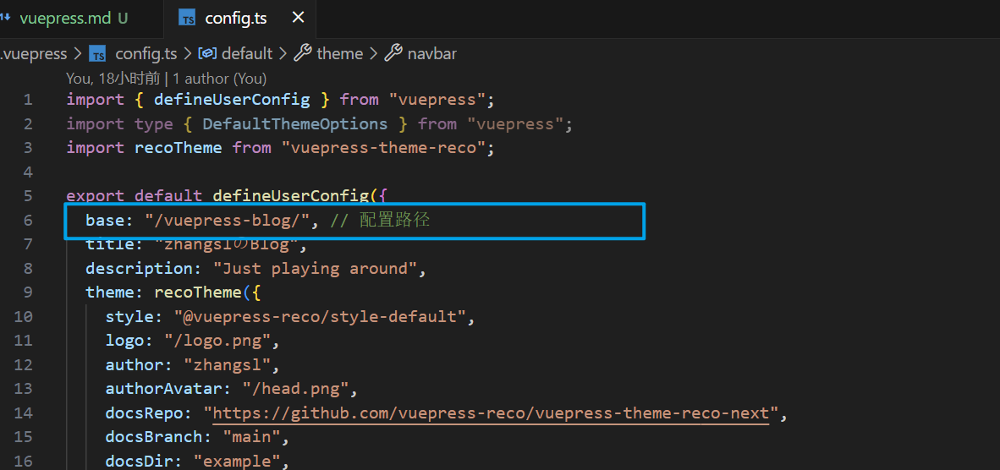

### 1、问题

#### ① 初始化项目运行报错

> 现象

- 使用 `npx` 初始化，项目启动失败，页面空白无显示，控制台报错（未解决）
- 使用 `npm` 初始化，项目成功启动

#### ② 项目部署后报错：.js、.css 文件 404

> 现象

打包部署到 `github` 上，访问页面，控制台显示相关 ` js、css` 文件请求 404

> 原因&解决方法

对应的部署地址：https://beganing.github.io/vuepress-blog/

需要配置对应的 `base` 配置项

如果项目名称和账号名称一致，则不用配置，默认是 `base: '/'`

> 参考

