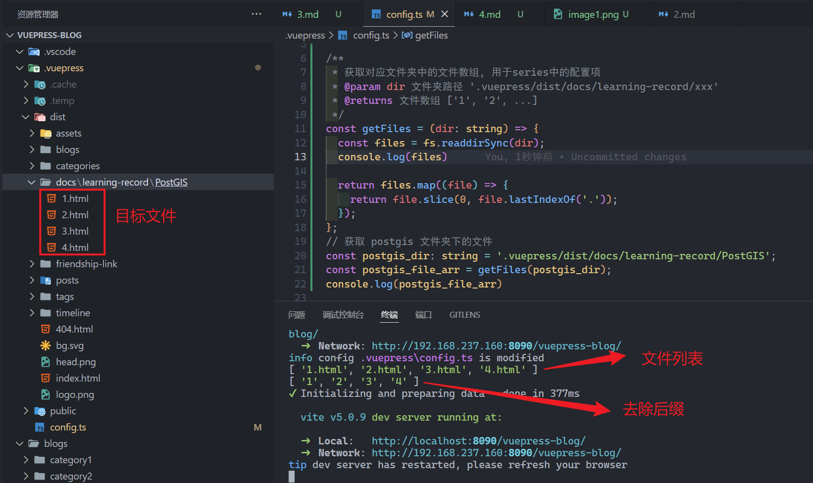

## 1. 引入`fs`模块

> 安装

```bash
npm install @types/node --save-dev
```

> 引入

```javascript
import * as fs from "fs"
```

> 参考-引入方法

[typescript中import”fs”模块_typescript fs-CSDN博客](https://blog.csdn.net/u013782762/article/details/76598999)

## 2. 获取目录中的文件列表

使用`Nodejs`的内置模块`fs`来获取

> 在 `ts`文件中进行获取

```javascript
/**
 * 获取对应文件夹中的文件数组, 用于series中的配置项
 * @param dir 文件夹路径 '.vuepress/dist/docs/learning-record/xxx'
 * @returns 文件数组 ['1', '2', ...]
 */
const getFiles = (dir: string) => {
  const files = fs.readdirSync(dir);

  return files.map((file) => {
    return file.slice(0, file.lastIndexOf('.'));
  });
};
// 获取 postgis 文件夹下的文件
const postgis_dir: string = '.vuepress/dist/docs/learning-record/PostGIS';
const postgis_file_arr = getFiles(postgis_dir);
```

> 实例

