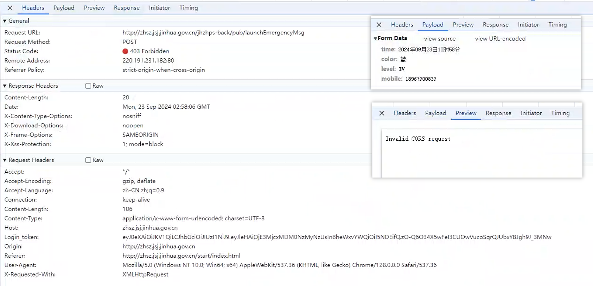
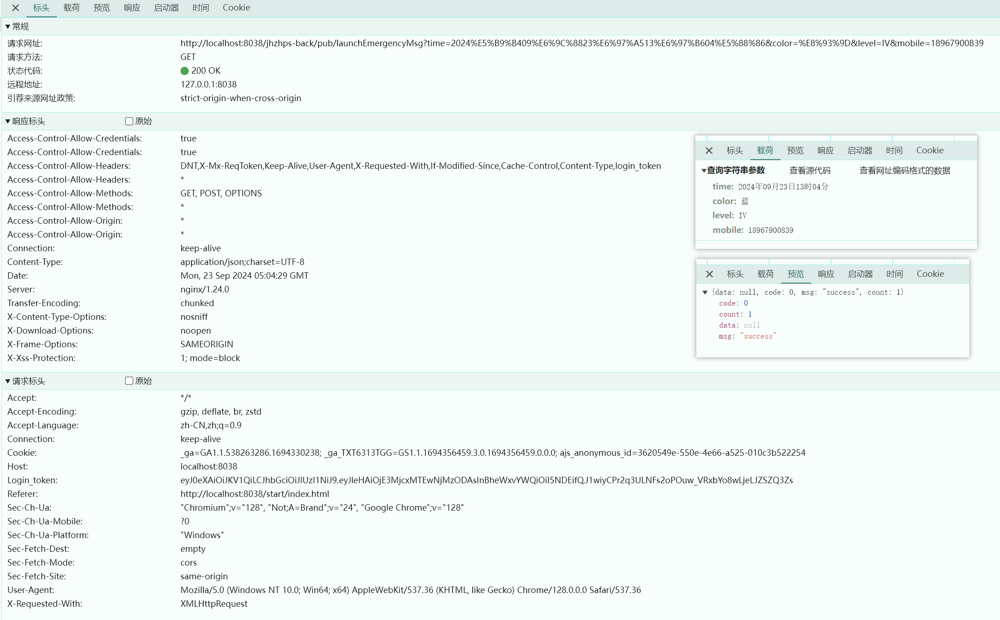

## 1. 问题

### 1.1. 代码

```js
$.ajaxSetup({
    headers: {
        login_token: localStorage.getItem('login_token'),
    },
});
$.ajax({
    url: global.ip.backUrl + "pub/launchEmergencyMsg",
    data: {
        time: startTime,
        color: color,
        level: level,
        mobile: mobile
    },
    type: "post", //HTTP请求类型
    success: function(data) {
        if (data.msg == "success") {
            layer.msg("启动应急短信发送成功!");
        } else {
            layer.msg("启动应急短信发送失败~");
        }
    }
});
```

### 1.2. 请求



## 2. 解决方式

将`post`请求换成`get`请求, 就正常了

### 2.1. 代码

```js
$.ajax({
    url: global.ip.backUrl + "pub/launchEmergencyMsg",
    data: {
        time: startTime,
        color: color,
        level: level,
        mobile: mobile
    },
    type: "get", //HTTP请求类型
    success: function(data) {
        if (data.msg == "success") {
            layer.msg("启动应急短信发送成功!");
        } else {
            layer.msg("启动应急短信发送失败~");
        }
    }
});
```

### 2.2. 请求



## 3. 疑惑

同样的情况, 在`apifox`中进行测试, `post`和`get`都可以成功, 不知道为什么!!!
