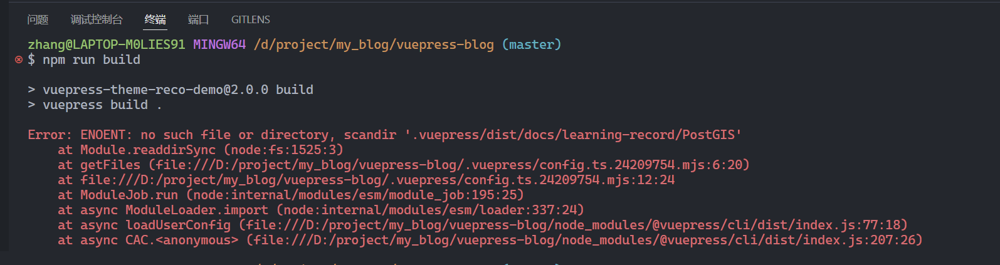
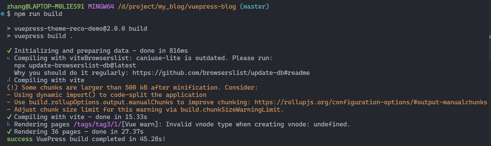

## 1. 报错

1. 首先执行`./deploy.sh`

   由于内存限制, 打包失败

2. 此时手动执行`npm run build`

   报错如下:

此时查看报错的文件, `.vuepress/dist`文件夹为空

分析是第一次构建失败, 导致该文件夹为空, 导致后续打包失败

## 2. 解决

手动在`dist`中添加文件夹

`.vuepress/dist/docs/learning-record/PostGIS`

重新打包即可

## 3. 原因

在`./vuepress/config.ts`文件中，自己编写了自动获取`./vuepress/doc/xxx`文件夹下的文档列表，用于设置`series`配置项。

由于打包失败，未生成对应的文件结构，所以获取失败，导致报错。