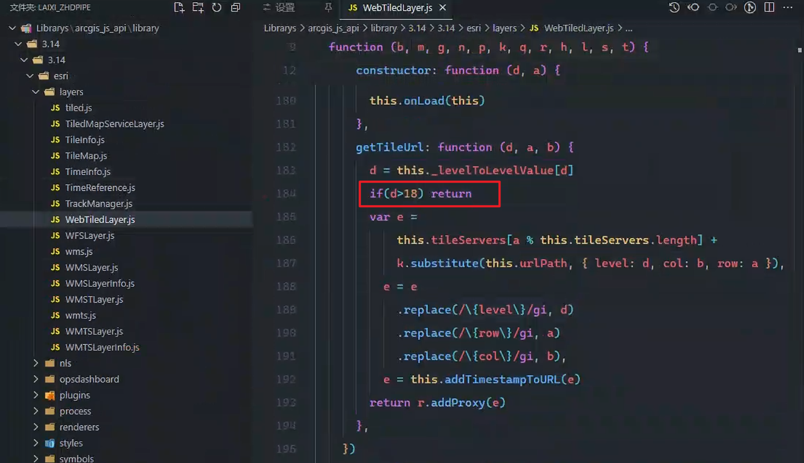
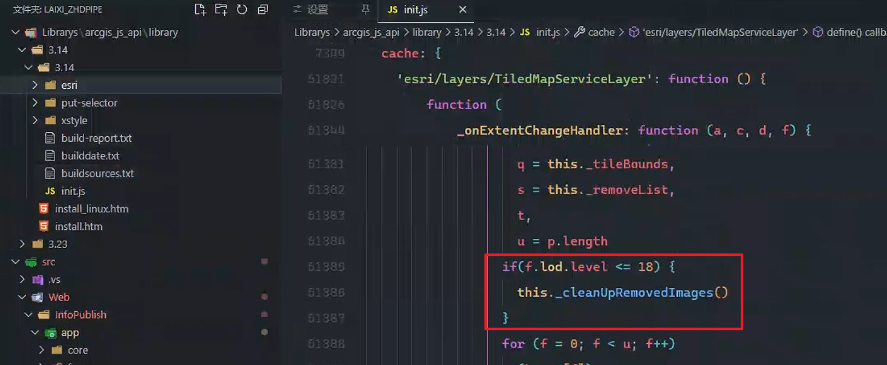

## 1. 设置`map`的`maxZoom`

```js
const map = new Map(id, {
    ...,
    maxZoom: 22,//最大空间等级
})            
```

##  2. 设置图层的`tileInfo`

```js
const tileInfo2 = new TileInfo({
    "rows":256,
    "cols":256,
    "origin":{
        "type":"point",
        "x":-20037508.342787,
        "y":20037508.342787,
        "spatialReference":{
            "wkid":102100
        }
    },
    spatialReference: {
        wkid: 102100
    },
    "lods":[
        {
            "level":0,
            "resolution":156543.033928,
            "scale":591657527.591555,
            "startTileRow":0,
            "startTileCol":0,
            "endTileRow":0,
            "_frameInfo":[
                1,
                0,
                0,
                256
            ]
        },
        {
            "level":1,
            "resolution":78271.5169639999,
            "scale":295828763.795777,
            "startTileRow":0,
            "startTileCol":0,
            "endTileRow":1,
            "endTileCol":1,
            "_frameInfo":[
                2,
                0,
                1,
                512
            ]
        },
        {
            "level":2,
            "resolution":39135.7584820001,
            "scale":147914381.897889,
            "startTileRow":0,
            "startTileCol":0,
            "endTileRow":3,
            "endTileCol":3,
            "_frameInfo":[
                4,
                0,
                3,
                1024
            ]
        },
        {
            "level":3,
            "resolution":19567.8792409999,
            "scale":73957190.948944,
            "startTileRow":0,
            "startTileCol":0,
            "endTileRow":7,
            "endTileCol":7,
            "_frameInfo":[
                8,
                0,
                7,
                2048
            ]
        },
        {
            "level":4,
            "resolution":9783.93962049996,
            "scale":36978595.474472,
            "startTileRow":0,
            "startTileCol":0,
            "endTileRow":15,
            "endTileCol":15,
            "_frameInfo":[
                16,
                0,
                15,
                4096
            ]
        },
        {
            "level":5,
            "resolution":4891.96981024998,
            "scale":18489297.737236,
            "startTileRow":0,
            "startTileCol":0,
            "endTileRow":31,
            "endTileCol":31,
            "_frameInfo":[
                32,
                0,
                31,
                8192
            ]
        },
        {
            "level":6,
            "resolution":2445.98490512499,
            "scale":9244648.868618,
            "startTileRow":0,
            "startTileCol":0,
            "endTileRow":63,
            "endTileCol":63,
            "_frameInfo":[
                64,
                0,
                63,
                16384
            ]
        },
        {
            "level":7,
            "resolution":1222.99245256249,
            "scale":4622324.434309,
            "startTileRow":0,
            "startTileCol":0,
            "endTileRow":127,
            "endTileCol":127,
            "_frameInfo":[
                128,
                0,
                127,
                32768
            ]
        },
        {
            "level":8,
            "resolution":611.49622628138,
            "scale":2311162.217155,
            "startTileRow":0,
            "startTileCol":0,
            "endTileRow":255,
            "endTileCol":255,
            "_frameInfo":[
                256,
                0,
                255,
                65536
            ]
        },
        {
            "level":9,
            "resolution":305.748113140558,
            "scale":1155581.108577,
            "startTileRow":0,
            "startTileCol":0,
            "endTileRow":512,
            "endTileCol":512,
            "_frameInfo":[
                512,
                0,
                511,
                131072
            ]
        },
        {
            "level":10,
            "resolution":152.874056570411,
            "scale":577790.554289,
            "startTileRow":0,
            "startTileCol":0,
            "endTileRow":1023,
            "endTileCol":1023,
            "_frameInfo":[
                1024,
                0,
                1023,
                262144
            ]
        },
        {
            "level":11,
            "resolution":76.4370282850732,
            "scale":288895.277144,
            "startTileRow":0,
            "startTileCol":0,
            "endTileRow":2048,
            "endTileCol":2048,
            "_frameInfo":[
                2048,
                0,
                2047,
                524288
            ]
        },
        {
            "level":12,
            "resolution":38.2185141425366,
            "scale":144447.638572,
            "startTileRow":0,
            "startTileCol":0,
            "endTileRow":4096,
            "endTileCol":4096,
            "_frameInfo":[
                4096,
                0,
                4095,
                1048576
            ]
        },
        {
            "level":13,
            "resolution":19.1092570712683,
            "scale":72223.819286,
            "startTileRow":0,
            "startTileCol":0,
            "endTileRow":8192,
            "endTileCol":8192,
            "_frameInfo":[
                8192,
                0,
                8191,
                2097152
            ]
        },
        {
            "level":14,
            "resolution":9.55462853563415,
            "scale":36111.909643,
            "startTileRow":0,
            "startTileCol":0,
            "endTileRow":16384,
            "endTileCol":16384,
            "_frameInfo":[
                16384,
                0,
                16383,
                4194304
            ]
        },
        {
            "level":15,
            "resolution":4.77731426794937,
            "scale":18055.954822,
            "startTileRow":0,
            "startTileCol":0,
            "endTileRow":32767,
            "endTileCol":32767,
            "_frameInfo":[
                32768,
                0,
                32767,
                8388608
            ]
        },
        {
            "level":16,
            "resolution":2.38865713397468,
            "scale":9027.977411,
            "startTileRow":0,
            "startTileCol":0,
            "endTileRow":65535,
            "endTileCol":65535,
            "_frameInfo":[
                65536,
                0,
                65535,
                16777216
            ]
        },
        {
            "level":17,
            "resolution":1.19432856685505,
            "scale":4513.988705,
            "startTileRow":0,
            "startTileCol":0,
            "endTileRow":131072,
            "endTileCol":131072,
            "_frameInfo":[
                131072,
                0,
                131071,
                33554432
            ]
        },
        {
            "level":18,
            "resolution":0.597164283559817,
            "scale":2256.994353,
            "startTileRow":0,
            "startTileCol":0,
            "endTileRow":262143,
            "endTileCol":262143,
            "_frameInfo":[
                262144,
                0,
                262143,
                67108864
            ]
        },
        {
            "level":19,
            "resolution":0.298582141647617,
            "scale":1128.497176,
            "startTileRow":0,
            "startTileCol":0,
            "endTileRow":524288,
            "endTileCol":524288,
            "_frameInfo":[
                524288,
                0,
                524287,
                134217728
            ]
        },
        {
            "level":20,
            "resolution":0.14929107088995425,
            "scale":564.248588,
            "startTileRow":0,
            "startTileCol":0,
            "endTileRow":1048576,
            "endTileCol":1048576,
            "_frameInfo":[
                1048576,
                0,
                1048576,
                268435456
            ]
        },
        {
            "level":21,
            "resolution":0.07464553544497712,
            "scale":282.124294,
            "startTileRow":0,
            "startTileCol":0,
            "endTileRow":2097152,
            "endTileCol":2097152,
            "_frameInfo":[
                2097152,
                0,
                2097152,
                536870912
            ]
        },
        {
            "level":22,
            "resolution":0.03732276772248856,
            "scale":141.062147,
            "startTileRow":0,
            "startTileCol":0,
            "endTileRow":4194304,
            "endTileCol":4194304,
            "_frameInfo":[
                4194304,
                0,
                4194304,
                1073741824
            ]
        },
    ],
    "width":256,
    "height":256,
    maxzoom: 18,
    minzoom: 0,
    })
```

```js
const options = {
    subDomains: ['t0', 't1', 't2', 't3', 't4', 't5', 't6', 't7'],
    tileInfo: tileInfo,
    ...
}

const layer = new WebTiledLayer('http://{subDomain}.tianditu.gov.cn/vec_w/wmts?SERVICE=WMTS&REQUEST=GetTile&VERSION=1.0.0&LAYER=vec&STYLE=default&TILEMATRIXSET=w&FORMAT=tiles&TILECOL={col}&TILEROW={row}&TILEMATRIX={level}&tk=5e6b50c26b65e5cc974c9765758f753b', options)
```

## 3. 修改`getTileUrl`方法

`esri->layers->WebTiledLayer` 找到源码, 找到`getTileUrl`方法

在请求瓦片前, 进行判断, 如果`zoom>18`就不再发送请求, 直接`return`



## 4. 修改`init.js`文件

在`init.js`文件中找到`_onExtentChangeHandler`方法, 内部调用清理瓦片的方法`_cleanUpRemovedImages`,需要添加条件, 在`zoom<=18`时执行此方法。



## 5. 参考

>  参考-可用

[acgis api for js 3.x，加载天地图超过18层级不展示问题处理](https://blog.csdn.net/qq_39651734/article/details/142104521)

> 参考-未成功

[使用arcgis api for js加载影像 | 如何在19级数时放大18级数的瓦片图层？](https://www.cnblogs.com/echohye/p/17303897.html)
