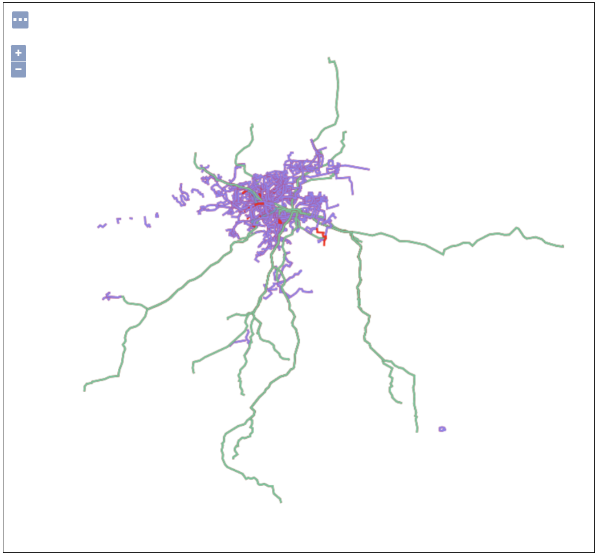

## 1. 核心

### 1.1. 中文报错

一般情况下, _xml_ 文件首行的 _encoding_ 是 _UTF-8_。

但是当 _SLD_ 文件含有中文，需要修改 **_encoding_** 值为 **_GBK_** 或 **_GB2312_**，否则会报错。

> 报错信息：


> 参考博客：[_GeoServer style（sld）_ 中文乱码解决方法](https://blog.csdn.net/ANNENBERG/article/details/107806113)

### 1.2. 样式配置

> _GeoServer_ 样式配置官方文档可参考如下：

[_GeoServer_ 样式配置官方文档](https://docs.geoserver.org/stable/en/user/styling/index.html)

## 2. 示例

### 2.1. 点

```xml
<?xml version="1.0" encoding="GBK"?>
<StyledLayerDescriptor version="1.0.0"
 xsi:schemaLocation="http://www.opengis.net/sld StyledLayerDescriptor.xsd"
    xmlns="http://www.opengis.net/sld"
    xmlns:ogc="http://www.opengis.net/ogc"
    xmlns:xlink="http://www.w3.org/1999/xlink"
    xmlns:xsi="http://www.w3.org/2001/XMLSchema-instance">
    <NamedLayer>
        <Name>default_point</Name>
        <UserStyle>
            <Title>Red Square Point</Title>
            <Abstract>A sample style that draws a red square point</Abstract>
            <FeatureTypeStyle>
                <Rule>
                    <Name>rule0</Name>
                    <Title>Other</Title>
                    <Abstract>A 6 pixel square with a red fill and no stroke</Abstract>
                    <PointSymbolizer>
                        <Graphic>
                            <Mark>
                                <WellKnownName>square</WellKnownName>
                                <Fill>
                                    <CssParameter name="fill">#FF0000</CssParameter>
                                </Fill>
                            </Mark>
                            <Size>6</Size>
                        </Graphic>
                    </PointSymbolizer>
                </Rule>
                <Rule>
                    <Name>rule1</Name>
                    <Title>Green Square Point</Title>
                    <Abstract>A 6 pixel square with a red fill and no stroke</Abstract>
                    <ogc:Filter>
                        <ogc:PropertyIsEqualTo>
                            <ogc:PropertyName>name</ogc:PropertyName>
                            <ogc:Literal>建设四路长池头路口</ogc:Literal>
                        </ogc:PropertyIsEqualTo>
                    </ogc:Filter>
                    <PointSymbolizer>
                        <Graphic>
                            <Mark>
                                <WellKnownName>square</WellKnownName>
                                <Fill>
                                    <CssParameter name="fill">#00FF00</CssParameter>
                                </Fill>
                            </Mark>
                            <Size>6</Size>
                        </Graphic>
                    </PointSymbolizer>
                </Rule>
                <Rule>
                    <Name>rule2</Name>
                    <Title>Green Square Point</Title>
                    <Abstract>A 6 pixel square with a red fill and no stroke</Abstract>
                    <ogc:Filter>
                        <ogc:PropertyIsEqualTo>
                            <ogc:PropertyName>name</ogc:PropertyName>
                            <ogc:Literal>凤升村</ogc:Literal>
                        </ogc:PropertyIsEqualTo>
                    </ogc:Filter>
                    <PointSymbolizer>
                        <Graphic>
                            <Mark>
                                <WellKnownName>square</WellKnownName>
                                <Fill>
                                    <CssParameter name="fill">#0000FF</CssParameter>
                                </Fill>
                            </Mark>
                            <Size>6</Size>
                        </Graphic>
                    </PointSymbolizer>
                </Rule>
                <Rule>
                    <Name>rule3</Name>
                    <Title>Green Square Point</Title>
                    <Abstract>A 6 pixel square with a red fill and no stroke</Abstract>
                    <ogc:Filter>
                        <ogc:PropertyIsEqualTo>
                            <ogc:PropertyName>name</ogc:PropertyName>
                            <ogc:Literal>渭水桥</ogc:Literal>
                        </ogc:PropertyIsEqualTo>
                    </ogc:Filter>
                    <PointSymbolizer>
                        <Graphic>
                            <Mark>
                                <WellKnownName>square</WellKnownName>
                                <Fill>
                                    <CssParameter name="fill">#00FEF0</CssParameter>
                                </Fill>
                            </Mark>
                            <Size>6</Size>
                        </Graphic>
                    </PointSymbolizer>
                </Rule>
            </FeatureTypeStyle>
        </UserStyle>
    </NamedLayer>
</StyledLayerDescriptor>
```

> 效果展示


### 2.2. 线

```xml
<?xml version="1.0" encoding="GBK"?>
<StyledLayerDescriptor version="1.0.0"
 xsi:schemaLocation="http://www.opengis.net/sld StyledLayerDescriptor.xsd"
    xmlns="http://www.opengis.net/sld"
    xmlns:ogc="http://www.opengis.net/ogc"
    xmlns:xlink="http://www.w3.org/1999/xlink"
    xmlns:xsi="http://www.w3.org/2001/XMLSchema-instance">
    <NamedLayer>
        <Name>Bus Route</Name>
        <UserStyle>
            <Title>Line Style</Title>
            <Abstract>Bus Route Style</Abstract>
            <FeatureTypeStyle>
                <Rule>
                    <Name>rule00</Name>
                    <Title>其他</Title>
                    <LineSymbolizer>
                        <Stroke>
                            <CssParameter name="stroke">#FF0000</CssParameter>
                            <CssParameter name="width">2</CssParameter>
                        </Stroke>
                    </LineSymbolizer>
                </Rule>
                <Rule>
                    <Name>rule01</Name>
                    <Title>普通公交</Title>
                    <ogc:Filter>
                        <ogc:PropertyIsEqualTo>
                            <ogc:PropertyName>type</ogc:PropertyName>
                            <ogc:Literal>普通公交</ogc:Literal>
                        </ogc:PropertyIsEqualTo>
                    </ogc:Filter>
                    <LineSymbolizer>
                        <Stroke>
                            <CssParameter name="stroke">#9381ee</CssParameter>
                            <CssParameter name="width">2</CssParameter>
                        </Stroke>
                    </LineSymbolizer>
                </Rule>
                <Rule>
                    <Name>rule02</Name>
                    <Title>机场大巴</Title>
                    <ogc:Filter>
                        <ogc:PropertyIsEqualTo>
                            <ogc:PropertyName>type</ogc:PropertyName>
                            <ogc:Literal>机场大巴</ogc:Literal>
                        </ogc:PropertyIsEqualTo>
                    </ogc:Filter>
                    <LineSymbolizer>
                        <Stroke>
                            <CssParameter name="stroke">#60c698</CssParameter>
                            <CssParameter name="width">2</CssParameter>
                        </Stroke>
                    </LineSymbolizer>
                </Rule>
                <Rule>
                    <Name>rule03</Name>
                    <Title>地铁</Title>
                    <ogc:Filter>
                        <ogc:PropertyIsEqualTo>
                            <ogc:PropertyName>type</ogc:PropertyName>
                            <ogc:Literal>地铁</ogc:Literal>
                        </ogc:PropertyIsEqualTo>
                    </ogc:Filter>
                    <LineSymbolizer>
                        <Stroke>
                            <CssParameter name="stroke">#6398ce</CssParameter>
                            <CssParameter name="width">2</CssParameter>
                        </Stroke>
                    </LineSymbolizer>
                </Rule>
            </FeatureTypeStyle>
        </UserStyle>
    </NamedLayer>
</StyledLayerDescriptor>
```

> 效果展示


