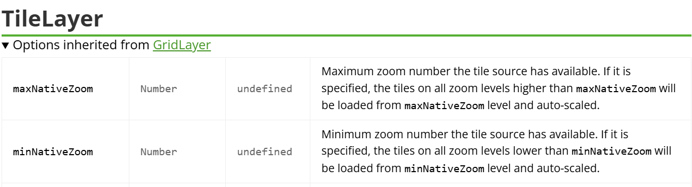

## 1. 3857 坐标系下

### 1.1. 初始化地图

```js
initMap(){
    this.map = L.map('map', {
        crs: L.CRS.EPSG3857,
        center: [30.26731716643256, 120.22817798404904],
        zoom: 10,
        maxZoom: 22, //最大缩放层级
        minZoom: 0, //最小缩放层级
      });
}
```

### 1.2. 添加底图

```js
L.tileLayer(
  'http://t0.tianditu.com/DataServer?T=vec_w&x={x}&y={y}&l={z}&tk=token',
  {
    minZoom: 0,
    minNativeZoom: 2,
    maxZoom: 22,
    maxNativeZoom: 18,
  }
).addTo(this.map);
```

## 2. 4326 坐标系下

### 2.1. 初始化地图

```js
initMap(){
    this.map = L.map('map', {
        crs: L.CRS.EPSG4326,
        center: [30.26731716643256, 120.22817798404904],
        zoom: 10,
        maxZoom: 22, //最大缩放层级
        minZoom: 0, //最小缩放层级
      });
}
```

### 2.2. 添加底图

```js
// 底图
L.tileLayer(
  'http://t0.tianditu.gov.cn/img_c/wmts?tk=7320c7ee67c1816975504867658c26b2&layer=img&style=default&tilematrixset=c&Service=WMTS&Request=GetTile&Version=1.0.0&Format=tiles&TileMatrix={z}&TileCol={x}&TileRow={y}',
  {
    crossOrigin: 'anonymous',
    tileSize: 256,
    zoomOffset: 1,
    zoomControl: true,
    attributionControl: false,
    minZoom: 0,
    minNativeZoom: 0,
    maxZoom: 22,
    maxNativeZoom: 17,
  }
).addTo(this.map);

// 注记
L.tileLayer(
  'http://t0.tianditu.gov.cn/cva_c/wmts?tk=7320c7ee67c1816975504867658c26b2&layer=cva&style=default&tilematrixset=c&Service=WMTS&Request=GetTile&Version=1.0.0&Format=tiles&TileMatrix={z}&TileCol={x}&TileRow={y}',
  {
    crossOrigin: 'anonymous',
    tileSize: 256,
    zoomOffset: 1,
    zoomControl: true,
    attributionControl: false,
    minZoom: 0,
    minNativeZoom: 0,
    maxZoom: 22,
    maxNativeZoom: 17,
  }
).addTo(this.map);
```

> 注意

天地图的 EPSG4326 跟国际的 wmts 差了一级，所以此处设置`zoomOffset: 1`，同样的，`maxNativeZoom`参数也要调整, 所以是`17`。

## 3. 参考

> 官网



> 参考

[leaflet瓦片图层缩放级别外不隐藏](https://blog.csdn.net/m0_45305745/article/details/132101359)

[CRS设置为4326后底图加载异常问题](https://segmentfault.com/q/1010000015462807)
