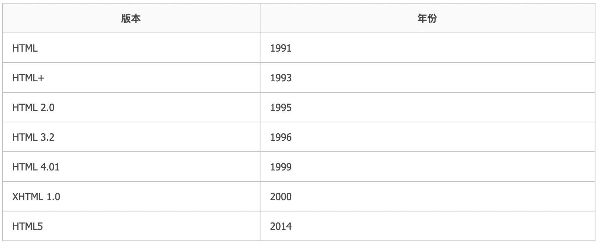
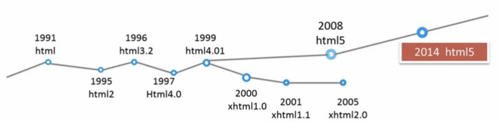
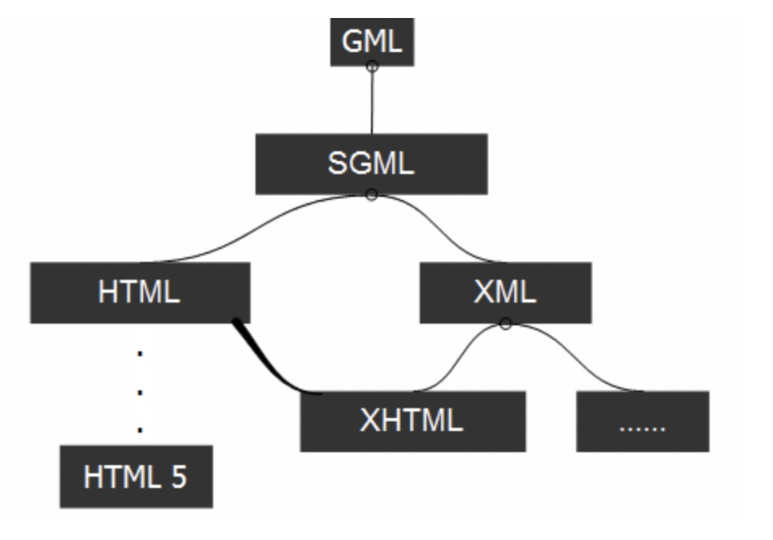
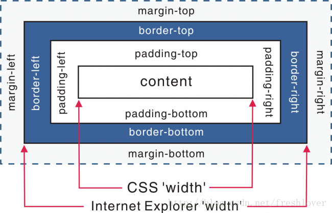

## 经典真题

- 什么是`<!DOCTYPE>`? 是否需要在*HTML5*中使用?
- 什么是严格模式与混杂模式?
- 列举几条怪异模式中的怪癖行为

## 1.1. 概念

*HTML*文档通常以**文档声明**开始，该声明的作用是**帮助浏览器确定其解析和显示的*HTML*文档类型**。

```html
<!DOCTYPE html>
```

- 文档声明必须在第一行、且顶格显示
- 大小写不敏感

如果有内容放在其前面，比如批注、*XML*声明等，会令*IE9*或者更早期的浏览器触发**怪异模式**（混杂模式）

文档声明并非一个*HTML*标签。它是一个"信息"，告诉浏览器期望的文档类型。

### 1.1.1. *HTML*发展历史





不同版本之间最显著的区别：**支持的*HTML*元素不同**

> 具体支持的*HTML*元素可以参阅：[不同 DOCTYPE 中的有效 HTML 元素](https://www.w3school.com.cn/tags/html_ref_dtd.asp)

### 1.1.2. 不同版本*HTML*的文档声明

#### 1.1.2.1. 最新的*HTML5*

```html
<!DOCTYPE html>
```

#### 1.1.2.2. _HTML 4.01 Strict_

该 _DTD_ 包含所有 _HTML_ 元素和属性，但不包括展示性的和弃用的元素（比如 _font_）。不允许框架集（_Framesets_）。

```html
<!DOCTYPE html PUBLIC "-//W3C//DTD HTML 4.01//EN" "http://www.w3.org/TR/html4/strict.dtd">
```

#### 1.1.2.3. **_HTML 4.01 Transitional_**

该 _DTD_ 包含所有的 _HTML_ 元素和属性，包括展示性的和弃用的元素（比如 _font_）。不允许框架集（_Framesets_）。

```html
<!DOCTYPE html PUBLIC "-//W3C//DTD HTML 4.01 Transitional//EN" "http://www.w3.org/TR/html4/loose.dtd">
```

> 上述不同版本的文档声明，_HTML5_ 不需要引入 _DTD_ 文件，而其他类型的文档声明是需要引入 _DTD_ 的。
> 更多的可参考：[HTML <!DOCTYPE> 声明](https://www.w3school.com.cn/tags/tag_doctype.asp)

### 1.1.3. _DTD_ & _SGML_

早期的版本中，比如 _HTML 4.01_，声明之所以要引用 _DTD_，是因为 _HTML 4.01_ 基于 _SGML_。而 _DTD_ 规定的是标记语言的规则，这样浏览器才能正确地呈现内容。
最新的 _HTML5_ 不基于 _SGML_，所以不需要引用 _DTD_。

"_ML_" 即 "_Markup language_ (置标语言、标记语言)"，是用标准的标记来解释纯文本文档的内容，从而提供关于文档结构或文档该如何渲染的信息。其发展如下：



_GML_ 是第一代置标语言，使文档能明确将标示和内容分开，所有文件使用同样的标识方法。

_SGML_ 在 _GML_ 的基础上进行整理，形成了一套非常严谨的文件描述方法。它的组成包括语法定义、**_DTD_**、文件实例三部分。_SGML_ 因太严谨，规范达 _500_ 多页，故而不易学、不易用、难以实现，所以在它的基础上又发展了其他的更易用的置标语言。

_HTML_ 抛弃了 _SGML_ 复杂庞大的缺点，继承了 _SGML_ 的很多优点。_HTML_ 最大的特点是简单性和跨平台性。它只使用了 _SGML_ 中很少的一部分标记。为了便于在计算机上实现，_HTML_ 规定的标记是固定的，即 **_HTML_ 语法是不可扩展的**。

随着 _Web_ 应用的不断发展，_HTML_ 的局限性也越来越明显，如 _HTML_ 无法描述数据、可读性差、搜索时间长等。人们又把目光转向 _SGML_，再次改造 _SGML_ 使之适应现在的网络需求。_1998_ 年 _2_ 月 _10_ 日，_W3C_ 公布 **_XML 1.0_** 标准。很长一段时间，**_XML_ 都作为网络传输的标准数据格式**。

_XHTML_ 的出现是因为当时的 _HTML_ 语法要求比较松散，这样对于网页编写者来说，比较方便，但对于机器来说，语言的语法越松散，处理起来就越困难，对于传统的计算机来说，还有能力兼容松散语法，但对于许多其他设备，比如手机，难度就比较大。因此产生了由 _DTD_ 定义规则，**语法要求更加严格的 _XHTML_**。

> _DTD_ 教程可参阅：[_DTD_ 教程](https://www.w3school.com.cn/dtd/index.asp)

最终，_HTML5_ 是 _HTML_ 的第五个修订版，该版本不再基于 _SGML_ 了，所以也就不再引入 _DTD_ 声明了。
_HTML5_ 的出现，其主要的目标是将互联网语义化，以便更好地被人类和机器阅读，并同时提供更好地支持各种媒体的嵌入。

## 1.2. 渲染模式

### 1.2.1. 概念

浏览器的渲染模式分为三种：

- 怪癖模式（混杂模式）[_Quirks mode_]
- 严格模式（标准模式）[_Standars mode_]
- 几乎标准模式 [_Almost standars mode_]

在控制台，可以通过 `document.compatMode` 来获取当前浏览器的渲染模式

> 之所以出现不同的渲染模式，是由于历史原因造成的。
>
> 当年 Netscape4（网景公司早期的浏览器）和 IE4（微软公司早期的浏览器）实现 CSS 机制时，没有遵循 W3C 提出的标准。Netscape4 提供了糟糕的支持，而 IE4 虽然接近标准，但依旧未能完全正确的支持标准。
>
> 所以，在 W3C 标准推出以前，浏览器在对页面的渲染上没有统一规范，产生了差异（Quirks mode 或者称为 Compatibility Mode）
>
> 为了保障自己的网站在各个浏览器上显示正确，网页开发者们不得不依据各个浏览器自身的规范来使用 CSS，因此大部分网站的 CSS 实现并不符合 W3C 规范的标准。
>
> W3C 标准推出后，浏览器渲染页面有了统一的标准（Strict mode 也有叫做 Standars mode）浏览器都开始采纳新标准，但存在一个问题就是如何保证旧的网页还能继续浏览，在标准出来以前，很多页面都是根据旧的渲染方法编写的，如果用的标准来渲染，将导致页面显示异常。
>
> 为保持浏览器渲染的兼容性，使以前的页面能够正常浏览，浏览器都保留了旧的渲染方法（如：微软的 IE）。这样浏览器渲染上就产生了 Quircks mode 和 Standars mode，两种渲染方法共存在一个浏览器上。混杂模式服务于旧式规则，而严格模式服务于标准规则。

对于 _HTML_ 文档来说，浏览器使用文档开头的 _DOCTYPE_ 来决定用混杂模式或标准模式处理。

如果文档中没有 _DOCTYPE_，将触发文档的怪异模式。怪异模式最明显的影响是会触发怪异盒模型。

在 _DOCTYPE_ 声明中，没有使用 _DTD_ 声明或者使用 _HTML4_ 以下的 _DTD_ 声明时，基本所有的浏览器都是使用 _Quirks mode_ 呈现，其他的则使用 _Standars mode_ 解析。

### 1.2.2. 标准模式和混杂模式的渲染区别

1. 盒模型的高宽包含 _padding_ 和 _border_

   

   在 _W3C_ 标准中，如果设置一个元素的宽度和高度，指的是元素内容的宽度和高度，而在 _IE5.5_ 及以下的浏览器及其他版本的 _Quirks_ 模式下，_IE_ 的宽度和高度还包含了 _padding_ 和 _border_。

2. 可以设置行内元素的宽高
   在 _Standars_ 模式下，给 _span_ 等行内元素设置 _width_ 和 _height_ 都不会生效，而在 _Quirks_ 模式下，则会生效。

3. _Quirks_ 模式下设置图片的 _padding_ 会失效。
4. _Quirks_ 模式下 _Table_ 中的字体属性不能继承上层的设置。
5. _Quirks_ 模式下 _white-space: pre_ 会失效。

> 更多可以参阅 _MDN_ 上的解释：[怪异模式和标准模式](https://developer.mozilla.org/zh-CN/docs/Web/HTML/Quirks_Mode_and_Standards_Mode)

> _MDN_ 上给出了不同模式在不同浏览器下的渲染区别（英文）：[Activating Browser Modes with Doctype](https://hsivonen.fi/doctype/)

## 真题解答

- 什么是`<!DOCTYPE>`? 是否需要在 _HTML5_ 中使用?

  它是 _HTML_ 的文档声明，通过它告诉浏览器，使用哪一个 _HTML_ 版本标准解析文档。

  在浏览器发展的历史中，_HTML_ 出现过很多个版本，不同版本在元素、属性等书写格式上略有差异，如果不预先告诉浏览器，浏览器就不知道我们的文档标准是什么，在这种情况下，大部分浏览器将开启最大兼容模式来解析网页，我们称之为怪异模式。这不仅会降低解析效率，而且会在解析过程中产生一些难以预知的 _bug_，所以文档声明是必须的。

  而文档声明有多种书写格式，对应不同的 _HTML_ 版本，`<!DOCTYPE>`这种书写是告诉浏览器，整个文档使用 _HTML5_ 的标准进行解析。

- 什么是严格模式与混杂模式?

  - **严格模式**：又称标准模式，是指浏览器按照 _W3C_ 标准解析代码。
  - **混杂模式**：又称怪异模式或兼容模式，是指浏览器按照自己的方式解析代码。
  - **如何区分**：浏览器解析时到底使用严格模式还是混杂模式，与网页中的 _DTD_ 直接相关。
    1. 如果文档包含严格的 _DOCTYPE_，那么它一般以严格模式呈现。
    2. 包含过渡 _DTD_ 和 _URI_ 的 _DOCTYPE_，也以严格模式呈现，但有过渡 _DTD_ 而没有 _URI_ （统一资源标识符，就是声明最后的地址）会导致页面以混杂模式呈现。
    3. _DOCTYPE_ 不存在或形式不正确，会导致文档以混杂模式呈现。
    4. _HTML5_ 没有 _DTD_，因此也就没有严格模式与混杂模式的区别，_HTML5_ 有相对宽松的语法，实现时，已经尽可能大的实现了向后兼容。
  - **意义**：严格模式与混杂模式存在的意义与其来源密切相关，如果说只存在严格模式，那么许多旧网站必然受到影响，如果只存在混杂模式，那么会回到当时浏览器大战时的混乱，每个浏览器都有自己的解析模式。

- 列举几条怪异模式中的怪癖行为

  - 宽高的算法与 _W3C_ 盒模型不同
  - 在表格中的字体样式不会继承
  - 怪异模式下可以设置行内元素宽高
  - 怪异模式下 _white-space: pre_ 会失效
