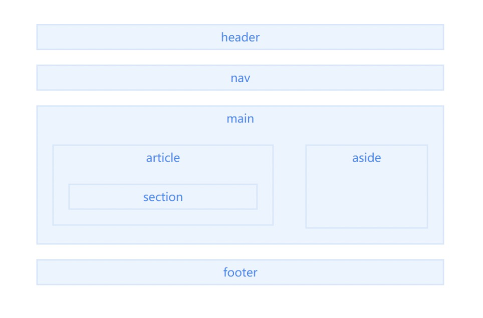

## 经典真题

- 说说对 _html_ 语义化的理解

## 1. 什么是语义元素?

语义是指对一个词或句子含义的正确解释。很多 _HTML_ 标签也具有语义的意义，也就是元素本身传达了关于标签所包含内容类型的一些信息。例如，当浏览器解析到 `<h1></h1>` 标签时，它将该标签解释为包含这一块内容的最重要的标题。_h1_ 标签的语义就是用它来标识特定网页或部分最重要的标题。

## 2. 为什么要语义化?

- 代码结构：使页面没有 _css_ 的情况下，也能够呈现出很好的内容结构
- **有利于 _SEO_**：爬虫依赖标签来确定关键字的权重，因此可以和搜索引擎建立良好的沟通，帮助爬虫抓取更多的有效信息
- 提升用户体验：例如 _title_、_alt_ 可以用于解释名称或者解释图片信息，以及 _label_ 标签的灵活运用
- 便于团队开发和维护：语义化使得代码更具有可读性，让其他开发人员更加理解你的 _html_ 结构，减少差异化
- **方便其他设备解析**：如屏幕阅读器、盲人阅读器、移动设备等，以有意义的方式来渲染网页

## 3. _HTML5_ 常用的语义元素

_HTML5_ 提供了新的语义元素来定义网页的不同部分，它们被称为"切片元素"，如下：

- header：用于定义页面的头部区域，通常包括网站 logo、主导航、全站链接以及搜索框。
- nav：定义页面的导航链接部分区域。
- main：定义文档的主要内容，**该内容在文档中应当是独一无二的**
- article：定义页面独立的内容，它可以有自己的 header、footer、sections 等，专注于单个主题的博客文章，报纸文章或网页文章。
- section：表示文档中的一个区域（或节），比如，内容中的一个专题组。
- aside：表示一个和其余页面内容几乎无关的部分，被认为是独立于该内容的一部分且可以被单独的拆分出来而不会影响整体。通常表现为侧边栏或嵌入内容。
- footer：定义最近一个章节内容或者根节点元素的页脚。一个页脚通常包含该章节作者、版权数据或者与文档相关的链接等信息。

大约有 100 多个 HTML 语义元素可供选择

> 更多的语义化标签可以参阅：[HTML 元素参考](https://developer.mozilla.org/en-US/docs/Web/HTML/Element)

## 4. 无障碍网页

_W3C_ 在 _1997_ 年发起了一项 _WAI（Web Accessibility Initiative）_ 的计划，该计划的目标是提升网站的易用性(_accessibility_)，而其中有一个很重要的指标，那就是能够被残障人士使用的网站才能称得上一个易用的（易访问的）网站。

**HTML5 在无障碍方面进行了加强，加入了无障碍属性。**

所谓 _HTML5_ 无障碍属性，主要针对的是视觉缺陷，失聪，行动不便的残疾人以及假装残疾的测试人员。尤其像盲人，眼睛看不到，其浏览网页则需要借助辅助设备，如屏幕阅读器，屏幕阅读机可以大声朗读或者输出盲文。

而 _HTML5_ 无障碍属性就是可以让屏幕阅读器准确识别网页中的内容，变化，状态的技术规范，可以让盲人这类用户也能无障碍阅读！

> 关于无障碍的更多说明，参阅：[无障碍](https://developer.mozilla.org/zh-CN/docs/Web/Accessibility)

**常见的无障碍属性**

_WAI-ARIA_ 是 _W3C_ 编写的规范，定义了一组可用于其他元素的 _HTML_ 特性，用于提供额外的语义化以及改善缺乏的可访问性。以下是规范中三个主要的特性：

- 角色：这定义了元素是干什么的。许多「标志性的角色」，其实重复了 _HTML5_ 的结构元素的语义价值。例如 _role="navigation" (nav)_ 或者 _role="complementary" (aside)_。

- 属性：我们能通过定义一些属性给元素，让他们具备更多的语义。例如：_aria-required="true"_ 意味着元素在表单上是必填的。然而 _aria-labelledby="label"_ 允许在元素上设置一个 _ID_，用于 _labelledby_ 引用作为屏幕阅读器指定的 _label_ 内容 ，多个也可以。

- 状态：用于表达元素当前的条件的特殊属性，例如 _aria-disabled="true"_，屏幕阅读器就会这个表单禁止输入。状态和属性的差异之处就是：属性在应用的生命周期中不会改变，而状态可以，通常我们用编程的方法改变它，例如 _Javascript_。

关于 _WAI-ARIA_ 属性重要的一点是它不会对 _Web_ 页面有任何影响，除了让更多的信息从浏览器暴露给 _accessibility APIs (无障碍 API)_，这也是屏幕阅读器这一类软件的信息源。_WAI-ARIA_ 不会影响网页的结构，以及 _DOM_ 等等，尽管这些属性可用于作为 _CSS_ 选择器。

> 更多无障碍属性，参阅：[_WAI-ARIA_ 基础](https://developer.mozilla.org/zh-CN/docs/Learn_web_development/Core/Accessibility/WAI-ARIA_basics)

## 真题解答

- 说说对 _html_ 语义化的理解
  语义化的目的主要有以下几点：
  1. 去掉或者丢失样式的时候能够让页面呈现出清晰的结构
  2. 有利于 _SEO_：和搜索引擎建立良好沟通，有助于爬虫抓取更多的有效信息（爬虫依赖于标签来确定上下文和各个关键字的权重）
  3. 方便其他设备解析（如屏幕阅读器、盲人阅读器、移动设备）以有意义的方式来渲染网页
  4. 便于团队开发和维护，语义化更具可读性，遵循 _W3C_ 标准的团队都遵循这个标准，可以减少差异化。_HTML5_ 中新增加的很多标签，例如：_arctilce_、_nav_、_header_ 和 _footer_ 等，就是基于语义化设计原则。
