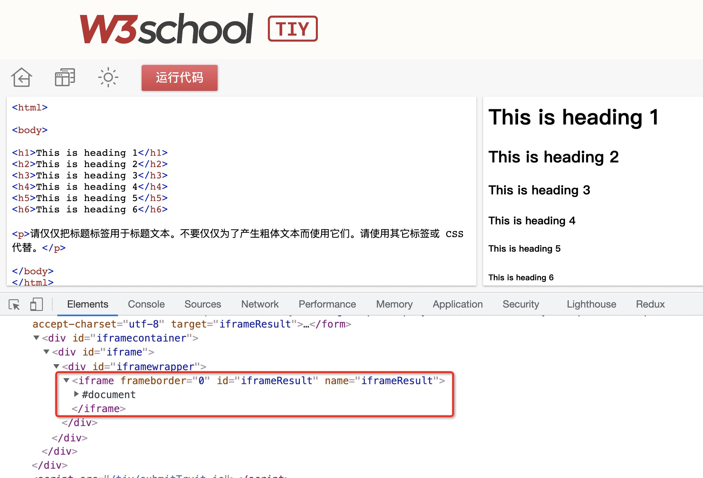
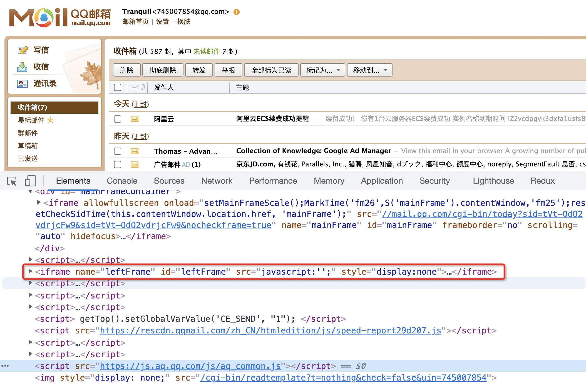

## 经典真题

- _iframe_ 是用来干什么的 ? 有哪些优缺点 ?

## 1. _iframe_ 介绍

_iframe_ 称之为嵌入式框架，嵌入式框架可以把一个完整的网页内容嵌入到现有的网页中。

下面是一个简单示例：

```html
<body>
  <h3>iframe测试</h3>
  <iframe
    src="https://www.jd.com/"
    frameborder="0"
    width="1200"
    height="600"
  ></iframe>
</body>
```

效果：


早期，_iframe_ 在开发中用得很多。使用 _iframe_ 可以很方便的制作一个页面的公共部分，例如导航栏。

现在还能找到一些使用 _iframe_ 的网站（大多是旧项目）

例如 _W3school_：



再比如邮箱：



但是随着 _Ajax_ 的出现，_iframe_ 用得越来越少了。现在还在特定的场景可以看到，比如模拟窗口、邮箱或者 _HTML_ 在线编辑器等。

究其原因，是因为 _iframe_ 有种种不便，比如一个直观的问题就是 _iframe_ 的自适应高度，这是处理起来比较麻烦的问题，随便百度下都是一大串的代码。

另外还有个重大的缺点，那就是搜索引擎的 "爬虫" 程序无法解读这种页面，当 "爬虫" 遇到多个页面嵌套的网页时只看到框架却找不到链接，然后认定此网站是死站点并离开。这对于 _SEO_ 来讲无疑是毁灭性的打击。并且使用大量的 _iframe_ 标签也会稀释你该页面的关键词密度并对其产生影响。

## 真题解答

- iframe 用来干什么的 ? 有哪些优缺点 ?

  _iframe_ 也称作嵌入式框架，嵌入式框架和网页类似，它可以把一个网页的框架和内容嵌入到现有的网页中。

  **优点**

  - 重载页面时不需要重载整个页面，只需要重载页面中的一个框架页（减少了数据传输，增加了网页的下载速度）
  - 方便制作导航栏

  **缺点**

  - 会产生很多页面，不容易管理
  - 调用外部页面，需要额外调用 _CSS_，给页面带来额外的请求次数
  - 会阻塞页面的加载，_window_ 的 _onload_ 事件需要在所有的 _iframe_ 加载完毕后（包含里面的元素）才会触发
  - 浏览器的后退按钮无效
  - **无法被一些搜索引擎索引到**
  - 多数小型的移动设备无法完全显示框架

综上，由于诸多缺点，因此不符合标准网页设计的理念，已经被标准网页设计抛弃，目前框架的所有优点完全可以使用 _Ajax_ 实现，因此已经没有必要使用 _iframe_ 框架了。
