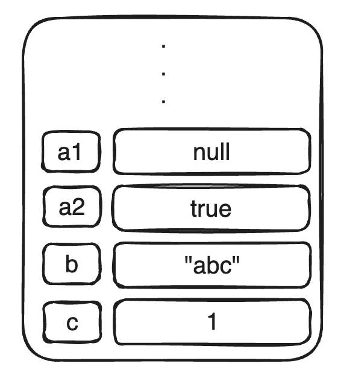
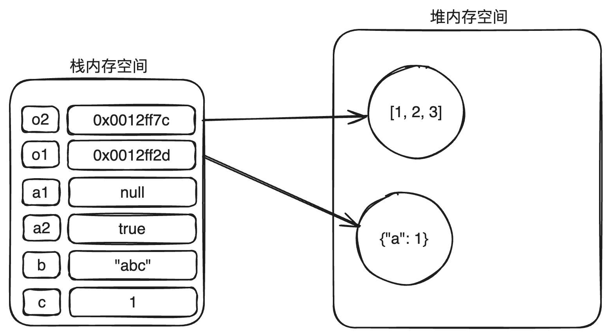

## 经典真题

- _JS_ 中的数据类型有哪些？基本类型和引用类型的区别是什么？

## 1. 简单值和复杂值

_JS_ 的数据类型就分为两大类：

- 简单值（基本类型、原始类型）
- 复杂值（引用类型、引用值）

### 1.1. 简单值

一共有 _7_ 种：

- _number_ 数字
- _string_ 字符串
- _boolean_ 布尔值
- _null_ 空值
- _undefined_ 未定义
- _symbol_ 符号
- _bigint_ 大数

所谓简单值，是因为**这些类型的值，无法再继续往下拆分**。

#### 1.1.1. 注意

1. **_symbol_** 和 **_bigint_**

   - 这两个数据类型是从 _ES6_ 开始新增的。
   - _symbol_ 主要用于**创建唯一的标识符**。_symbol_ 的值是唯一且不可变的，适用于作为对象属性的键，以及保证不会与其他属性键发生冲突，特别是在多人合作的大型项目中或着是用第三方库的时候。
   - _bigint_ 是一个新增的基础数据类型，它于 _ECMAScript 2020_（_ES11_）中被正式添加到语言标准中。_bigint_ 数据类型用于表示大于 `Number.MAX_SAFE_INTERGER`（即 `2^53 - 1`）或小于 `Number.MIN_SAFE_INTERGER`（即 `-2^53 + 1`）的整数。这个类型**提供了一种在 _JS_ 中安全处理非常大的整数的方法**，这在之前的 _JS_ 版本中是不可能的。这种类型非常适合用于在金融、科学计算和加密等领域。

2. **_null_** 和 **_undefined_**

> 问题 1：为什么 _null_ 的数据类型打印出来是 _object_ ?

```javascript
console.log(null); // object
console.log(undefined); // undefined
```

这是 _JS_ 从第一个版本开始时，**设计上的一个遗留问题**。最初的 _JS_ 语言实现是在 _1995_ 年由 _Brendan Eich_ 在 _Netscape Navigator_ 中设计的。在 _JS_ 最初的版本中，**数据类型是使用底层的位模式来标识的，每种数据类型的前几位是用来表示类型信息的**。例如，**对象的类型标记通常以 _00_ 开头**，而由于一个历史错误，**_null_ 被表示为全零（_00000000_）**，这就使得 _null_ 的类型检查结果与对象一致。

虽然这个行为在技术上是不正确的（因为 _null_ 既不是对象也不包含任何属性），但改变这个行为可能会破坏大量现存的 _Web_ 页面和应用。因此，尽管这是一个众所周知的问题，但由于向后兼容性的考虑，这个设计决策一直未被修改。

不仅没有被修改，这个行为目前还被 _ECMAScript_ 标准所采纳，成为了规范的一部分，所有遵循 _ECMAScript_ 标准的 _JS_ 实现都默认在 _typeof null_ 时返回 _object_。

> 问题 2：为什么 _undefined_ 和 _null_ 明明是两种基础数据类型，但 `undefined == null` 返回的是 `true` ?

```javascript
console.log(undefined == null); // true
console.log(undefined === null); // false
```

这是由语言规范决定的。

- `undefined` 表示变量未定义或未赋值，而 `null` 表示变量已定义但值为空。尽管含义不同，但它们都表示 “无值” 状态，因此在某些情况下可以互换。

- 在非严格相等比较（==）中，_JavaScript_ 会进行隐式类型转换。根据规范，`undefined` 和 `null` 在比较时都不会转换为其他类型，且它们都被认为是 “假值”，因此 `undefined == null` 返回 `true`。

- 根据 _ECMAScript_ 规范，`undefined == null` 是明确规定的行为。

注意：

- 使用严格相等（===）时，`undefined` 和 `null` 不相等，因为它们的类型不同（`undefined` 是 `undefined` 类型，`null` 是 `object` 类型）。

目前，关于 `null` 和 `undefined` 的一些区别：

- `null`：表示一个明确的 "空值" 或 "无对象" 的占位符。
  - 显式地将一个变量设置为 "空值"。
  - 作为函数地返回值，表示 "无结果" 或 "无对象"。
  - 作为对象属性的值，表示该属性为 "空"。如原型链的终点。
  - 转为数值时会被转换为 `0`。
- `undefined`：表示变量已声明但未赋值，或者访问对象中不存在的属性。
  - 变量声明但未初始化时，默认值为 `undefined`。
  - 函数没有明确返回值时，默认返回 `undefined`。
  - 访问对象中不存在的属性时，返回 `undefined`。
  - 转为数值时值为 `NaN`。

### 1.2. 复杂值

就一种：

- _object_

之所以称为复杂值，就是因为**这种类型的值可以继续往下拆分**，分为多个简单值或复杂值。

**数组、函数、正则这些统统都是对象类型，属于复杂值**。

```javascript
console.log(typeof []); // object
console.log(typeof function () {}); // function
console.log(typeof /ab/); // object
```

**函数的本质也是对象**。可以添加属性和方法。

```javascript
function fun() {}

fun.a = 'aaaa';
fun.test = function () {
  console.log('this is a test function');
};

console.log(fun.a); // aaaa
fun.test(); // this is a test function
```

在函数内部，有一个特别的内部属性 `[[Call]]`，这属于内部代码，开发者层面是没有办法调用的。**有了这个属性之后，表示这个对象是可以被调用**。

因为函数是可调用的对象，为了区分**普通对象**和**函数对象**，当我们用 `typeof` 操作符检测一个函数时，返回的是 `function`。

正因为这种设计，所以 _JS_ 中能够实现高阶函数。高阶函数定义如下（满足一个条件即可）：

- 接受一个或多个函数作为输入。
- 输出一个函数。

因为在 _JS_ 中，函数的本质就是对象，所以可以像普通对象一样，作为参数或返回值进行传递。

## 2. 两者之间的本质区别

内存的存储区域可以分为 **栈** 和 **堆** 两大块。

- 栈内存：栈内存因为其数据大小和生命周期的可预测性而易于管理和快速访问。栈支持快速的数据分配和销毁过程，但它**不适合复杂的或大规模的数据结构**。
- 堆内存：堆内存更加灵活，可以动态地分配和释放空间，**适合存储生命周期长或大小不确定的数据**。使用堆内存可以有效地管理大量的数据，但相对于栈来说，其管理成本更高，访问速度也较慢。

对于**简单值而言，它们通常存储在栈内存里面**。栈内存的特点是管理简单且访问速度快，适用于存储**大小固定、生命周期短**的数据。简单值的存储通常包括直接在栈内存中分配的数据空间，并且直接存储了数据的实际值。



对于复杂值而言，**具体的值是存储在堆内存里面**的。因为复杂值往往大小是不固定的，无法在栈区分配一个固定大小的内存，因此具体的数据放在堆里面。**栈区会存储一个内存地址**，通过该内存地址可以访问到堆区里面具体的数据。



> 注意：**在 _JS_ 中调用函数的时候，统统都是值传递，而非引用传递**。

```javascript
function test(obj) {
  obj.a = 1000;
}
const obj = {};
console.log(obj); // {}
test(obj);
console.log(obj); // { a: 1000 }
```

上面的代码，有一定的迷惑性。从结果看，调用函数之后，`obj` 发生了真实的修改，所以这是一个引用传递。

**但是这里仍然是一个值传递**。只是这里的值背后对应的是一个地址值，这个地址值和简单值一模一样，会被复制一份传递给函数，然后函数内部拿到的是地址值，就可以通过这个地址值找到同一份堆区数据。

```javascript
function test(obj) {
  obj = {}; // 这里赋值一个新对象，不再使用原来的对象
  obj.a = 1000;
}
const obj = {};
console.log(obj); // {}
test(obj);
console.log(obj); // {}
```

如果是真正的引用传递，那么函数内部的 `obj` 和外部的 `obj` 是绑在一起的，函数内部对 `obj` 做任何修改，都会影响外部。但是上面的代码中，很明显在函数内部对 `obj` 重新赋值后，断开了内外的联系，因此，**在 _JS_ 中只有值传递**。（_C、C#_ 可以实现真正的引用传递）

## 3. 两者之间的行为区别

### 3.1. 访问方式

简单值是**按值访问**，也就是说，一个变量如果存储的是一个简单值，当访问这个变量的时候，得到的就是对应的值。

复杂值也是**按值访问**，但是由于值对应的是一个**内存地址值**，一般不能够直接使用，还需要进一步获取地址值背后对应的值。

### 3.2. 比较方式

**无论是简单值，还是复杂值，都是进行的值比较**。不过由于复杂值对应的值是一个**内存地址值**，因此只有在这个内存地址值相同时，才会被认为是相等。

### 3.3. 动态属性

**复杂值，可以动态的为其添加属性和方法，这一点简单值是做不到的**。

如果为简单值动态添加属性，不会报错，会静默失败，访问时返回的值为 `undefined`。

如果为简单值动态添加方法，不会报错，会静默失败，但是访问时会报错 `xxx is not a function`。

```javascript
const a = 1;
a.b = 2;
console.log(a.b); // undefined
a.c = function () {};
a.c(); // error
```

### 3.4. 变量赋值

他们都是**将值复制一份，然后赋值给另外一个变量**。

不过由于复杂值复制的是**内存地址**，因此修改新的变量会对旧的变量有影响。
