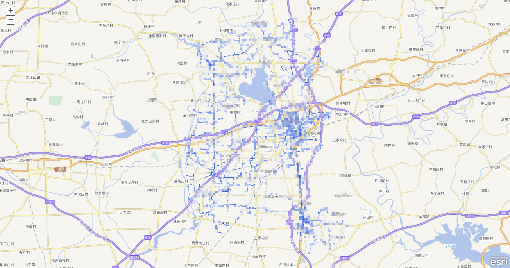

## 1. 使用拼接token的方式

### 1.1. 代码

```html
<!DOCTYPE html>
<html>
  <head>
    <meta http-equiv="Content-Type" content="text/html; charset=utf-8" />
    <meta
      name="viewport"
      content="initial-scale=1, maximum-scale=1,user-scalable=no"
    />
    <title>test</title>
    <link
      rel="stylesheet"
      href="https://js.arcgis.com/3.31/esri/css/esri.css"
    />
    <script src="https://cdn.bootcdn.net/ajax/libs/jquery/1.11.1/jquery.min.js"></script>
    <!-- <script src="../jquery-1.11.1.min.js"></script> -->
    <style>
      html,
      body,
      #map {
        height: 100%;
        width: 100%;
        margin: 0;
        padding: 0;
      }
    </style>
    <script src="https://js.arcgis.com/3.31/"></script>
    <script>
      require([
        'esri/map',
        'esri/layers/WebTiledLayer',
        'esri/layers/TileInfo',
        'esri/geometry/Point',
        'esri/layers/ArcGISDynamicMapServiceLayer',
        'esri/dijit/OverviewMap',
        'dojo/domReady!',
      ], function (
        Map,
        WebTiledLayer,
        TileInfo,
        Point,
        ArcGISDynamicMapServiceLayer,
        OverviewMap
      ) {
        var map = new Map('map', {
          center: [0, 0],
          zoom: 0,
        });
        console.log(map);
        map.on('click', (e) => {
          console.log(e, 'e');
        });

        var tileInfo = new TileInfo({
          dpi: 90.71428571427429,
          rows: 256,
          cols: 256,
          compressionQuality: 0,
          origin: {
            x: -180,
            y: 90,
          },
          spatialReference: {
            wkid: 4326,
          },
          lods: [
            {
              level: 2,
              levelValue: 2,
              resolution: 0.3515625,
              scale: 147748796.52937502,
            },
            {
              level: 3,
              levelValue: 3,
              resolution: 0.17578125,
              scale: 73874398.264687508,
            },
            {
              level: 4,
              levelValue: 4,
              resolution: 0.087890625,
              scale: 36937199.132343754,
            },
            {
              level: 5,
              levelValue: 5,
              resolution: 0.0439453125,
              scale: 18468599.566171877,
            },
            {
              level: 6,
              levelValue: 6,
              resolution: 0.02197265625,
              scale: 9234299.7830859385,
            },
            {
              level: 7,
              levelValue: 7,
              resolution: 0.010986328125,
              scale: 4617149.8915429693,
            },
            {
              level: 8,
              levelValue: 8,
              resolution: 0.0054931640625,
              scale: 2308574.9457714846,
            },
            {
              level: 9,
              levelValue: 9,
              resolution: 0.00274658203125,
              scale: 1154287.4728857423,
            },
            {
              level: 10,
              levelValue: 10,
              resolution: 0.001373291015625,
              scale: 577143.73644287116,
            },
            {
              level: 11,
              levelValue: 11,
              resolution: 0.0006866455078125,
              scale: 288571.86822143558,
            },
            {
              level: 12,
              levelValue: 12,
              resolution: 0.00034332275390625,
              scale: 144285.93411071779,
            },
            {
              level: 13,
              levelValue: 13,
              resolution: 0.000171661376953125,
              scale: 72142.967055358895,
            },
            {
              level: 14,
              levelValue: 14,
              resolution: 8.58306884765625e-5,
              scale: 36071.483527679447,
            },
            {
              level: 15,
              levelValue: 15,
              resolution: 4.291534423828125e-5,
              scale: 18035.741763839724,
            },
            {
              level: 16,
              levelValue: 16,
              resolution: 2.1457672119140625e-5,
              scale: 9017.8708819198619,
            },
            {
              level: 17,
              levelValue: 17,
              resolution: 1.0728836059570313e-5,
              scale: 4508.9354409599309,
            },
            {
              level: 18,
              levelValue: 18,
              resolution: 5.3644180297851563e-6,
              scale: 2254.4677204799655,
            },
            {
              level: 19,
              levelValue: 19,
              resolution: 2.68220901489257815e-6,
              scale: 1127.23386023998275,
            },
            {
              level: 20,
              levelValue: 2,
              resolution: 1.341104507446289075e-6,
              scale: 563.616930119991375,
            },
          ],
        });

        var vecLayer = new WebTiledLayer(
          'http://{subDomain}.tianditu.com/DataServer?T=vec_c&x={col}&y={row}&l={level}&tk=3fc715d47bc5243b5230875b4fe84a65',
          {
            subDomains: ['t0', 't1', 't2', 't3', 't4', 't5', 't6', 't7'],
            tileInfo: tileInfo,
          }
        );
        var labelLayer = new WebTiledLayer(
          'http://{subDomain}.tianditu.com/DataServer?T=cva_c&x={col}&y={row}&l={level}&tk=3fc715d47bc5243b5230875b4fe84a65',
          {
            subDomains: ['t0', 't1', 't2', 't3', 't4', 't5', 't6', 't7'],
            tileInfo: tileInfo,
          }
        );
        map.addLayer(vecLayer);
        map.addLayer(labelLayer);
        var username = 'arcgis123';
        var password = 'arcgis!@#123';
        var tokenvalue = $.ajax({
          type: 'POST',
          url: 'http://xxx.xxx.xx.xx:xxxx/arcgis/tokens/generateToken',
          data: {
            username: username,
            password: password,
            client: 'requestip',
            expiration: '60',
            f: 'json',
          },
          dataType: 'json', //dataType不能少
        });
        if (tokenvalue) {
          tokenvalue
            .success(function (response) {
              if (response.token) {
                //成功生成token
                console.log(response.token);
                var layerUrl =
                  'http://xxx.xxx.xx.xx:xxxx/arcgis/rest/services/xx/xxxx/MapServer?token=' +
                  response.token;
                var layer = new ArcGISDynamicMapServiceLayer(layerUrl);
                map.addLayer(layer);
              }
            })
            .error(function (err) {
              console.log('操作失败。err:' + err);
            });
        }

        map.centerAndZoom(
          new Point({
            x: 120.429961458006,
            y: 36.855850355488756,
            spatialReference: {
              wkid: 4326,
            },
          }),
          9
        );
      });
    </script>
  </head>

  <body>
    <div id="map"></div>
  </body>
</html>
```

### 1.2. 结果展示



### 1.3. 参考

> 官网文档

[令牌和令牌服务](https://help.arcgis.com/zh-cn/arcgisserver/10.0/help/arcgis_server_java_help/index.html#//0092000000p2000000)

> 博客文章

[arcgis api for javascript 3.x 通过"url?token="动态拼接的方式访问 server 的安全服务](https://mp.weixin.qq.com/s/wGe2Gb-eiNpauXwjILwxpA)

## 2. 使用`IdentityManager.registerToken`注册token

### 2.1. 代码

```html
<!DOCTYPE html>
<html>
  <head>
    <meta http-equiv="Content-Type" content="text/html; charset=utf-8" />
    <meta
      name="viewport"
      content="initial-scale=1, maximum-scale=1,user-scalable=no"
    />
    <title>test</title>
    <link
      rel="stylesheet"
      href="https://js.arcgis.com/3.31/esri/css/esri.css"
    />
    <script src="https://cdn.bootcdn.net/ajax/libs/jquery/1.11.1/jquery.min.js"></script>
    <!-- <script src="../jquery-1.11.1.min.js"></script> -->
    <style>
      html,
      body,
      #map {
        height: 100%;
        width: 100%;
        margin: 0;
        padding: 0;
      }
    </style>
    <script src="https://js.arcgis.com/3.31/"></script>
    <script>
      require([
        'esri/map',
        'esri/layers/WebTiledLayer',
        'esri/layers/TileInfo',
        'esri/geometry/Point',
        'esri/layers/ArcGISDynamicMapServiceLayer',
        'esri/dijit/OverviewMap',
        'esri/IdentityManager',
        'dojo/domReady!',
      ], function (
        Map,
        WebTiledLayer,
        TileInfo,
        Point,
        ArcGISDynamicMapServiceLayer,
        OverviewMap,
        IdentityManager
      ) {
        var map = new Map('map', {
          center: [0, 0],
          zoom: 0,
        });
        console.log(map);
        map.on('click', (e) => {
          console.log(e, 'e');
        });

        var tileInfo = new TileInfo({
          dpi: 90.71428571427429,
          rows: 256,
          cols: 256,
          compressionQuality: 0,
          origin: {
            x: -180,
            y: 90,
          },
          spatialReference: {
            wkid: 4326,
          },
          lods: [
            {
              level: 2,
              levelValue: 2,
              resolution: 0.3515625,
              scale: 147748796.52937502,
            },
            {
              level: 3,
              levelValue: 3,
              resolution: 0.17578125,
              scale: 73874398.264687508,
            },
            {
              level: 4,
              levelValue: 4,
              resolution: 0.087890625,
              scale: 36937199.132343754,
            },
            {
              level: 5,
              levelValue: 5,
              resolution: 0.0439453125,
              scale: 18468599.566171877,
            },
            {
              level: 6,
              levelValue: 6,
              resolution: 0.02197265625,
              scale: 9234299.7830859385,
            },
            {
              level: 7,
              levelValue: 7,
              resolution: 0.010986328125,
              scale: 4617149.8915429693,
            },
            {
              level: 8,
              levelValue: 8,
              resolution: 0.0054931640625,
              scale: 2308574.9457714846,
            },
            {
              level: 9,
              levelValue: 9,
              resolution: 0.00274658203125,
              scale: 1154287.4728857423,
            },
            {
              level: 10,
              levelValue: 10,
              resolution: 0.001373291015625,
              scale: 577143.73644287116,
            },
            {
              level: 11,
              levelValue: 11,
              resolution: 0.0006866455078125,
              scale: 288571.86822143558,
            },
            {
              level: 12,
              levelValue: 12,
              resolution: 0.00034332275390625,
              scale: 144285.93411071779,
            },
            {
              level: 13,
              levelValue: 13,
              resolution: 0.000171661376953125,
              scale: 72142.967055358895,
            },
            {
              level: 14,
              levelValue: 14,
              resolution: 8.58306884765625e-5,
              scale: 36071.483527679447,
            },
            {
              level: 15,
              levelValue: 15,
              resolution: 4.291534423828125e-5,
              scale: 18035.741763839724,
            },
            {
              level: 16,
              levelValue: 16,
              resolution: 2.1457672119140625e-5,
              scale: 9017.8708819198619,
            },
            {
              level: 17,
              levelValue: 17,
              resolution: 1.0728836059570313e-5,
              scale: 4508.9354409599309,
            },
            {
              level: 18,
              levelValue: 18,
              resolution: 5.3644180297851563e-6,
              scale: 2254.4677204799655,
            },
            {
              level: 19,
              levelValue: 19,
              resolution: 2.68220901489257815e-6,
              scale: 1127.23386023998275,
            },
            {
              level: 20,
              levelValue: 2,
              resolution: 1.341104507446289075e-6,
              scale: 563.616930119991375,
            },
          ],
        });

        var vecLayer = new WebTiledLayer(
          'http://{subDomain}.tianditu.com/DataServer?T=vec_c&x={col}&y={row}&l={level}&tk=3fc715d47bc5243b5230875b4fe84a65',
          {
            subDomains: ['t0', 't1', 't2', 't3', 't4', 't5', 't6', 't7'],
            tileInfo: tileInfo,
          }
        );
        var labelLayer = new WebTiledLayer(
          'http://{subDomain}.tianditu.com/DataServer?T=cva_c&x={col}&y={row}&l={level}&tk=3fc715d47bc5243b5230875b4fe84a65',
          {
            subDomains: ['t0', 't1', 't2', 't3', 't4', 't5', 't6', 't7'],
            tileInfo: tileInfo,
          }
        );
        map.addLayer(vecLayer);
        map.addLayer(labelLayer);
        var username = 'arcgis';
        var password = 'arcgis';
        var tokenvalue = $.ajax({
          type: 'POST',
          url: 'http://xxx.xx.xx:xxxx/arcgis/tokens/generateToken',
          data: {
            username: username,
            password: password,
            client: 'requestip',
            expiration: '60',
            f: 'json',
          },
          dataType: 'json', //dataType不能少
        });
        if (tokenvalue) {
          tokenvalue
            .success(function (response) {
              if (response.token) {
                //成功生成token
                console.log(response.token);
                var layerUrl =
                  'http://xxx.xx.xx:xxxx/arcgis/rest/services/yy/yyyyy/MapServer';
                IdentityManager.registerToken({
                  server: 'http://xxx.xx.xx:xxxx/arcgis/rest/services',
                  token: response.token,
                });
                var layer = new ArcGISDynamicMapServiceLayer(layerUrl);
                map.addLayer(layer);
              }
            })
            .error(function (err) {
              console.log('操作失败。err:' + err);
            });
        }

        map.centerAndZoom(
          new Point({
            x: 120.429961458006,
            y: 36.855850355488756,
            spatialReference: {
              wkid: 4326,
            },
          }),
          9
        );
      });
    </script>
  </head>

  <body>
    <div id="map"></div>
  </body>
</html>

```

### 2.2. 结果展示


### 2.3. 参考

[arcgis api for javascript通过IdentityManager注册token的方式访问server安全服务](https://mp.weixin.qq.com/s/zxQPSm3ztWnWXLIvYOB1vQ)
