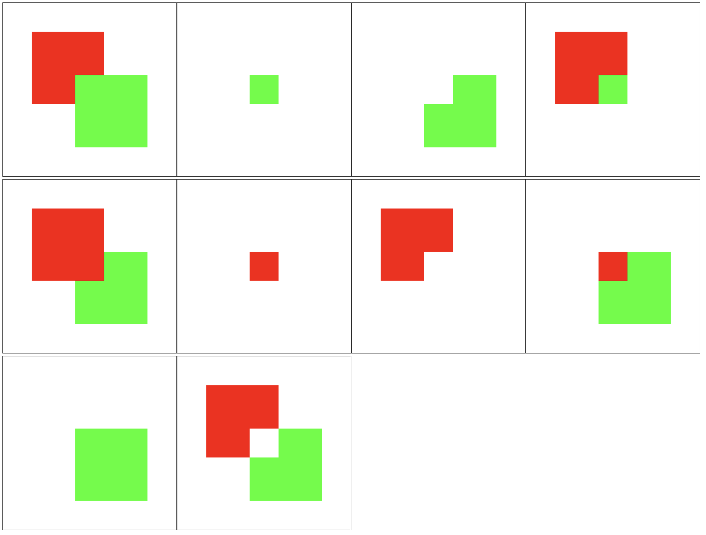
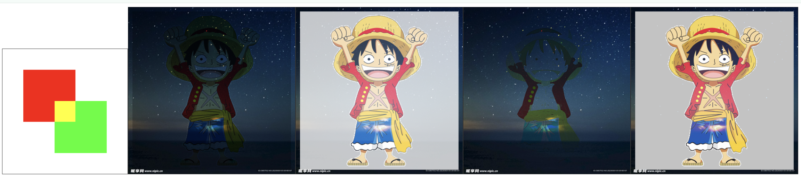
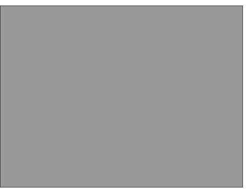

将前后图形合成一个图形

`ctx.globalCompositeOperation` 属性，设置合成机制。需要在前后两个图形中间设置。

## 6.1. 路径合成（形状合成）

- _source-over_：默认值，后面的图形覆盖在前面的图形上
- _source-in_：展示后面图形与前面图形重叠部分
- _source-out_：展示后面图形与前面图形不重叠部分
- _source-atop_：展示前面图形不重叠部分 和 后面图形重叠部分
- _destination-系列_：与上述合成特点一样，只是前后图形互换
  - _destination-over_
  - _destination-in_
  - _destination-out_
  - _destination-atop_
- _copy_：后面的正常显示，前面的不显示
- _xor_：展示前后不重叠的部分

```javascript
const ctx = canvas.getContext('2d');

ctx.beginPath();
ctx.fillStyle = '#f00';
ctx.rect(50, 50, 200, 200);
ctx.fill();

ctx.globalCompositeOperation = 'source-over'; // 展示前面的不重叠部分和后面的重叠部分
// ...

ctx.beginPath();
ctx.fillStyle = '#0f0';
ctx.rect(150, 150, 200, 200);
ctx.fill();
```

> 效果如下：

下方效果与上面列举的参数依次对应



## 6.2. 颜色合成

关注颜色的混合，图形的形状没有变化。

`ctx.globalCompositeOperation` 属性，设置合成机制。需要在前后两个图形中间设置。

- _lighter_：重叠部分的颜色相加
- _multiply_：整体偏暗
- _screen_：整体偏亮
- _darken_：同一个位置像素的颜色，取暗色，整体偏暗
- _lighten_：同一个位置像素的颜色，取亮色，整体偏亮

```javascript
/* 方块颜色融合 */
const ctx = canvas.getContext('2d');

ctx.beginPath();
ctx.fillStyle = '#f00';
ctx.rect(50, 50, 125, 125);
ctx.fill();

ctx.globalCompositeOperation = 'lighter';

ctx.beginPath();
ctx.fillStyle = '#0f0';
ctx.rect(125, 125, 125, 125);
ctx.fill();
```

```javascript
/* 图片进行合成 */
const ctx = canvas.getContext('2d');

const img1 = new Image();
img1.src = '../../imgs/星空.jpg';
img1.onload = () => {
  ctx.beginPath();
  ctx.drawImage(img1, 0, 0);

  /* 在两个图片加载之间，进行颜色合成 */
  ctx.globalCompositeOperation = 'multiply';
};

const img2 = new Image();
img2.src = '../../imgs/路飞.png';
img2.onload = () => {
  ctx.beginPath();
  ctx.drawImage(img2, 200 - img2.width / 2, 200 - img2.height / 2);
};
```

> 效果如下：



## 6.3. 刮刮乐案例

```html
<!DOCTYPE html>
<html lang="en">
  <head>
    <meta charset="UTF-8" />
    <meta name="viewport" content="width=device-width, initial-scale=1.0" />
    <title>Document</title>
    <style>
      canvas {
        border: 1px solid #333;
        position: absolute;
      }

      img {
        position: absolute;
        width: 400px;
        height: 300px;
      }
    </style>
  </head>

  <body>
    
    <script>
      (() => {
        const canvas = document.createElement('canvas');
        document.body.append(canvas);
        if (!canvas.getContext) {
          console.log('浏览器版本过低，不支持 canvas，请升级或更换浏览器');
          return;
        }

        canvas.width = 400;
        canvas.height = 300;

        const ctx = canvas.getContext('2d');

        ctx.beginPath();
        ctx.fillStyle = '#999';
        ctx.fillRect(0, 0, 400, 300);

        ctx.globalCompositeOperation = 'destination-out';

        ctx.beginPath();
        ctx.strokeStyle = '#fff';
        ctx.lineWidth = 20;
        ctx.lineCap = 'round';
        ctx.lineJoin = 'round';

        canvas.onmousedown = (e) => {
          ctx.moveTo(e.offsetX, e.offsetY);

          canvas.onmousemove = (e) => {
            ctx.lineTo(e.offsetX, e.offsetY);
            ctx.stroke();
          };

          canvas.onmouseup = canvas.onmouseout = () => {
            canvas.onmousemove = null;
            canvas.onmouseup = canvas.onmouseout = null;
          };
        };
      })();
    </script>
  </body>
</html>
```

> 效果如下：


