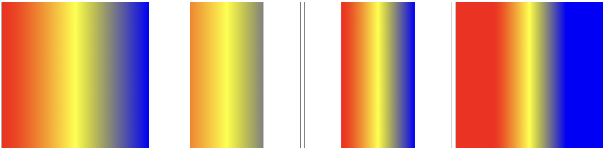

## 7.1. 线性渐变

`ctx.createLinearGradient(x0, y0, x1, y1)` 方法，创建线性渐变的对象 _CanvasGradient_。

- _x0_, _y0_ 和 _x1_, _y1_ 是两个点，会按照两点的连线方向渐变
- **两点是基于画布坐标系的**，可能最终显示效果与预期不符

`gradient.addColorStop(百分比, color)` 方法，设置渐变过程中每一部分的颜色。

`ctx.fillStyle = gradient` 方法，设置渐变填充

`ctx.storkeStyle = gradient` 方法，设置渐变描边

```javascript
/* 
  通过修改渐变点和图形的位置, 会有不同的效果
  想要渐变和图形完全匹配，通过计算可以实现（当前代码对应下图中第三个）
*/
canvas.width = 400;
canvas.height = 400;

const ctx = canvas.getContext('2d');

const gradient = ctx.createLinearGradient(100, 0, 300, 0);
gradient.addColorStop(0, 'red');
gradient.addColorStop(0.5, 'yellow');
gradient.addColorStop(1, 'blue');

ctx.fillStyle = gradient;

ctx.beginPath();
ctx.fillRect(100, 0, 200, 400);
```

> 效果如下：



> 注意：
>
> - 如果渐变范围比图形范围小，图形范围的两侧就是渐变两侧对应的颜色（见上图中第四个）

## 7.2. 径向渐变

`ctx.createRadialGradient(x1, y1, r1, x2, y2, r2)` 方法，创建径向渐变对象。

- _x1_, _y1_, _r1_ 表示渐变开始的圆
- _x2_, _y2_, _r2_ 表示渐变结束的圆

> 注意：
>
> - 一般都是一个大圆，一个小圆才有效果
> - 小圆一定要在大圆内，否则会出现意想不到的效果
> - 小圆以里，大圆以外的范围就是渐变两端的颜色

```javascript
const ctx = canvas.getContext('2d');

const gradient = ctx.createRadialGradient(200, 200, 50, 200, 200, 150);
gradient.addColorStop(0, 'red');
// gradient.addColorStop(0.5, 'yellow');
gradient.addColorStop(1, 'blue');

ctx.fillStyle = gradient;

ctx.beginPath();
ctx.arc(200, 200, 150, 0, Math.PI * 2);
ctx.fill();
```

> 效果如下：
>
> 小圆在中心、在边界、超出边界的三种情况


## 7.3. 锥型渐变

`ctx.createConicGradient(angle, x, y)` 方法，创建一个锥型渐变对象。

- _x_, _y_ 是圆心点坐标
- _angle_ 起始绘制角度，弧度值。默认从三点钟方向开始（_0°_）。

```javascript
const ctx = canvas.getContext('2d');

const gradient = ctx.createConicGradient(Math.PI / 2, 200, 200);
gradient.addColorStop(0, 'red');
gradient.addColorStop(0.5, 'yellow');
gradient.addColorStop(1, 'blue');

ctx.fillStyle = gradient;

ctx.arc(200, 200, 150, 0, Math.PI * 2);
ctx.stroke();
ctx.fill();

/* 可以再覆盖一个圆, 实现环形 */
ctx.beginPath();
ctx.fillStyle = '#fff';
ctx.arc(200, 200, 100, 0, Math.PI * 2);
ctx.fill();
```

> 效果如下：


