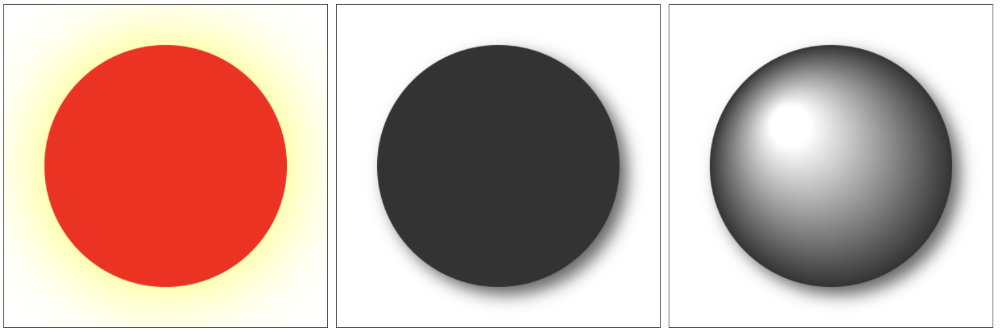

`ctx.shadowBlur` 属性，设置模糊程度，数字越大，越模糊。

`ctx.shadowColor` 属性，设置阴影颜色。

`ctx.shadowOffsetX`，`ctx.shadowOffsetY` 属性，设置阴影的偏移量。

```javascript
/* 基础设置 */
const ctx = canvas.getContext('2d');

ctx.shadowBlur = 100;
ctx.shadowColor = '#ff0';

ctx.beginPath();
ctx.fillStyle = '#f00';
ctx.arc(200, 200, 150, 0, Math.PI * 2);
ctx.fill();

/* 加入偏移 */
const ctx = canvas.getContext('2d');

ctx.shadowBlur = 20;
ctx.shadowColor = '#666';
ctx.shadowOffsetX = 10;
ctx.shadowOffsetY = 10;

ctx.beginPath();
ctx.fillStyle = '#333';
ctx.arc(200, 200, 150, 0, Math.PI * 2);
ctx.fill();

/* 加入渐变 */
const ctx = canvas.getContext('2d');

ctx.shadowBlur = 20;
ctx.shadowColor = '#666';
ctx.shadowOffsetX = 10;
ctx.shadowOffsetY = 10;

ctx.beginPath();
const gradient = ctx.createRadialGradient(150, 150, 25, 200, 200, 150);
gradient.addColorStop(0, '#fff');
gradient.addColorStop(1, '#333');
ctx.fillStyle = gradient;

ctx.arc(200, 200, 150, 0, Math.PI * 2);
ctx.fill();
```

> 效果如下：


