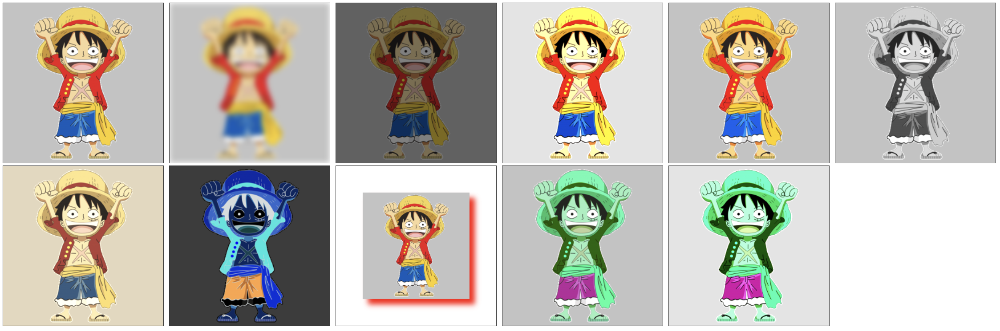

`ctx.filter` 属性，设置一个或多个滤镜。

- _'blur(5px)'_：设置高斯模糊。数值越大越模糊。
- _'brightness(百分比)'_：设置亮度。小于 _1_ 更暗，大于 _1_ 更亮，等于 _0_ 完全显示黑色，等于 _1_ 保持不变。
- _'contrast(百分比)'_：设置对比度。值为 _0_ 会生成完全黑色的绘图，值为 _1_ 保持绘图不变。值小于 _1_，颜色更接近，值大于 _1_，颜色更鲜艳。
- _'saturate(百分比)'_：设置饱和度。值为 _0_ 完全显示黑白色，值为 _1_ 保持不变。
- _'grayscale(百分比 )'_：设置灰度。值为 _0_ 保持不变，值为 _1_ 完全变灰。
- _'sepia(百分比)'_：设置为深褐色（怀旧风格）。值为 _1_ 完全变成深褐色，值为 _0_ 保持不变。
- _'invert(1)'_：设置反色。值为 _0_ 保持不变，值为 _1_ 完全反转，值为 _0.5_ 显示灰色。
- _'drop-shadow(offset-x offset-y blur-radius color)'_：设置阴影。
- _'hue-rotate(90deg)'_：设置色相旋转。值为 _0deg_ 保持不变。
- _'hue-rotate(90deg) contrast(1.5)'_：设置多个滤镜。
- _'url()'_：接受任意一个可以解析为 _SVG_ 滤镜元素的 _URL_。

```javascript
const ctx = canvas.getContext('2d');

ctx.beginPath();
const img = new Image();
img.src = '../imgs/路飞.png';
img.onload = () => {
  // ctx.filter = 'blur(5px)';
  // ctx.filter = 'brightness(0.5)';
  // ctx.filter = 'contrast(1.5)';
  // ctx.filter = 'saturate(1.5)';
  // ctx.filter = 'grayscale(1)';
  // ctx.filter = 'sepia(0.5)';
  // ctx.filter = 'invert(1)';
  // ctx.filter = 'drop-shadow(10px 10px 5px red)';
  // ctx.filter = 'hue-rotate(90deg)';
  // ctx.filter = 'hue-rotate(90deg) contrast(1.5)';
  ctx.drawImage(img, 0, 0, 400, 400);
};
```

> 效果如下：
>
> 第一个是原图，后面依次对应上面的滤镜效果


