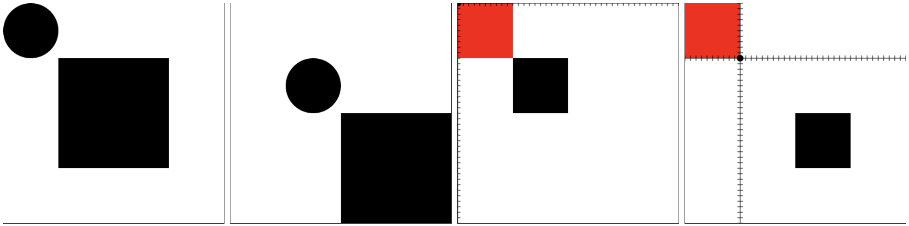
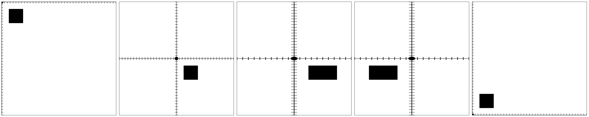
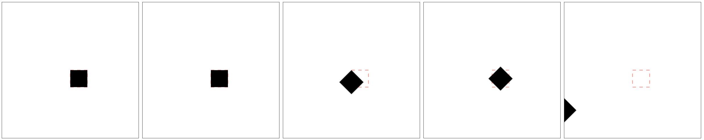
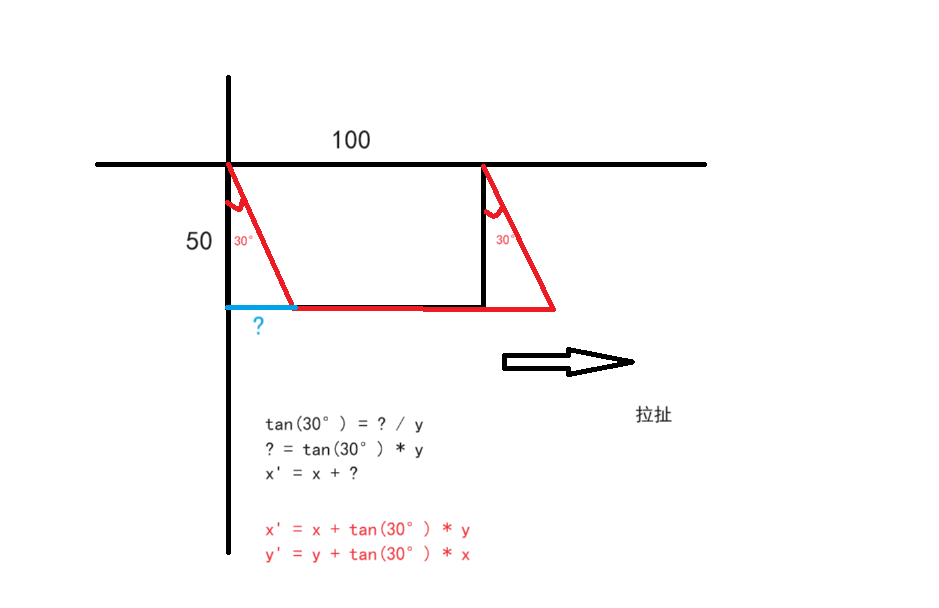
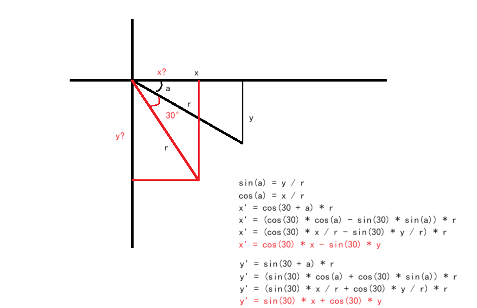
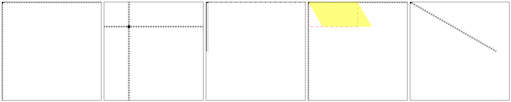

就是对图像进行移动、旋转、缩放、斜切（矩阵斜切）。

## 10.1. 图形移动

移动不是动画，只是视觉位置上的变化，本质上是对坐标系的移动。

`ctx.translate(x, y)` 方法，控制图形位置移动。

- _x_, _y_：_X_ 轴和 _Y_ 轴上移动的距离。

> 注意：
>
> - 这里实际移动的是坐标系，而不是图形
> - 对于之前已经绘制完成的图形没有影响

```javascript
const ctx = canvas.getContext('2d');

/* 之前绘制的图形不变 */
ctx.beginPath();
ctx.fillStyle = '#f00';
ctx.fillRect(0, 0, 100, 100);

/* 开始移动 */
ctx.translate(100, 100);

ctx.beginPath();
ctx.arc(0, 0, 6, 0, Math.PI * 2);
ctx.fill();

ctx.beginPath();
ctx.moveTo(-400, 0);
ctx.lineTo(400, 0);
ctx.stroke();

ctx.beginPath();
ctx.moveTo(0, -400);
ctx.lineTo(0, 400);
ctx.stroke();

for (let i = -400; i <= 400; i += 10) {
  ctx.beginPath();
  ctx.moveTo(i, -5);
  ctx.lineTo(i, 5);
  ctx.stroke();

  ctx.beginPath();
  ctx.moveTo(-5, i);
  ctx.lineTo(5, i);
  ctx.stroke();
}

ctx.beginPath();
ctx.fillStyle = '#000';
ctx.fillRect(100, 100, 100, 100);
```

> 效果如下：



## 10.2. 图形缩放

本质是对坐标系横纵坐标的缩放。

`ctx.scale(xRatio, yRatio)` 方法，设置横纵坐标的缩放比例。

- _ratio > 1_：放大。
- _0 < ratio < 1_：缩小。
- 负数：坐标系方向反转。
- 等于 _0_：经测试，不显示。

```javascript
const ctx = canvas.getContext('2d');

/* 第一个 无更改 */

/* 第二个 移动坐标系 */
// ctx.translate(200, 200);

/* 第三个 将横坐标放大 */
// ctx.translate(200, 200);
// ctx.scale(2, 1);

/* 第四个 将横坐标系方向反转 */
// ctx.translate(200, 200);
// ctx.scale(-2, 1);

/* 第五个 将纵坐标系方向反转，形成数学中的坐标系 */
// ctx.translate(0, 400);
// ctx.scale(1, -1); // 变成数学中的坐标系

ctx.beginPath();
ctx.fillStyle = '#000';
ctx.arc(0, 0, 6, 0, Math.PI * 2);
ctx.fill();

ctx.beginPath();
ctx.moveTo(-400, 0);
ctx.lineTo(400, 0);
ctx.stroke();

ctx.beginPath();
ctx.moveTo(0, -400);
ctx.lineTo(0, 400);
ctx.stroke();

for (let i = -400; i <= 400; i += 10) {
  ctx.beginPath();
  ctx.moveTo(i, -5);
  ctx.lineTo(i, 5);
  ctx.stroke();

  ctx.beginPath();
  ctx.moveTo(-5, i);
  ctx.lineTo(5, i);
  ctx.stroke();
}

ctx.beginPath();
ctx.fillStyle = '#000';
ctx.fillRect(25, 25, 50, 50);
```

> 效果如下：



## 10.3. 图形旋转

本质是对坐标系的旋转。

`ctx.rotate(angle)` 方法，设置旋转角度（从 _x_ 正轴方向，顺时针旋转）。

- _angle_：弧度值。

> 注意：
>
> - 先移动，再旋转 和 先旋转，再移动效果不一样（见下面最后一个示例）

```javascript
/* 原图像 */
const ctx = canvas.getContext('2d');

ctx.beginPath();
ctx.strokeStyle = '#f00';
ctx.setLineDash([10]);
ctx.rect(200, 200, 50, 50);
ctx.stroke();

ctx.beginPath();
ctx.fillStyle = '#000';
ctx.fillRect(200, 200, 50, 50);

/* 移动坐标系 */
const ctx = canvas.getContext('2d');

ctx.beginPath();
ctx.strokeStyle = '#f00';
ctx.setLineDash([10]);
ctx.rect(200, 200, 50, 50);
ctx.stroke();

ctx.translate(200, 200);

ctx.beginPath();
ctx.fillStyle = '#000';
ctx.fillRect(0, 0, 50, 50);

/* 以图形左上角为基准点旋转 */
const ctx = canvas.getContext('2d');

ctx.beginPath();
ctx.strokeStyle = '#f00';
ctx.setLineDash([10]);
ctx.rect(200, 200, 50, 50);
ctx.stroke();

ctx.translate(200, 200);
ctx.rotate((45 * Math.PI) / 180);

ctx.beginPath();
ctx.fillStyle = '#000';
ctx.fillRect(0, 0, 50, 50);

/* 以图形中心为基准点旋转 */
const ctx = canvas.getContext('2d');

ctx.beginPath();
ctx.strokeStyle = '#f00';
ctx.setLineDash([10]);
ctx.rect(200, 200, 50, 50);
ctx.stroke();

ctx.translate(225, 225);
ctx.rotate((45 * Math.PI) / 180);

ctx.beginPath();
ctx.fillStyle = '#000';
ctx.fillRect(-25, -25, 50, 50);

/* 以图形中心为基准点旋转（先旋转再移动） */
const ctx = canvas.getContext('2d');

ctx.beginPath();
ctx.strokeStyle = '#f00';
ctx.setLineDash([10]);
ctx.rect(200, 200, 50, 50);
ctx.stroke();

ctx.rotate((45 * Math.PI) / 180);
ctx.translate(225, 225);

ctx.beginPath();
ctx.fillStyle = '#000';
ctx.fillRect(-25, -25, 50, 50);
```

> 效果如下：



## 10.4. 矩阵变换

`canvas` 没有提供斜切方法，可以利用矩阵变换来实现。

矩阵变换又可以实现所有的图形变换（移动、缩放、旋转、斜切）。

### 10.4.1. 矩阵变换机制

所谓的变换就是将原坐标按照一定的变换公式（逻辑），变换成一个新坐标。即

`(x, y) ---矩阵---> (x', y')`

使用齐次坐标系来进行矩阵变换，可以简化平移计算。

```text
|x|     |a   c   e|       |x'|
|y|  *  |b   d   f|   =   |y'|
|1|     |0   0   1|       |1 |

x' = x*a + y*c + 1*e
y' = x*b + y*d + 1*f
1  = x*0 + y*0 + 1*1
```

`ctx.transform(a, b, c, d, e, f)` 方法，传递转换矩阵，实现图形变换。

### 10.4.2. 矩阵移动

就是在原有 _x, y_ 的基础上，移动指定的数值。

```text
1 0 e
0 1 f
```

_e_ 指定 _x_ 轴上移动的距离，_f_ 指定 _y_ 轴上移动的距离。

```javascript
const ctx = canvas.getContext('2d');

ctx.transform(1, 0, 0, 1, 100, 100);

ctx.beginPath();
ctx.arc(0, 0, 6, 0, Math.PI * 2);
ctx.fill();

ctx.beginPath();
ctx.moveTo(-400, 0);
ctx.lineTo(400, 0);
ctx.stroke();

ctx.beginPath();
ctx.moveTo(0, -400);
ctx.lineTo(0, 400);
ctx.stroke();

for (let i = -400; i <= 400; i += 10) {
  ctx.beginPath();
  ctx.moveTo(i, -5);
  ctx.lineTo(i, 5);
  ctx.stroke();

  ctx.beginPath();
  ctx.moveTo(-5, i);
  ctx.lineTo(5, i);
  ctx.stroke();
}
```

### 10.4.3. 矩阵缩放

就是在原有 _x, y_ 的基础上，乘上指定的倍率。

```text
a 0 0
0 d 0
```

_a_ 指定 _x_ 轴缩放的倍率，_d_ 指定 _y_ 轴缩放到倍率。

```javascript
const ctx = canvas.getContext('2d');

ctx.transform(2, 0, 0, 0.5, 0, 0);

ctx.beginPath();
ctx.arc(0, 0, 6, 0, Math.PI * 2);
ctx.fill();

ctx.beginPath();
ctx.moveTo(-400, 0);
ctx.lineTo(400, 0);
ctx.stroke();

ctx.beginPath();
ctx.moveTo(0, -400);
ctx.lineTo(0, 400);
ctx.stroke();

for (let i = -400; i <= 400; i += 10) {
  ctx.beginPath();
  ctx.moveTo(i, -5);
  ctx.lineTo(i, 5);
  ctx.stroke();

  ctx.beginPath();
  ctx.moveTo(-5, i);
  ctx.lineTo(5, i);
  ctx.stroke();
}
```

### 10.4.4. 矩阵斜切

就是沿 _x_ 轴或 _y_ 轴做一个拉扯，使得与 _x_ 轴或 _y_ 轴形成一个夹角。

- 沿 _x_ 轴斜切，会产生与 _y_ 轴的夹角。
- 沿 _y_ 轴斜切，会产生与 _x_ 轴的夹角。

```text
     1        tan(angle2)    0
tan(angle1)         1        0
```

- _angle1_：向 _y_ 轴方向拉扯，是与 _x_ 轴的夹角，弧度值。
- _angle2_：向 _x_ 轴方向拉扯，是与 _y_ 轴的夹角，弧度值。

> 示意图如下：



```javascript
const ctx = canvas.getContext('2d');

ctx.beginPath();
ctx.arc(0, 0, 6, 0, Math.PI * 2);
ctx.fill();

ctx.beginPath();
ctx.moveTo(-400, 0);
ctx.lineTo(400, 0);
ctx.stroke();

ctx.beginPath();
ctx.moveTo(0, -400);
ctx.lineTo(0, 400);
ctx.stroke();

for (let i = -400; i <= 400; i += 10) {
  ctx.beginPath();
  ctx.moveTo(i, -5);
  ctx.lineTo(i, 5);
  ctx.stroke();

  ctx.beginPath();
  ctx.moveTo(-5, i);
  ctx.lineTo(5, i);
  ctx.stroke();
}

ctx.beginPath();
ctx.strokeStyle = '#f00';
ctx.setLineDash([10]);
ctx.rect(0, 0, 200, 100);
ctx.stroke();

ctx.transform(1, 0, Math.tan((30 * Math.PI) / 180), 1, 0, 0);

ctx.beginPath();
ctx.fillStyle = 'rgba(255,255, 0, 0.5)';
ctx.rect(0, 0, 200, 100);
ctx.fill();
```

### 10.4.5. 矩阵旋转

- 旋转也会发生一个角度的变化
- 旋转都是基于 _x_ 轴正方向，顺时针旋转
- 这里面的旋转角度是基于原位置的旋转角度，而不是基于 _x_ 轴的旋转角度，所以还要考虑原位置与 _x_ 轴夹角。

```text
<!-- 和角公式 -->
sin(a + b) = sin(a) * cos(b) + cos(a) * sin(b)
cos(a + b) = cos(a) * cos(b) - sin(a) * sin(b)
```

```text
cos(angle)   -sin(angle)  0
sin(angle)   cos(angle)   0
```

> 示意图如下：



```javascript
const ctx = canvas.getContext('2d');

ctx.transform(
  Math.cos((30 * Math.PI) / 180),
  Math.sin((30 * Math.PI) / 180),
  -Math.sin((30 * Math.PI) / 180),
  Math.cos((30 * Math.PI) / 180),
  0,
  0
);

ctx.beginPath();
ctx.arc(0, 0, 6, 0, Math.PI * 2);
ctx.fill();

ctx.beginPath();
ctx.moveTo(-400, 0);
ctx.lineTo(400, 0);
ctx.stroke();

ctx.beginPath();
ctx.moveTo(0, -400);
ctx.lineTo(0, 400);
ctx.stroke();

for (let i = -400; i <= 400; i += 10) {
  ctx.beginPath();
  ctx.moveTo(i, -5);
  ctx.lineTo(i, 5);
  ctx.stroke();

  ctx.beginPath();
  ctx.moveTo(-5, i);
  ctx.lineTo(5, i);
  ctx.stroke();
}
```

> 效果如下：
>
> 1-原图，2-移动，3-缩放，4-斜切，5-旋转。


