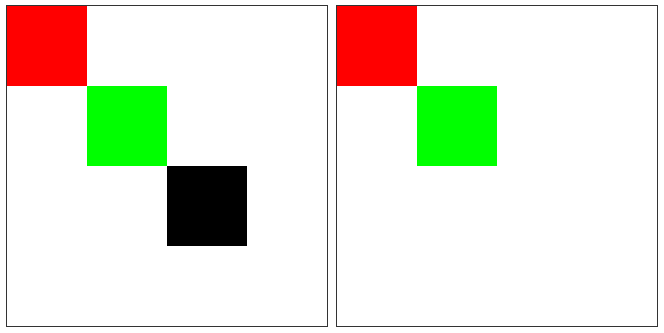

`ctx.save()` 和 `ctx.restore()` 方法，实现绘制状态的存储和重置。

绘制状态：

- 描边样式、填充样式
- 线条样式
- 文本样式
- 裁剪
- 合成
- 图像变换
- ...

`ctx.save()`

- 调用此方法，会将之前的状态存储起来（存入栈中，先入后出）。
- 可以多次调用此方法，将多个状态按顺序存入栈中。

`ctx.restore()`

- 调用此方法，会重置状态。就是将当前状态从栈中移除（删除），恢复到上一次的状态。

> 注意：
>
> - 这两个方法不是必须的，可以手动按照逻辑，恢复上一次的状态。
> - 建议每块单独的绘制，在前面加上 `ctx.save()`，在后面加上 `ctx.restore()`，这样每次绘制都是初始默认的配置，不会被影响。

```javascript
/* 颜色重置 */
const ctx = canvas.getContext('2d');

ctx.save();
ctx.fillStyle = '#f00';
ctx.beginPath();
ctx.fillRect(0, 0, 100, 100);
ctx.restore();

ctx.save();
ctx.fillStyle = '#0f0';
ctx.beginPath();
ctx.fillRect(100, 100, 100, 100);
ctx.restore();

ctx.save();
ctx.beginPath();
ctx.fillRect(200, 200, 100, 100);
ctx.restore();

/* 图像变换-移动 */
const ctx = canvas.getContext('2d');

ctx.save();
ctx.fillStyle = '#0f0';
ctx.translate(100, 100);
ctx.beginPath();
ctx.fillRect(0, 0, 100, 100);
ctx.restore();

ctx.save();
ctx.fillStyle = '#f00';
ctx.beginPath();
ctx.fillRect(0, 0, 100, 100);
ctx.restore();
```

> 效果如下：


