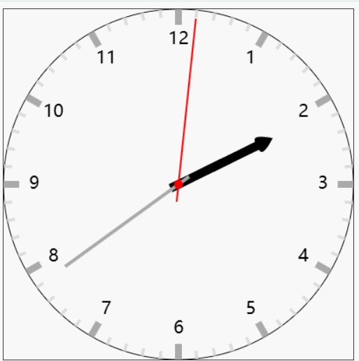

## 12.1. 动态时钟

- 表盘，刻度（大刻度、小刻度），时间数字，表针（时针、分针、秒针）
- 表针需要不停的转动
  - 动画绘制
  - 表针角度

```javascript
/* 动静分离, 分两个画布，css样式中设置绝对定位重叠在一块 */
(() => {
  let canvas = document.createElement('canvas');
  document.body.appendChild(canvas);
  if (!canvas.getContext) {
    console.log('浏览器版本过低，不支持 canvas，请升级或更换浏览器');
    return;
  }
  canvas.width = 400;
  canvas.height = 400;

  let ctx = canvas.getContext('2d');

  ctx.translate(200, 200);

  /* 绘制圆盘 */
  ctx.save();
  ctx.beginPath();
  ctx.arc(0, 0, 200, 0, Math.PI * 2);
  ctx.stroke();
  ctx.restore();

  /* 绘制大刻度 */
  ctx.save();
  ctx.strokeStyle = '#aaa';
  ctx.lineWidth = 8;
  for (let i = 0; i < 12; i++) {
    ctx.beginPath();
    ctx.moveTo(0, -200);
    ctx.lineTo(0, -182);
    ctx.stroke();
    ctx.rotate((Math.PI * 2) / 12);
  }
  ctx.restore();

  /* 绘制小刻度 */
  ctx.save();
  ctx.strokeStyle = '#ddd';
  ctx.lineWidth = 4;
  for (let i = 0; i < 60; i++) {
    if (i % 5 != 0) {
      ctx.beginPath();
      ctx.moveTo(0, -200);
      ctx.lineTo(0, -191);
      ctx.stroke();
    }
    ctx.rotate((Math.PI * 2) / 60);
  }
  ctx.restore();

  canvas = document.createElement('canvas');
  document.body.appendChild(canvas);
  if (!canvas.getContext) {
    console.log('浏览器版本过低，不支持 canvas，请升级或更换浏览器');
    return;
  }
  canvas.width = 400;
  canvas.height = 400;

  ctx = canvas.getContext('2d');

  ctx.translate(200, 200);

  (function draw() {
    ctx.clearRect(-200, -200, canvas.width, canvas.height);
    /* 绘制时间数字 */
    ctx.save();
    ctx.font = '20px sans-serif';
    ctx.textAlign = 'center';
    ctx.textBaseline = 'middle';
    const r = 165;
    for (let i = 0; i < 12; i++) {
      const text = i === 0 ? 12 : i;
      const x = Math.sin((i * Math.PI * 2) / 12) * r;
      const y = -Math.cos((i * Math.PI * 2) / 12) * r;
      ctx.fillText(text, x, y);
    }
    ctx.restore();

    /* 计算当前时分秒 */
    const now = new Date();
    const hour = now.getHours() % 12;
    const minute = now.getMinutes();
    const second = now.getSeconds();
    // console.log(hour, minute, second);

    /* 绘制时针 */
    ctx.save();
    ctx.beginPath();
    ctx.rotate(
      (hour * Math.PI * 2) / 12 +
        (minute * Math.PI * 2) / 60 / 60 +
        (second * Math.PI * 2) / 60 / 60 / 60
    );
    ctx.moveTo(-5, 10);
    ctx.lineTo(-5, -100);
    ctx.quadraticCurveTo(-15, -100, 0, -120);
    ctx.quadraticCurveTo(15, -100, 5, -100);
    ctx.lineTo(5, 10);
    ctx.closePath();
    ctx.fill();
    ctx.restore();

    /* 绘制分针 */
    ctx.save();
    ctx.lineWidth = 4;
    ctx.strokeStyle = '#aaa';
    ctx.beginPath();
    ctx.rotate((minute * Math.PI * 2) / 60 + (second * Math.PI * 2) / 60 / 60);
    ctx.moveTo(0, 15);
    ctx.lineTo(0, -160);
    ctx.stroke();
    ctx.restore();

    /* 绘制秒针 */
    ctx.save();
    ctx.lineWidth = 2;
    ctx.strokeStyle = '#f00';
    ctx.beginPath();
    ctx.rotate((second * Math.PI * 2) / 60);
    ctx.moveTo(0, 20);
    ctx.lineTo(0, -190);
    ctx.stroke();
    ctx.restore();

    /* 绘制圆心点 */
    ctx.save();
    ctx.fillStyle = '#f00';
    ctx.beginPath();
    ctx.arc(0, 0, 5, 0, Math.PI * 2);
    ctx.fill();
    ctx.restore();

    setTimeout(draw, 1000);
  })();
})();
```

> 效果如下：


