## 3.1. 绘制矩形

可以绘制两种矩形，有三种方式。

- 填充的矩形（实心矩形）
- 描边的矩形（空心矩形）

> 方式 1 - 填充

```javascript
ctx.fillRect(x, y, width, height);
```

> 方式 2 - 描边

```javascript
ctx.strokeRect(x, y, width, height);
```

> 方式 3 - 填充&描边

只设置位置和宽高，默认没有效果。需要配合 `ctx.stroke()` 或 `ctx.fill()`（这两个可以单独使用，也可以同时使用）。

```javascript
ctx.rect(x, y, width, height);
ctx.fill();
ctx.stroke();
```

**样式设置**（一定要在绘制图形之前设置，支持多种颜色写法）

- 使用 `fillStyle` 属性设置填充的颜色
- 使用 `strokeStyle` 属性设置描边的颜色
- 使用 `lineWidth` 属性设置描边粗细

```javascript
const ctx = canvas.getContext('2d');

ctx.rect(100, 100, 100, 200);

ctx.strokeStyle = '#0f0';
ctx.lineWidth = 10;
ctx.stroke();

ctx.fillStyle = '#f00';
ctx.fill();
```

## 3.2. beginPath 方法

`ctx.fill()` 和 `ctx.stroke` 默认会对之前所有绘制的路径进行统一处理。

当我们需要对不同的图形分别绘制，就需要使用 `ctx.beginPath()` 方法，通过清空子路径列表开始一个新路径。

```javascript
const ctx = canvas.getContext('2d');

ctx.beginPath(); // 第一个

ctx.rect(100, 10, 100, 100);

ctx.strokeStyle = '#0f0';
ctx.lineWidth = 10;
ctx.stroke();

ctx.fillStyle = '#f00';
ctx.fill();

ctx.beginPath(); // 第二个

ctx.rect(100, 200, 100, 100);

ctx.strokeStyle = '#00f';
ctx.lineWidth = 20;
ctx.stroke();

ctx.fillStyle = '#0f0';
ctx.fill();
```

> 效果如下：

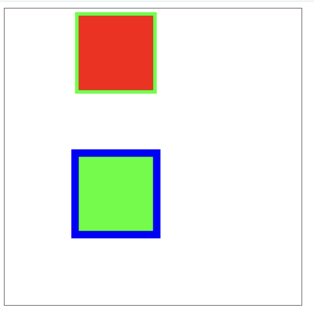

> 注意
>
> - 一组路径可以有多个
> - 使用 `fillRect()`，`strokeRect()` 不会有影响

## 3.3. 绘制圆角矩形

使用 `ctx.roundRect(x, y, width, height, r)` 方法绘制圆角矩形

```javascript
const ctx = canvas.getContext('2d');

ctx.roundRect(100, 10, 100, 100, 10);
ctx.roundRect(100, 200, 100, 100, 50);
ctx.stroke();
```

> 效果如下：

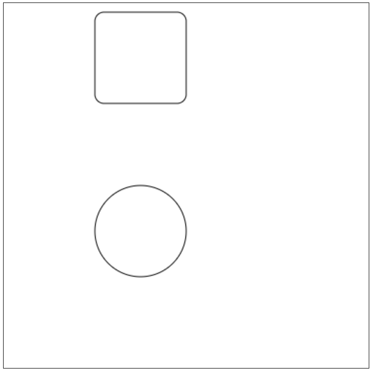

> _r_ 有多种写法，可实现四个圆角单独设置

- r
- [r]
- [r1, r2]
- [r1, r2, r3]
- [r1, r2, r3, r4]

```javascript
const ctx = canvas.getContext('2d');

ctx.roundRect(10, 10, 100, 100, [10]);
ctx.roundRect(200, 10, 100, 100, [10, 30]);
ctx.roundRect(10, 200, 100, 100, [10, 20, 30]);
ctx.roundRect(200, 200, 100, 100, [10, 20, 30, 40]);
ctx.stroke();
```

> 效果如下：

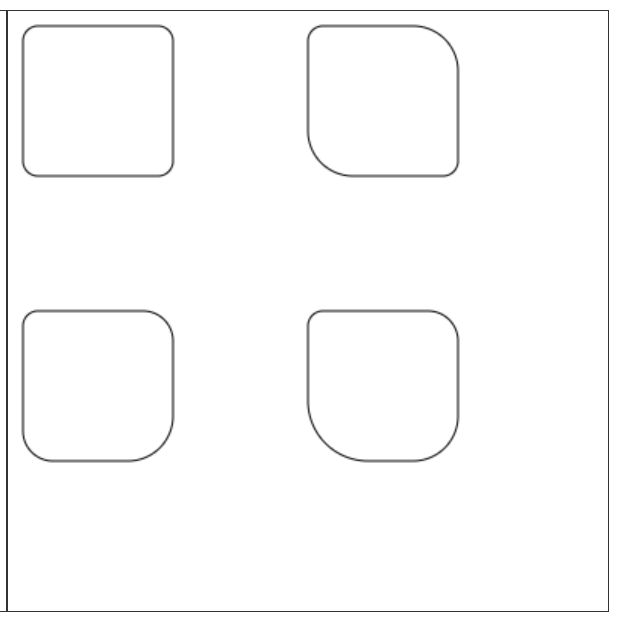

## 3.4. 绘制直线&折线

`ctx.moveTo(x, y)` 将画笔放置到制定的位置（起始点）
`ctx.lineTo(x, y)` 从**上一个点**绘制直线路径到指定的点

- 上一个点可以是 `moveTo` 指定的点
- 上一个点也可以是 `lineTo` 指定的点

```javascript
/* 直线 */
const ctx = canvas.getContext('2d');

ctx.beginPath();
ctx.strokeStyle = '#f00';
ctx.moveTo(100, 100);
ctx.lineTo(200, 100);
ctx.stroke();

ctx.beginPath();
ctx.strokeStyle = '#0f0';
ctx.lineWidth = 10;
ctx.moveTo(100, 200);
ctx.lineTo(200, 200);
ctx.stroke();
```

```javascript
/* 折线 */
const ctx = canvas.getContext('2d');

ctx.beginPath();
ctx.strokeStyle = '#f00';
ctx.moveTo(100, 100);
ctx.lineTo(200, 100);
ctx.lineTo(100, 200);
ctx.lineTo(200, 200);
ctx.stroke();
```

> 效果如下：

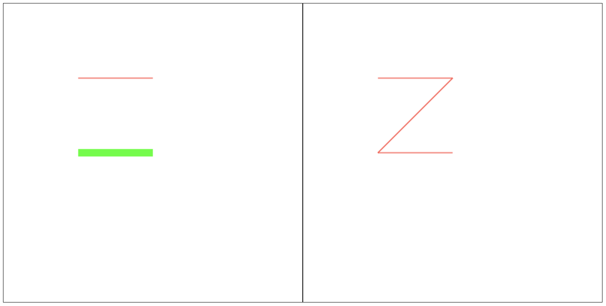

## 3.5. 线条 API

### 3.5.1. lineWidth

`ctx.lineWidth` 属性，设置线条粗细。

### 3.5.2. lineCap

`ctx.lineCap` 属性，设置线条端点的样式（连接点、线帽）。

- butt 平的，默认值，没有任何额外的效果
- round 圆的，端点处增加了半圆
- square 平的，端点处增加了矩形，视觉效果上变长了

```javascript
const ctx = canvas.getContext('2d');

ctx.beginPath();
ctx.moveTo(100, 20);
ctx.lineTo(100, 100);
ctx.stroke();

ctx.beginPath();
ctx.moveTo(300, 20);
ctx.lineTo(300, 100);
ctx.stroke();

ctx.strokeStyle = '#00f';
ctx.lineWidth = 10;
ctx.beginPath();
ctx.lineCap = 'butt';
ctx.moveTo(100, 40);
ctx.lineTo(300, 40);
ctx.stroke();

ctx.beginPath();
ctx.lineCap = 'round';
ctx.moveTo(100, 60);
ctx.lineTo(300, 60);
ctx.stroke();

ctx.beginPath();
ctx.lineCap = 'square';
ctx.moveTo(100, 80);
ctx.lineTo(300, 80);
ctx.stroke();
```

> 效果如下：

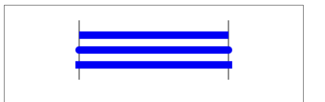

### 3.5.3. lineJoin

`ctx.lineJoin` 属性，设置折线连接处的样式

- miter 尖的
- bevel 平的
- round 圆的

```javascript
const ctx = canvas.getContext('2d');

ctx.strokeStyle = '#00f';
ctx.lineWidth = 10;
ctx.beginPath();
ctx.lineJoin = 'miter';
ctx.moveTo(50, 50);
ctx.lineTo(150, 150);
ctx.lineTo(250, 50);
ctx.stroke();

ctx.beginPath();
ctx.lineJoin = 'bevel';
ctx.moveTo(50, 100);
ctx.lineTo(150, 200);
ctx.lineTo(250, 100);
ctx.stroke();

ctx.beginPath();
ctx.lineJoin = 'round';
ctx.moveTo(50, 150);
ctx.lineTo(150, 250);
ctx.lineTo(250, 150);
ctx.stroke();
```

> 效果如下：


### 3.5.4. miterLimit

`ctx.miterLimit` 属性，设置折线形成的尖的限制。

当线条比较粗，折线夹角比较小的时候，折角处可能会比较长，可以通过此属性来限制。

```javascript
const ctx = canvas.getContext('2d');

ctx.strokeStyle = '#00f';
ctx.lineWidth = 40;
ctx.beginPath();
ctx.moveTo(50, 50);
ctx.lineTo(80, 150);
ctx.lineTo(120, 50);
ctx.stroke();

ctx.beginPath();
ctx.miterLimit = 1;
ctx.moveTo(200, 50);
ctx.lineTo(230, 150);
ctx.lineTo(260, 50);
ctx.stroke();
```

> 效果如下：

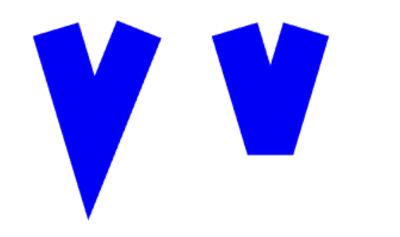

### 3.5.5. setLineDash

`ctx.setLineDash(Array)` 方法，用来设置虚线。

`Array` 中可以放置多个数值。依次表示线段的长度和线段间留白的长度。

- [_length_] 线段长度和留白长度一致
- [_length1_, _length2_] 线段长度为 _length1_，留白长度为 _length2_
- [_length1_, _length2_, _length3_] 以此顺序为准，依次给线段长度和留白长度赋值

```javascript
const ctx = canvas.getContext('2d');

ctx.strokeStyle = '#00f';
ctx.lineWidth = 10;
ctx.beginPath();
ctx.setLineDash([10]);
ctx.moveTo(50, 50);
ctx.lineTo(250, 50);
ctx.stroke();

ctx.beginPath();
ctx.setLineDash([20, 10]);
ctx.moveTo(50, 100);
ctx.lineTo(250, 100);
ctx.stroke();

ctx.beginPath();
ctx.setLineDash([10, 20, 30]);
ctx.moveTo(50, 150);
ctx.lineTo(250, 150);
ctx.stroke();
```

> 效果如下：

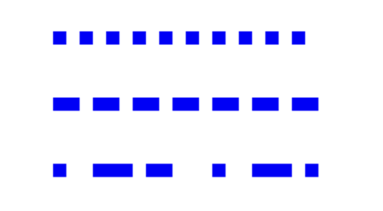

### 3.5.6. lineDashOffset

`ctx.lineDashOffset` 属性，设置虚线起始位置的偏移。

```javascript
/* 设置偏移，实现偏移动画 */
const ctx = canvas.getContext('2d');

ctx.beginPath();
ctx.moveTo(50, 50);
ctx.lineTo(50, 200);
ctx.stroke();

ctx.strokeStyle = '#00f';
ctx.lineWidth = 10;
ctx.beginPath();
ctx.moveTo(50, 100);
ctx.lineTo(300, 100);
ctx.stroke();

ctx.beginPath();
ctx.setLineDash([250]);
ctx.lineDashOffset = 240;
ctx.moveTo(50, 150);
ctx.lineTo(300, 150);
ctx.stroke();

function animate() {
  ctx.lineDashOffset -= 0.1;
  ctx.stroke();

  if (ctx.lineDashOffset > 0) {
    requestAnimationFrame(animate);
  }
}
requestAnimationFrame(animate);
```

> 效果如下：

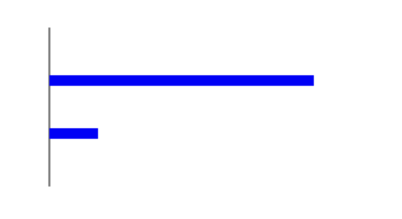

## 3.6. 清除画布

`ctx.clearRect(x, y, width, height)` 方法，清除画布中的指定矩形区域。

清除画布的本质是将指定的矩形区域，设置透明度为 0，之前的路径依然存在。此时如果没有配合 `beginPath()`，而是继续使用 `stroke()` 或者 `fill()`，那么之前的路径重现。

```javascript
const ctx = canvas.getContext('2d');

ctx.beginPath();
ctx.strokeStyle = '#00f';
ctx.lineWidth = 10;
ctx.moveTo(0, 50);
ctx.lineTo(400, 50);
ctx.stroke();

ctx.clearRect(0, 0, 400, 400);

ctx.beginPath(); // 如果不加，上面的轨迹会重现
ctx.strokeStyle = '#00f';
ctx.lineWidth = 10;
ctx.moveTo(50, 0);
ctx.lineTo(50, 400);
ctx.stroke();
```

> 效果如下：

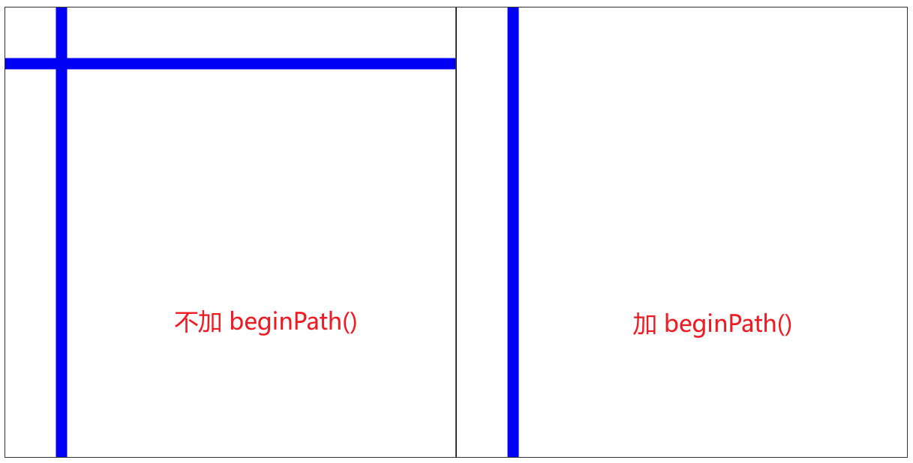

## 3.7. 虚线 + 清除实现动画

```javascript
/* 动画1：进度条 */
const ctx = canvas.getContext('2d');

ctx.beginPath();
ctx.moveTo(50, 100);
ctx.lineTo(50, 200);
ctx.moveTo(250, 100);
ctx.lineTo(250, 200);
ctx.stroke();

ctx.beginPath();
ctx.lineDashOffset = 200;
function animate() {
  ctx.clearRect(50, 145, 200, 10);
  ctx.beginPath();
  ctx.lineWidth = 10;
  ctx.strokeStyle = '#00f';
  ctx.setLineDash([200]);
  ctx.lineDashOffset -= 1;
  ctx.moveTo(50, 150);
  ctx.lineTo(250, 150);
  ctx.stroke();

  if (ctx.lineDashOffset == -200) {
    ctx.lineDashOffset = 200;
  }

  requestAnimationFrame(animate);
}
requestAnimationFrame(animate);

ctx.beginPath();
ctx.strokeStyle = '#0f0';
ctx.lineWidth = 10;
ctx.moveTo(50, 300);
ctx.lineTo(350, 300);
ctx.stroke();
```

```javascript
/* 动画2：矩形旋转边框 */
const ctx = canvas.getContext('2d');

ctx.beginPath();
ctx.lineDashOffset = 200;
function animate() {
  ctx.clearRect(45, 45, 210, 210);
  ctx.beginPath();
  ctx.lineWidth = 5;
  ctx.strokeStyle = '#00f';
  ctx.setLineDash([20]);
  ctx.lineDashOffset -= 0.5;
  ctx.strokeRect(50, 50, 200, 200);

  requestAnimationFrame(animate);
}
requestAnimationFrame(animate);

ctx.beginPath();
ctx.strokeStyle = '#0f0';
ctx.lineWidth = 10;
ctx.moveTo(50, 300);
ctx.lineTo(350, 300);
ctx.stroke();
```

> 效果如下：

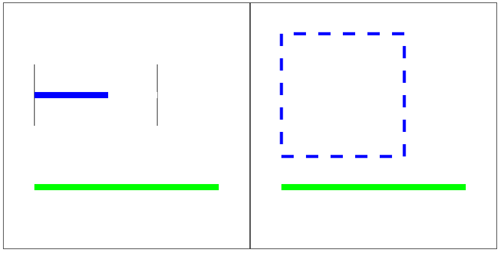

## 3.8. closePath 方法

多个连续线条合围的区域，是可以使用 `ctx.fill()` 进行填充的。

如果需要首尾节点自动闭合，可以使用 `ctx.closePath()` 方法。

```javascript
const ctx = canvas.getContext('2d');

ctx.beginPath();
ctx.lineWidth = 10;
ctx.moveTo(50, 50);
ctx.lineTo(50, 150);
ctx.lineTo(150, 150);
ctx.closePath();
ctx.stroke();
ctx.fill();
```

> 效果如下：

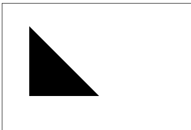

## 3.9. 绘制圆弧

### 3.9.1. arc

`ctx.arc(x, y, startAngle, endAngle [, dir])`

- _x_, _y_ 原点坐标
- _r_ 半径
- _startAngle_ 起始点角度（弧度值）。默认原点到 _x_ 轴正向为 _0_ 度点。
- _endAngle_ 结束点角度（弧度值）
- _dir_ 绘制方向。_false_ - 顺时针（默认），_true_ - 逆时针。

设计圆弧时，用的是角度。传递参数时，传递的是弧度。

- `1° = Math.PI / 180 (弧度)`

```javascript
const ctx = canvas.getContext('2d');

ctx.beginPath();
ctx.arc(100, 100, 50, 0, Math.PI * 2);
ctx.stroke();

ctx.beginPath();
ctx.arc(300, 100, 50, 0, Math.PI);
ctx.stroke();

ctx.beginPath();
ctx.arc(100, 300, 50, 0, Math.PI, true);
ctx.stroke();

ctx.beginPath();
ctx.arc(300, 300, 50, Math.PI / 2, Math.PI);
ctx.stroke();
```

> 效果如下：

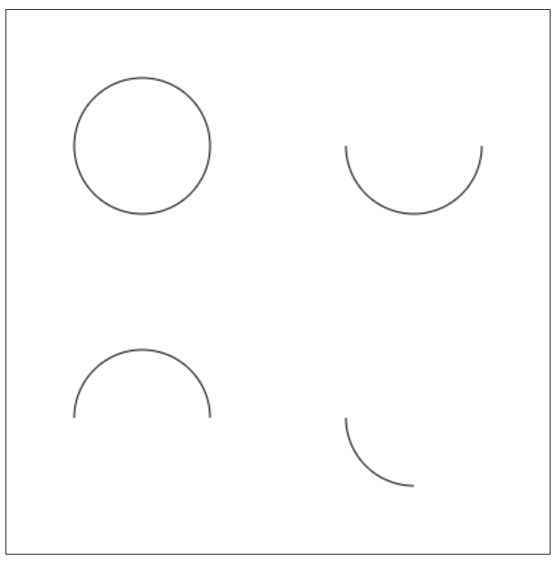

### 3.9.2. arcTo

`ctx.arcTo(x1, y1, x2, y2, r)`

由三个控制点实现圆弧的绘制

- `moveTo` 或上一次图形结束的点，为第一个点
- _x1_, _y1_ 第二个点
- _x2_, _y2_ 第三个点

三个点依次连线，两条线会形成一个夹角。根据 _r_ 绘制圆弧，保证与两个线条相切。

```javascript
const ctx = canvas.getContext('2d');

ctx.beginPath();
ctx.arc(150, 150, 50, 0, Math.PI * 2);
ctx.stroke();

ctx.beginPath();
ctx.lineWidth = 10;
ctx.moveTo(100, 150);
ctx.arcTo(100, 200, 150, 200, 50);
ctx.stroke();
```

> 效果如下：

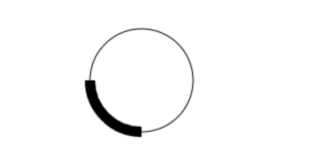

## 3.10. 绘制椭圆

`ctx.ellipse(x, y, rx, ry, rotate, startAngle, endAngle, dir)`

- _x_, _y_ 原点坐标
- _rx_, _ry_ _x_ 轴半径，_y_ 轴半径
- _rotate_ _x_ 轴旋转角度（弧度值，顺时针）
- _startAngle_ 起始点角度。三点钟方向为 _0_ 度
- _endAngle_ 终点角度
- _dir_ 绘制方向。_false_ - 顺时针（默认），_true_ - 逆时针。

```javascript
const ctx = canvas.getContext('2d');

ctx.beginPath();
ctx.ellipse(110, 100, 100, 50, 0, 0, Math.PI * 2);
ctx.stroke();

ctx.beginPath();
ctx.ellipse(370, 100, 100, 50, 0, 0, Math.PI / 2);
ctx.stroke();

ctx.beginPath();
ctx.ellipse(110, 300, 100, 50, 0, 0, Math.PI / 2, true);
ctx.stroke();

ctx.beginPath();
ctx.ellipse(370, 300, 100, 50, Math.PI / 4, 0, Math.PI * 2);
ctx.stroke();
```

> 效果如下：

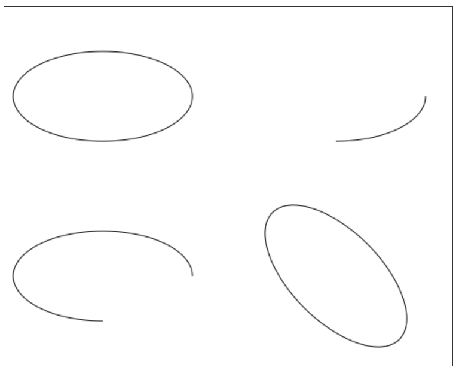

## 3.11. 绘制曲线

### 3.11.1. 贝塞尔曲线绘制原理

_canvas_ 提供了一种绘制曲线的方式：贝塞尔曲线。

目前提供了二次贝塞尔曲线和三次贝塞尔曲线的 _API_。

- 有一个起点和终点
- 在起终点之间，有多个控制点
  - 有一个控制点，称为二次贝塞尔曲线
  - 有两个控制点，称为三次贝塞尔曲线
- 从起点开始，经过控制点，最后到终点，依次连线
- 提供一个参数 _t_，取值范围是 [0-1]。每一个 _t_ 都存在以下情况：
  - 在任意线段中，从起点到终点，存在一个中间点，使得 `前部分线段/整体线段 = t`
  - 对每条线段的这些点，再依次连接，形成了一批新的线段
  - 在新的一批连线中，依然存在那些符合比例 _t_ 的点
  - 重复之前连线、找点的操作
  - 直到找到最后一个点，就是此贝塞尔曲线，在当前比例 _t_ 时，曲线的点
- 当 _t_ 在 [0-1] 之间变化，每次都会有一个这样的点，这些点连接后就形成了贝塞尔曲线

> 图示如下：


### 3.11.2. 绘制

`ctx.quadraticCurveTo(cx, cy, ex, ey)`

- _cx_, _cy_ 控制点坐标
- _ex_, _ey_ 终点坐标
- 起点坐标可以通过 _moveTo_ 设置，或者时上一次绘图的结尾

```javascript
/* 二次贝塞尔曲线 */
const ctx = canvas.getContext('2d');

ctx.fillStyle = 'f00';

ctx.beginPath();
ctx.arc(100, 200, 5, 0, Math.PI * 2);
ctx.fill();

ctx.beginPath();
ctx.arc(150, 100, 5, 0, Math.PI * 2);
ctx.fill();

ctx.beginPath();
ctx.arc(300, 200, 5, 0, Math.PI * 2);
ctx.fill();

ctx.beginPath();
ctx.moveTo(100, 200);
ctx.quadraticCurveTo(150, 100, 300, 200);
ctx.stroke();
```

`ctx.bezierCurveTo(c1x, c1y, c2x, c2y, ex, ey)`

- _cx1_, _cy1_ 控制点 1 坐标
- _cx2_, _cy2_ 控制点 2 坐标
- _ex_, _ey_ 终点坐标
- 起点坐标可以通过 _moveTo_ 设置，或者时上一次绘图的结尾

```javascript
/* 三次贝塞尔曲线 */
const ctx = canvas.getContext('2d');

ctx.fillStyle = 'f00';

ctx.beginPath();
ctx.arc(100, 200, 5, 0, Math.PI * 2);
ctx.fill();

ctx.beginPath();
ctx.arc(150, 100, 5, 0, Math.PI * 2);
ctx.fill();

ctx.beginPath();
ctx.arc(250, 300, 5, 0, Math.PI * 2);
ctx.fill();

ctx.beginPath();
ctx.arc(300, 200, 5, 0, Math.PI * 2);
ctx.fill();

ctx.beginPath();
ctx.moveTo(100, 200);
ctx.bezierCurveTo(150, 100, 250, 300, 300, 200);
ctx.stroke();
```

> 效果如下：

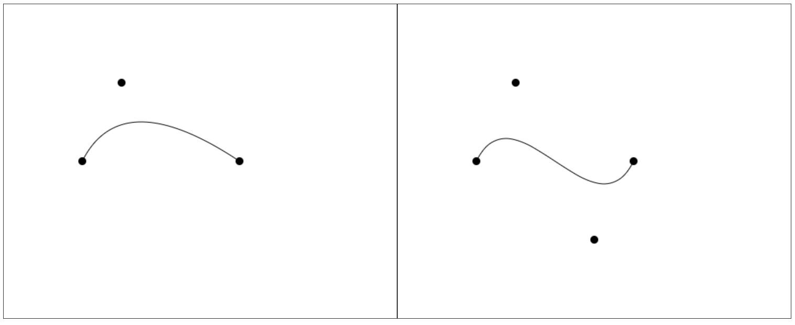
