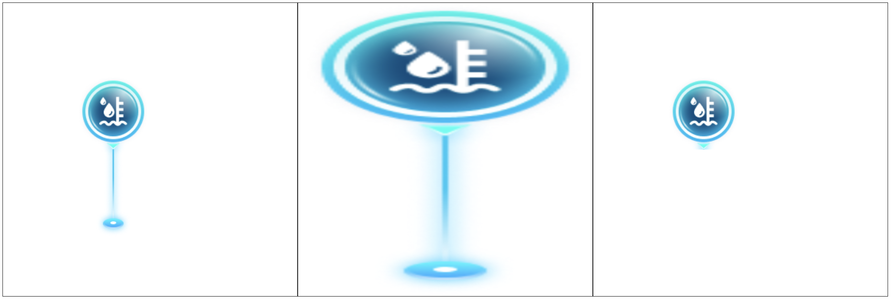

在 `canvas` 中引入其他的图片。

## 4.1. 基本使用

需要有一个图片源

- `Image` 对象，对应 `img` 标签
  - 可以是图片的路径
  - 也可以是图片的 _base64_ 表示
- `video` 对象
- `canvas`

### 4.1.1. drawImage 方法

`ctx.drawImage(imgSource, x, y)` 方法，引入图片。

- _x_, _y_ 是在 `canvas` 画布中放置的起始坐标（以左上角为准）。
- 按照图片原本大小展示（超出画布部分不显示）。

```javascript
const ctx = canvas.getContext('2d');

ctx.beginPath();
const img = new Image();
img.src = '../../imgs/液位计.png';
img.onload = () => {
  ctx.drawImage(img, 100, 100);
};
```

`ctx.drawImage(imgSource, x, y, width, height)` 方法，引入图片。

- _width_, _height_ 设置图像展示的宽高。

```javascript
const ctx = canvas.getContext('2d');

ctx.beginPath();
const img = new Image();
img.src = '../../imgs/液位计.png';
img.onload = () => {
  ctx.drawImage(img, 0, 0, canvas.width, canvas.height);
};
```

`ctx.drawImage(imgSource, x1, y1, w1, h1, x2, y2, w2, h2)`

- _x1_, _y1_, _w1_, _h1_ 是图像的截图区域，此时是基于图像的坐标系。
- _x2_, _y2_, _w2_, _h2_ 是画布的展示区域

```javascript
const ctx = canvas.getContext('2d');

ctx.beginPath();
const img = new Image();
img.src = '../../imgs/液位计.png';
img.onload = () => {
  ctx.drawImage(img, 0, 0, 100, 100, 100, 100, 100, 100);
};
```

> 效果如下：



## 4.2. 图像与动画

> 引入图像如下：


> 制作动画：

```javascript
/* 动画1：走路的动作 */
const ctx = canvas.getContext('2d');

ctx.beginPath();
const img = new Image();
img.src = '../../imgs/walk.jpg';

let i = 0;
const imgWidth = 59,
  imgCount = 8;
img.onload = () => {
  function animate() {
    ctx.clearRect(0, 0, canvas.width, canvas.height);
    ctx.drawImage(
      img,
      i * imgWidth,
      0,
      imgWidth,
      img.height,
      10,
      10,
      imgWidth,
      img.height
    );
    i++;
    if (i === imgCount) {
      i = 0;
    }
  }

  setInterval(animate, 100);
};
```

```javascript
/* 动画2：走路 + 移动 */
const ctx = canvas.getContext('2d');

ctx.beginPath();
const img = new Image();
img.src = '../../imgs/walk.jpg';

let i = 0,
  j = 0;
const imgWidth = 59,
  imgCount = 8;
img.onload = () => {
  function animate() {
    ctx.clearRect(0, 0, canvas.width, canvas.height);
    ctx.drawImage(
      img,
      i * imgWidth,
      0,
      imgWidth,
      img.height,
      j,
      10,
      imgWidth,
      img.height
    );
    i++;
    j += 10;
    if (i === imgCount) {
      i = 0;
    }
    if (j >= canvas.width) {
      j = -imgWidth;
    }
  }

  setInterval(animate, 100);
};
```

> 效果如下：


## 4.3. 视频图像

在视频播放中，抓取当前帧作为图像，引入 `canvas`。

```javascript
(() => {
  const video = document.createElement('video');
  video.src = '../video/VID_20240727_231904.mp4';
  video.controls = true;
  video.style.width = '200px';
  document.body.append(video);

  const canvas = document.createElement('canvas');
  document.body.append(canvas);
  if (!canvas.getContext) {
    console.log('浏览器版本过低，不支持 canvas，请升级或更换浏览器');
    return;
  }

  canvas.width = 400;
  canvas.height = 400;
  const ctx = canvas.getContext('2d');

  ctx.beginPath();

  let isListener = false;
  video.addEventListener('play', () => {
    !isListener && animate();
  });

  function animate() {
    isListener = true;
    ctx.clearRect(0, 0, canvas.width, canvas.height);
    ctx.arc(200, 200, 150, 0, Math.PI * 2);
    ctx.clip(); // 裁剪
    // ctx.filter = 'blur(10px)'; // 滤镜效果
    ctx.drawImage(video, 0, 0, 400, 400);

    requestAnimationFrame(animate);
  }
})();
```

> 效果如下：


## 4.4. 引入 canvas 图像 & canvas 下载

`canvas` 本身也是图像，也可以作为图像源，引入另一个 `canvas` 画布。

`canvas` 画布可以下载

- 右键另存
- 编程式下载

### 4.4.1. 引入

```javascript
let canvas1 = null;
(() => {
  const canvas = document.createElement('canvas');
  document.body.append(canvas);
  if (!canvas.getContext) {
    console.log('浏览器版本过低，不支持 canvas，请升级或更换浏览器');
    return;
  }

  canvas.width = 300;
  canvas.height = 300;
  const ctx = canvas.getContext('2d');

  ctx.beginPath();
  ctx.moveTo(150, 0);
  ctx.lineTo(150, 300);
  ctx.stroke();

  ctx.beginPath();
  ctx.moveTo(0, 150);
  ctx.lineTo(300, 150);
  ctx.stroke();

  for (let i = 0; i < 5; i++) {
    ctx.beginPath();
    ctx.arc(150, 150, 35 * i, 0, Math.PI * 2);
    ctx.stroke();
  }

  canvas1 = canvas;
})();
(() => {
  const canvas = document.createElement('canvas');
  document.body.append(canvas);
  if (!canvas.getContext) {
    console.log('浏览器版本过低，不支持 canvas，请升级或更换浏览器');
    return;
  }

  canvas.width = 400;
  canvas.height = 400;
  const ctx = canvas.getContext('2d');

  ctx.drawImage(canvas1, 0, 0, 150, 150, 125, 125, 150, 150);
})();
```

> 效果如下：


### 4.4.2. 下载

```html
<div>
  <button>点击下载canvas1</button>
</div>
```

```javascript
const btn = document.querySelector('button');
btn.onclick = () => {
  const url = canvas1.toDataURL(); // 默认是 png
  const a = document.createElement('a');
  a.href = url;
  a.download = 'canvas1.png';
  a.click();
};
```

**导出格式问题**

`canvas.toDataUrl()` 方法，可以传参控制格式

- _'image/png'_ 默认值
- _'image/jpeg'_
- _'image/webp'_

**导出时同源问题**

如果 `canvas` 中的图像是来自于其他路径的图像源（_img_, _video_），可能存在同源问题，即画布被污染。解决方法如下：

- 设置同源策略。`img.crossOrigin = 'anonymous'`，`video` 也是一样。
- 用服务器启动（比如 _Live Server_）。
