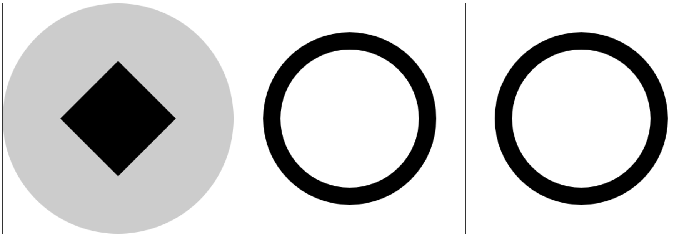

`ctx.clip()` 方法，设置裁剪，接下来绘制的图形只会在裁剪路径中展示（对之前绘制的图形没有影响）。

裁剪路径是执行 `ctx.clip()` 之前绘制的路径。

```javascript
const ctx = canvas.getContext('2d');

ctx.beginPath();
ctx.fillStyle = 'rgba(0, 0, 0, 0.2)';
ctx.arc(200, 200, 200, 0, Math.PI * 2);
ctx.fill();

ctx.beginPath();
ctx.moveTo(200, 100);
ctx.lineTo(300, 200);
ctx.lineTo(200, 300);
ctx.lineTo(100, 200);
ctx.closePath();

/* clip 之后绘制的图形都会被裁剪 */
ctx.clip();

ctx.beginPath();
ctx.fillStyle = 'rgba(0, 0, 0, 1)';
ctx.rect(100, 100, 200, 200);
ctx.fill();

ctx.beginPath();
ctx.fillStyle = 'rgba(0, 0, 0, 0.5)';
ctx.arc(200, 200, 150, 0, Math.PI * 2);
ctx.fill();
```

`ctx.clip(rule)` 方法，可以传递一个参数 _rule_

- _nonzero_ 非零环绕路径（默认值）
- _evenodd_ 奇偶环绕路径

在绘制裁剪路径的时候，有些路径区域可能会被重复绘制。

- 非零环绕：顺时针绘制路径区域，数量 _+1_，逆时针绘制路径区域，数量 _-1_。如果最后路径区域的绘制数量为 _0_，就不裁剪。
- 奇偶环绕：部分顺时针和逆时针，只要绘制路径经过区域，数量就 _+1_，最终数量是奇数的进行裁剪，偶数不裁剪。

```javascript
/* 非零环绕 */
const ctx = canvas.getContext('2d');

ctx.beginPath();
ctx.arc(200, 200, 150, 0, Math.PI * 2, false);
ctx.arc(200, 200, 120, 0, Math.PI * 2, true);
ctx.clip();

ctx.beginPath();
ctx.fillRect(0, 0, 400, 400);
```

```javascript
/* 奇偶环绕 */
const ctx = canvas.getContext('2d');

ctx.beginPath();
ctx.arc(200, 200, 150, 0, Math.PI * 2);
ctx.arc(200, 200, 120, 0, Math.PI * 2);
ctx.clip('evenodd');

ctx.beginPath();
ctx.fillRect(0, 0, 400, 400);
```

> 效果如下：


