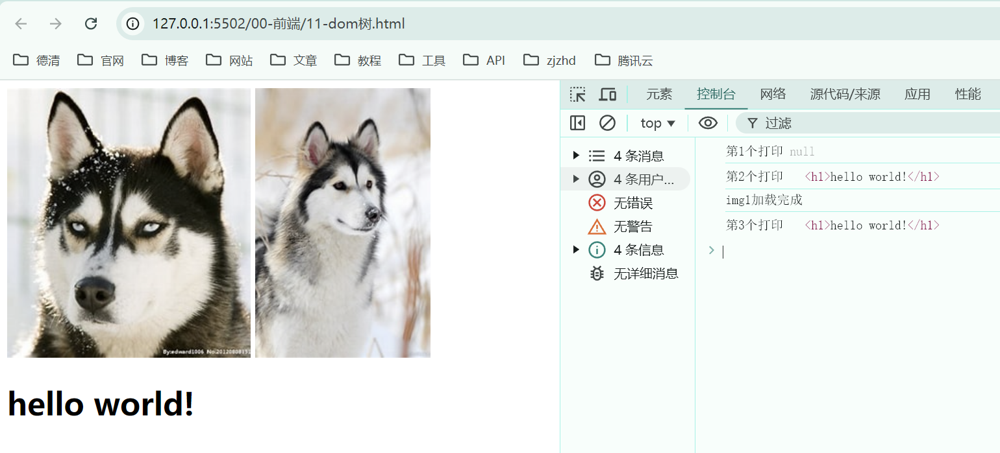

## 1. 解析 _HTML_

浏览器从本地文件或者网络中获取到 _HTML_ 源代码，从上到下依次解析源代码。

若解析过程中，遇到 _css_、_js_ 文件会**暂停解析（阻塞）**，转而等待 _css_、_js_ 文件请求完成、解析完成。之后，继续解析 _HTML_ 文件。

遇到 _img_、_video_、_audio_ 文件，**不会暂停解析**。

- 读取 _HTML_
- 解析 _HTML_
- 读取 _css_
- 解析 _css_
- 解析 _HTML_
- 读取 _js_
- 执行 _js_
- 解析 _HTML_

一般情况下，将 _css_ 引入写在页面开头，_js_ 文件写在页面最后

- 将 _css_ 写在前面，可以让浏览器尽快读取并解析样式，避免用户看到原生的页面，也可以避免页面闪烁（原生样式->自定义样式）
- 将 _js_ 写在最后，可以让页面尽快呈现给用户，然后再执行 _js_ 完成交互功能；当 _HTML_ 未解析完成时，提前用 _js_ 获取不到 _dom_

## 2. 生成 _DOM_ 树

浏览器会一边解析 _HTML_，一边生成 _DOM_ 树，是同步进行的。我们使用 _js_ 获取到的 _DOM_ 就是 _DOM_ 树中的 _DOM_。

- document
  - html
    - head
      - meta
      - title
      - link
    - body
      - h1
      - p
        - Hello World!

当 _DOM_ 树完全生成好之后，会触发 `DOMContentLoaded` 事件

```javascript
document.addEventListener('DOMContentLoaded', function () {
  const dom = document.querySelector('h1');
  console.log(1, dom); // <h1>hello world!</h1>
});
```

当页面中所有外部资源全部加载完毕，会触发 `load` 事件

```javascript
window.addEventListener('load', function () {
  const dom = document.querySelector('h1');
  console.log(3, dom); // <h1>hello world!</h1>
});
```

`load` 事件可以针对单个外部资源使用，资源加载完成后触发。

```javascript
const img1 = document.getElementById('img1');
img1.onload = function () {
  console.log('img1加载完成');
};
```

综合示例：

```html
<!DOCTYPE html>
<html lang="en">
  <head>
    <meta charset="UTF-8" />
    <meta name="viewport" content="width=device-width, initial-scale=1.0" />
    <title>Document</title>
    <script>
      document.addEventListener('DOMContentLoaded', function () {
        const dom = document.querySelector('h1');
        console.log('第2个打印', dom); // <h1>hello world!</h1>
      });

      const dom = document.querySelector('h1');
      console.log('第1个打印', dom); // null

      window.addEventListener('load', function () {
        const dom = document.querySelector('h1');
        console.log('第3个打印', dom); // <h1>hello world!</h1>
      });
    </script>
  </head>
  <body>
    
    
    <h1>hello world!</h1>

    <script>
      const img1 = document.getElementById('img1');
      img1.onload = function () {
        console.log('img1加载完成');
      };
    </script>
  </body>
</html>
```

效果：



## 3. 生成渲染树

浏览器一边生成 _DOM_ 树，一边计算 _DOM_ 树中每个节点的样式规则，最终形成渲染树。

_CSS_ 属性的计算过程，发生在这一步骤。

## 4. 布局 _layout_ / 重排 _reflow_

这个步骤称之为 **_reflow_（回流、重排）**，是指浏览器一边生成渲染树，一边计算每个元素最终的尺寸和位置。

完成后，页面中的所有元素的位置和尺寸就确定下来了，即将被渲染到页面。

这个步骤会在页面之后的运行过程中不断地重复，**下面的 _js_ 操作均会导致 _reflow_**：

- 获取元素的尺寸和位置
  - _reflow_ 非常耗时，浏览器为了提升性能，对 _js_ 中连续导致 _reflow_ 的代码，将 _reflow_ 的时间点延迟到结束后进行，**但在此过程中，如果遇到了获取尺寸和位置的代码，浏览器会迫不得已立即 _reflow_**。
- 直接或间接改变元素的尺寸和位置
  - 直接改变：就是直接设置宽高，或者设置 _position_ 的偏移值。
  - 间接改变：例如改变 _img_ 的 _src_ 值，因不同图片的大小可能不一致，从而导致 _reflow_；改变字体大小，从而间接导致 _dom_ 元素宽高变化，导致 _reflow_。

> 示例 1：正常修改 _dom_ 的尺寸和位置

```javascript
dom.style.width = '100px';
dom.style.height = '200px';
dom.style.left = '20px';
dom.style.top = '20px';
```

上述代码对应的 _reflow_ 过程：

1. 改变宽度
2. 改变高度
3. 改变横坐标
4. 改变纵坐标
5. _reflow_

将上面会连续导致 _reflow_ 的代码，依次连续处理，最后统一 _reflow_，这是浏览器对 _reflow_ 耗时而进行的优化。

> 示例 2：获取元素尺寸和位置

此时，如果在其中添加一个获取元素尺寸或位置的代码，则会强制出现 _reflow_。

```javascript
dom.style.width = '100px';
dom.style.height = '200px';
dom.clientHeight; // 读取高度，导致强行 reflow
dom.style.left = '20px';
dom.style.top = '20px';
```

上面代码对应的 _reflow_ 过程：

1. 改变宽度
2. 改变高度
3. 读取高度
4. _reflow_
5. 改变横坐标
6. 改变纵坐标
7. _reflow_

遇到获取元素尺寸或位置的代码，会强制 _reflow_，因为这样才能获取到最新的尺寸或位置数据。

## 5. 重绘 _repaint_

浏览器一边 _reflow_，一边进行生成对应的图形绘制到页面，绘制的过程称之为 _repaint_。

**所有会导致 _reflow_ 的代码，均会导致 _repaint_。**

绘制的过程是靠 **_GPU_** 完成的，速度非常快，因此，**相对于导致 _reflow_ 的代码，仅会导致 _repaint_ 的代码效率会高出很多**。

凡是不会影响盒子排列，仅影响盒子外观的代码都不会导致 _reflow_，仅导致 _repaint_，例如：

- 改变背景颜色
- 改变字体颜色
- 圆角边框
- 背景图
- ...
