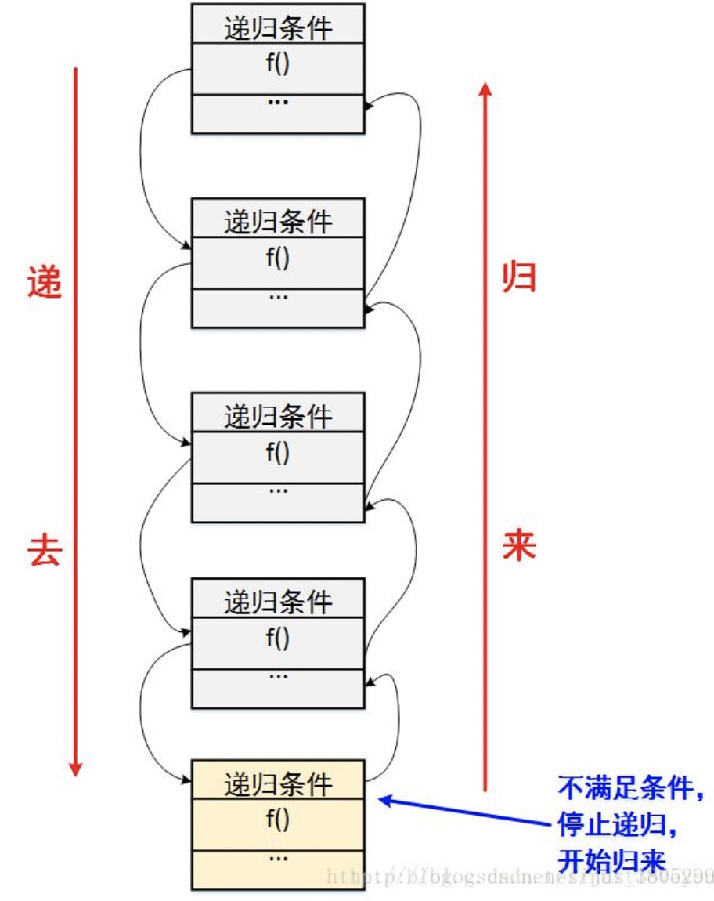
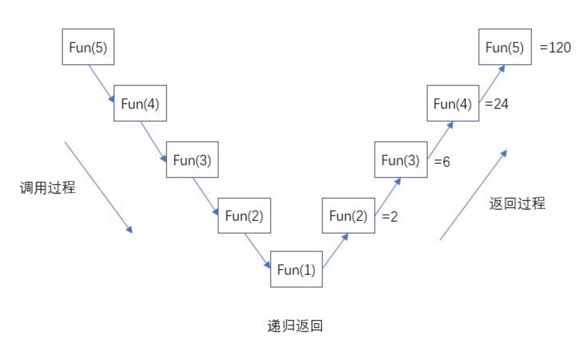

## 2.1. 概念

**递归调用**是一种特殊的调用形式，指的是方法自己调用自己的形式。



> 递归需要满足的条件：
>
> - 递归调用必须有结束条件
> - 每次调用的时候都需要根据需求改变传递的参数内容

## 2.2. 示例

### 2.2.1. 求某个数的阶乘

```javascript
function factorial(num) {
  if (num === 1) {
    return 1;
  } else {
    return num * factorial(num - 1);
  }
}
console.log(factorial(5)); // 120
```

> 整个递归的计算过程如下：

```text
===> factorial(5)
===> 5 * factorial(4)
===> 5 * (4 * factorial(3))
===> 5 * (4 * (3 * factorial(2)))
===> 5 * (4 * (3 * (2 * factorial(1))))
===> 5 * (4 * (3 * (2 * 1)))
===> 5 * (4 * (3 * 2))
===> 5 * (4 * 6)
===> 5 * 24
===> 120
```



### 2.2.2. 计算 x 加到 y 的结果

```javascript
function fun(x, y) {
  if (x === y) {
    return y;
  } else {
    return x + fun(x + 1, y);
  }
}
console.log(fun(1, 100)); // 5050
```

### 2.2.3. 计算斐波那契数列

```javascript
function fun(index) {
  if (index === 0 || index === 1) {
    return index;
  } else {
    return fun(index - 2) + fun(index - 1);
  }
}
console.log(fun(7)); // 21
```

## 2.3. 注意

- 递归函数定义简单，逻辑清晰。理论上，所有的递归函数都可以用循环的方式实现。
- 使用递归需要防止栈溢出。在计算机中，函数调用是通过栈（_stack_）这种数据结构实现的，每当一个函数调用，栈就会加一层，每当一个函数返回，栈就会减一层。由于栈的大小不是无限的，所以递归调用的次数过多，会导致栈溢出。
