到目前为止，我们仅使用了测量（**ST_Area**、**ST_Length**）、序列化（**ST_GeomFromText**）或反序列化（**ST_AsGML**）几何图形的空间函数。这些函数的共同点是它们每次只能处理一个几何图形。

空间数据库的功能强大，因为它们不仅存储几何图形，还能够比较*几何图形之间的关系*。

诸如“哪个自行车架离公园最近？”或“地铁线路和街道的交叉口在哪里？”之类的问题只能通过比较代表自行车架、街道和地铁线路的几何图形来回答。

OGC 标准定义了以下一组方法来比较几何。

## 6.1. ST_Equals

`ST_Equals(几何 A, 几何 B)`测试两个几何的空间相等性。

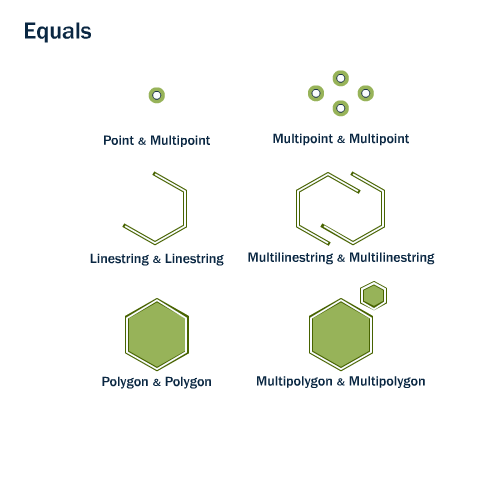

如果两个相同类型的几何图形具有相同的 x,y 坐标值，即第二个形状与第一个形状相等（相同），则 ST_Equals 返回 TRUE。

> 示例

1. 首先，让我们从`nyc_subway_stations`表中检索一个点的表示。我们只取“Broad St”的条目。

   ```sql
   SELECT name, geom
   FROM nyc_subway_stations
   WHERE name = 'Broad St';
   ```

   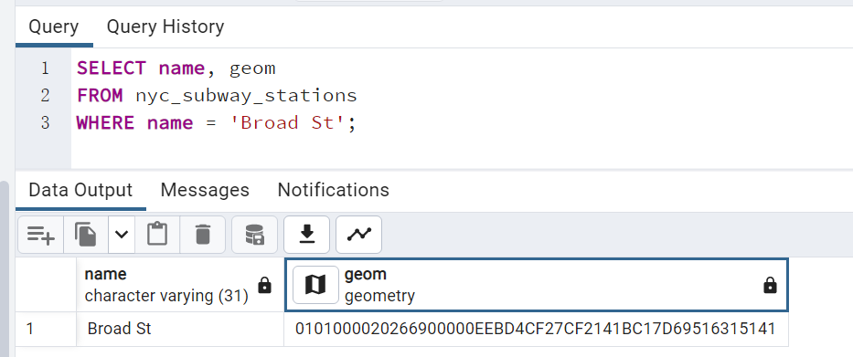

2. 然后，将几何表示重新插入到**ST_Equals**测试中：

   ```sql
   SELECT name
   FROM nyc_subway_stations
   WHERE ST_Equals(geom, '0101000020266900000EEBD4CF27CF2141BC17D69516315141');
   ```

   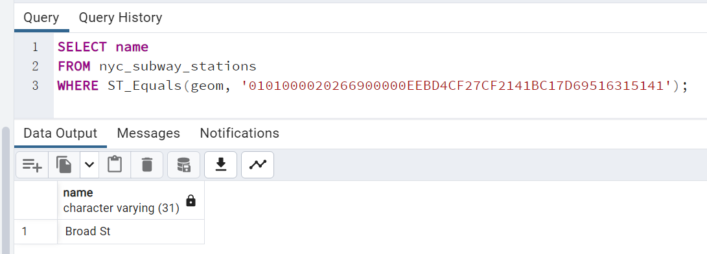

   ```text
   注释:
   点的表示不太人性化（0101000020266900000EEBD4CF27CF2141BC17D69516315141），但它是坐标值的精确表示。对于相等性之类的测试，使用精确坐标是必要的。
   ```

## 6.2. ST_Intersects、ST_Disjoint、ST_Crosses 和 ST_Overlaps

**ST_Intersects**、**ST_Crosses**和**ST_Overlaps**测试几何内部是否相交。

### 6.2.1. Intersects

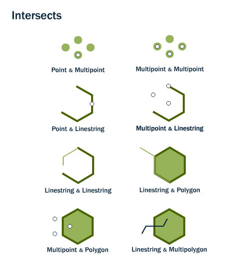

如果两个形状具有任何共同空间（即它们的边界或内部相交），则**ST_Intersects(geometry A, geometry B)返回 t（TRUE）。**

### 6.2.2. **Disjoint**

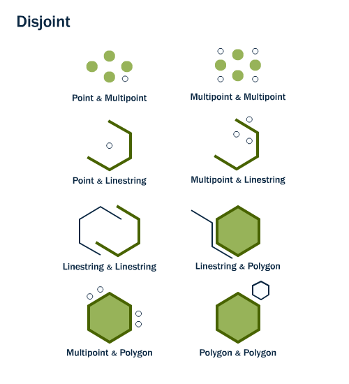

**ST_Intersects** 的反义词是**ST_Disjoint(geometry A, geometry B)**。如果两个几何图形不相交，则它们不相交，反之亦然。事实上，测试“相交”通常比测试“不相交”更有效，因为相交测试可以进行空间索引，而不相交测试则不能。

### 6.2.3. Cross

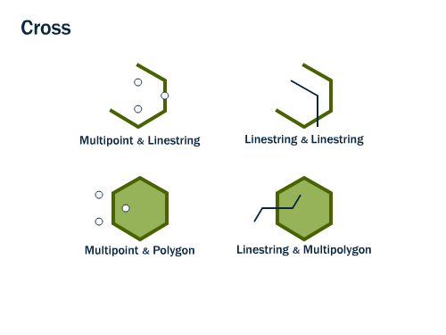

对于多点/多边形、多点/线串、线串/线串、线串/多边形和线串/多多边形比较，如果交集产生的几何图形的维度比两个源几何图形的最大维度小一，并且交集位于两个源几何图形的内部，则**ST_Crosses(几何图形 A, 几何图形 B)返回 t (TRUE)。**

### 6.2.4. Overlap

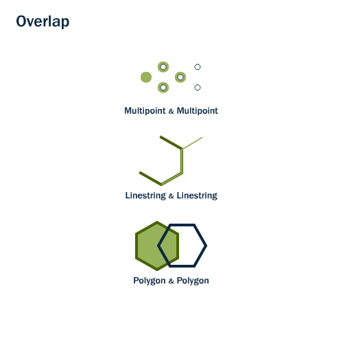

`ST_Overlaps(几何图形 A, 几何图形 B)`比较两个相同维度的几何图形，如果它们的交集结果为不同于两者但具有相同维度的几何图形，则返回 TRUE。

> 示例

以 Broad Street 地铁站为例，并使用**ST_Intersects**函数确定其邻近区域：

1. 查询`Broad St`的地铁站几何信息(wkt格式)

   ```sql
   SELECT name, ST_AsText(geom)
   FROM nyc_subway_stations
   WHERE name = 'Broad St';
   ```

   
   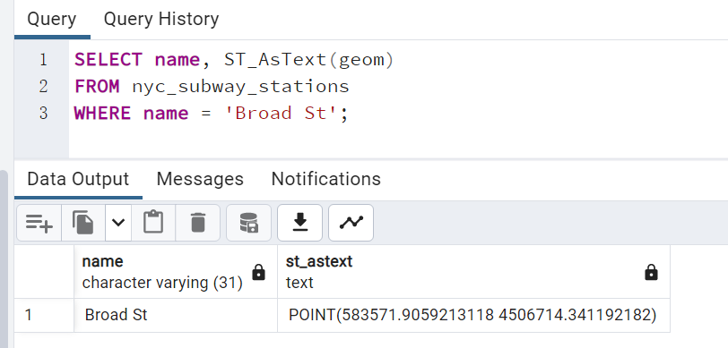

2. 确定临近区域

   ```sql
   SELECT name, boroname
   FROM nyc_neighborhoods
   WHERE ST_Intersects(geom, ST_GeomFromText('POINT(583571.9059213118 4506714.341192182)',26918));
   ```

   
   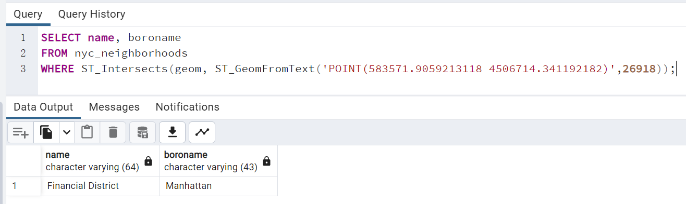

## 6.3. ST_Touches

**ST_Touches**测试两个几何图形是否在其边界处接触，但在其内部不相交

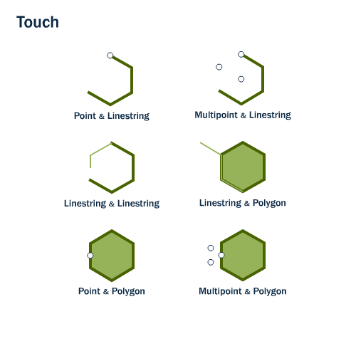

如果任一几何图形的边界相交，或者只有一个几何图形的内部与另一个几何图形的边界相交，则**ST_Touches(geometry A, geometry B)返回 TRUE。**

## 6.4. ST_Within 和 ST_Contains

**ST_Within**和**ST_Contains**测试一个几何图形是否完全位于另一个几何图形内。

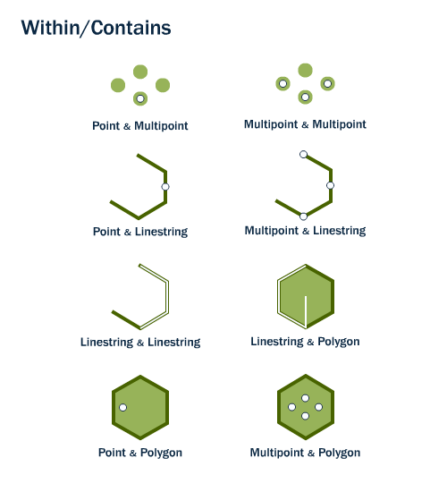

如果第一个几何图形完全位于第二个几何图形内，则**ST_Within(geometry A, geometry B)返回 TRUE**。ST_Within 测试的结果与 ST_Contains 完全相反。

如果第二个几何图形完全包含在第一个几何图形中，则**ST_Contains(geometry  A, geometry B)返回 TRUE。**

## 6.5. ST_Distance 和 ST_DWithin

一个极为常见的 GIS 问题是“找到距离该物体 X 范围内的所有物体”。

`ST_Distance (几何图形 A, 几何图形 B)`计算两个几何图形之间的*最短*距离并将其作为浮点数返回。这对于实际报告对象之间的距离非常有用。

> 示例-计算两个几何体间的最短距离

```sql
SELECT ST_Distance(
  ST_GeometryFromText('POINT(0 5)'),
  ST_GeometryFromText('LINESTRING(-2 2, 2 2)'));
```

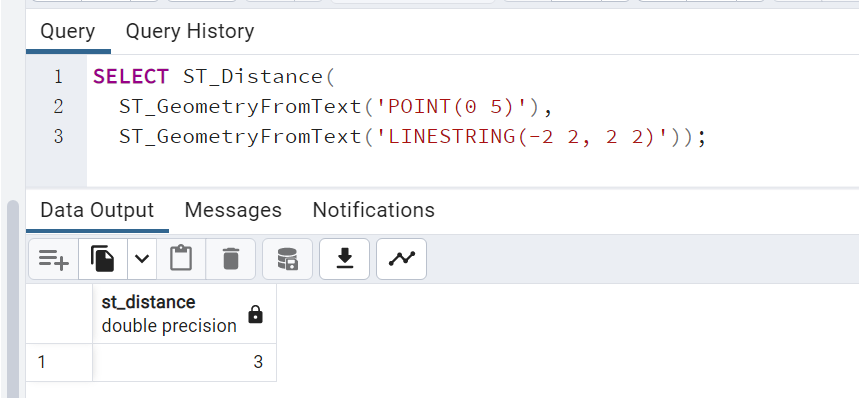

为了测试两个对象是否在彼此的距离之内，**ST_DWithin**函数提供了索引加速的真/假测试。这对于诸如“道路 500 米缓冲区内有多少棵树？”之类的问题非常有用。您不必计算实际的缓冲区，只需测试距离关系即可。

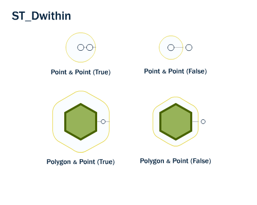

> 示例
>
> 再次使用我们的 Broad Street 地铁站，我们可以找到地铁站附近的街道（10 米以内）：

```sql
SELECT name
FROM nyc_streets
WHERE ST_DWithin(
        geom,
        ST_GeomFromText('POINT(583571 4506714)',26918),
        10
      );
```

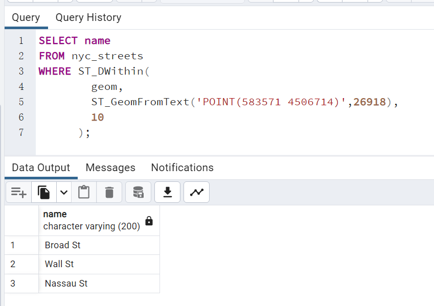

## 6.6. 函数列表

[ST_Contains(geometry A, Geometry B)](http://postgis.net/docs/ST_Contains.html) :当且仅当B的任何点都不位于A的外部，并且B的内部至少有一个点位于A的内部时，返回true。

[ST_Crosses(几何 A, 几何 B)](http://postgis.net/docs/ST_Crosses.html)：如果所提供的几何图形有一些（但不是全部）共同的内部点，则返回 TRUE。

[ST_Disjoint(几何图形 A, 几何图形 B)](http://postgis.net/docs/ST_Disjoint.html)：如果几何图形不“空间相交” - 如果它们不共享任何空间，则返回 TRUE。

[ST_Distance（几何 A，几何 B）](http://postgis.net/docs/ST_Distance.html)：以投影单位返回两个几何体之间的二维笛卡尔最小距离（基于空间参考）。

[ST_DWithin(几何图形 A, 几何图形 B, 半径)](http://postgis.net/docs/ST_DWithin.html)：如果几何图形彼此在指定的距离（半径）内，则返回 true。

[ST_Equals(geometry A, geometry B)](http://postgis.net/docs/ST_Equals.html)：如果给定的几何图形表示相同的几何图形，则返回 true。方向性被忽略。

[ST_Intersects(geometry A, Geometry B)](http://postgis.net/docs/ST_Intersects.html) : 如果几何/地理“空间相交”（任意部分重叠），则返回 TRUE，否则返回（FALSE 它们不相交）。

[ST_Overlaps（几何图形 A，几何图形 B）](http://postgis.net/docs/ST_Overlaps.html)：如果几何图形共享空间、具有相同的维度，但彼此并不完全包含，则返回 TRUE。

[ST_Touches(几何图形 A, 几何图形 B)](http://postgis.net/docs/ST_Touches.html)：如果几何图形至少有一个共同点，但它们的内部不相交，则返回 TRUE。

[ST_Within(几何图形 A，几何图形 B)](http://postgis.net/docs/ST_Within.html)：如果几何图形 A 完全位于几何图形 B 内部，则返回 true