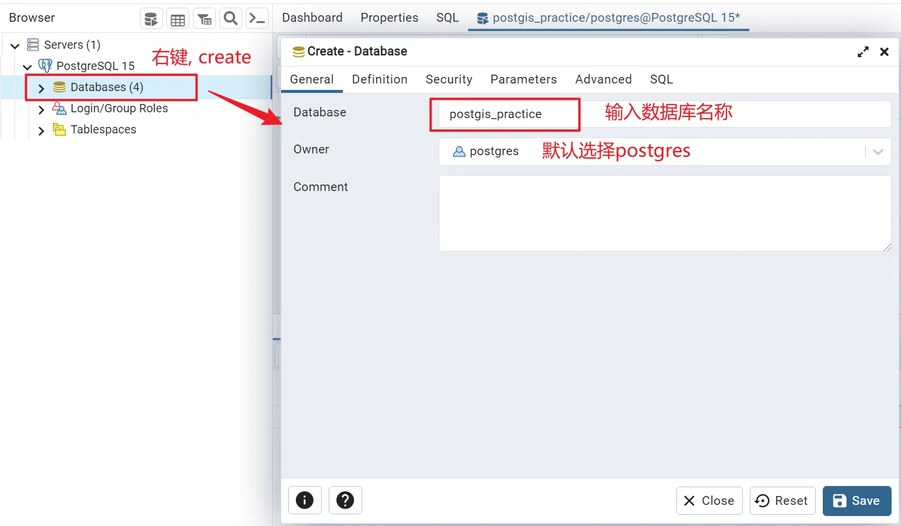
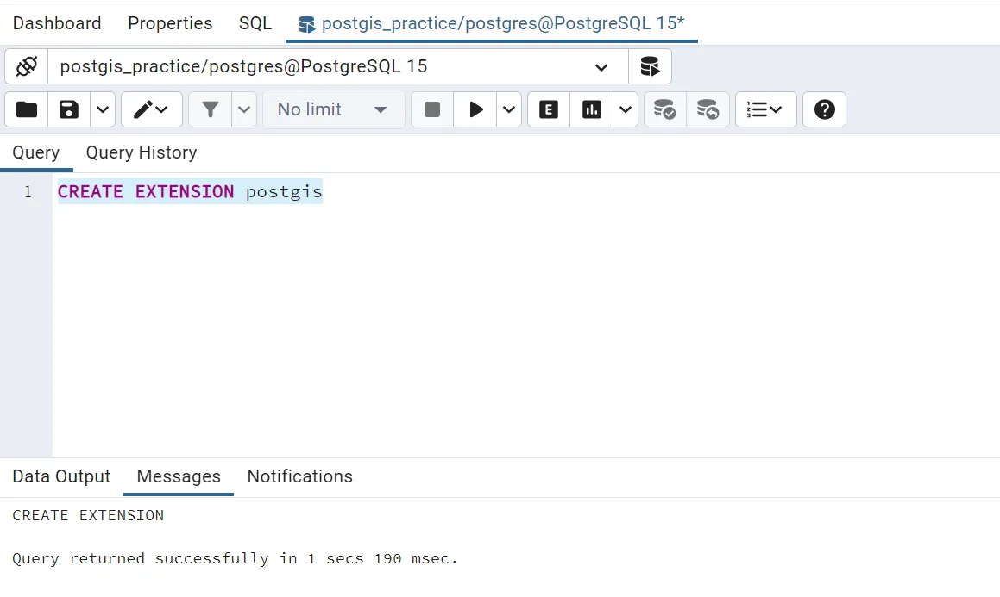
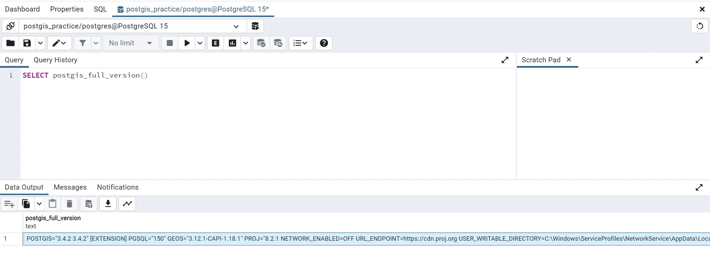

## 1.1. 创建数据库



## 1.2. 加载`PostGIS`拓展

### 1.2.1. 加载

点击工具栏`*Tools > Query Tool*`, 输入以下命令, 执行查询

```plsql
CREATE EXTENSION postgis
```

> 实例



### 1.2.2. 验证

输入以下命令, 执行查询

```plsql
SELECT postgis_full_version()
```

返回 PostGIS 的完整版本和构建配置信息



```text
POSTGIS="3.4.2 3.4.2" [EXTENSION] PGSQL="150" GEOS="3.12.1-CAPI-1.18.1" PROJ="8.2.1 NETWORK_ENABLED=OFF URL_ENDPOINT=https://cdn.proj.org USER_WRITABLE_DIRECTORY=C:\Windows\ServiceProfiles\NetworkService\AppData\Local/proj DATABASE_PATH=D:\software\PostgreSQL_15\share\contrib\postgis-3.4\proj\proj.db" LIBXML="2.9.14" LIBJSON="0.12" LIBPROTOBUF="1.2.1" WAGYU="0.5.0 (Internal)"
```
