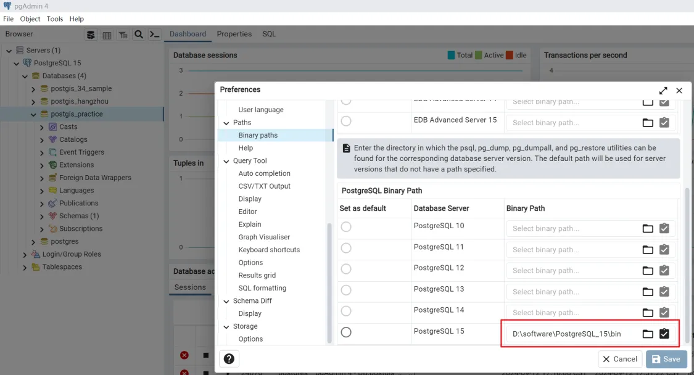
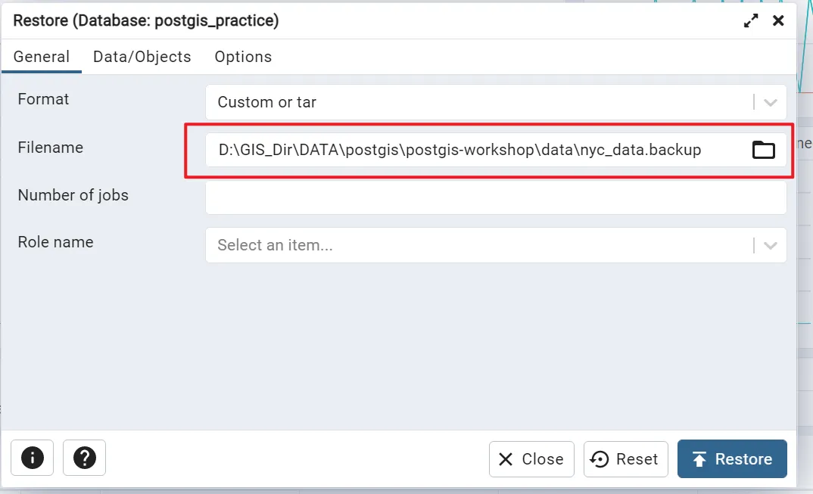
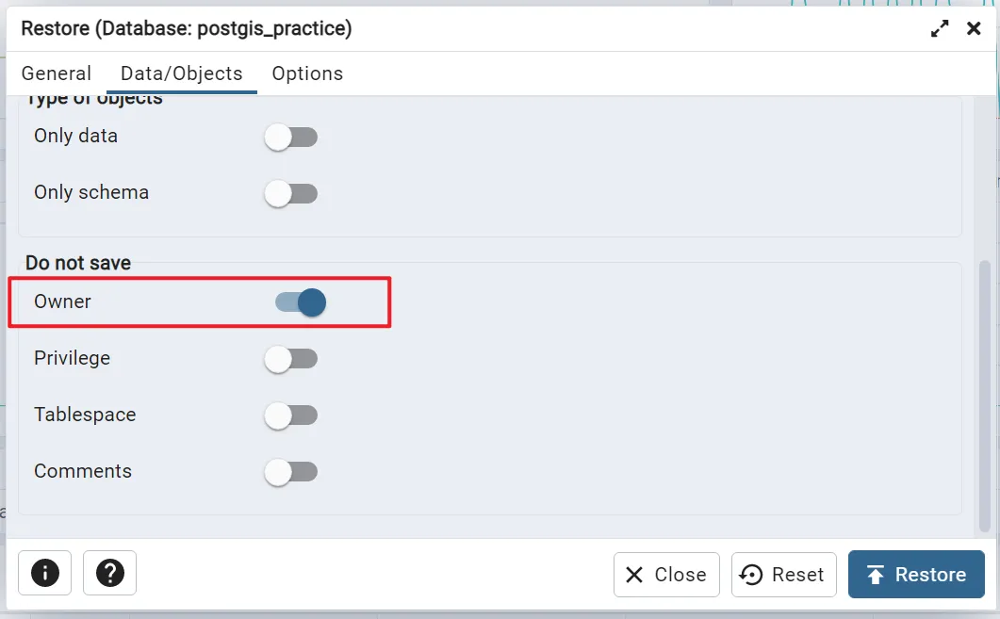
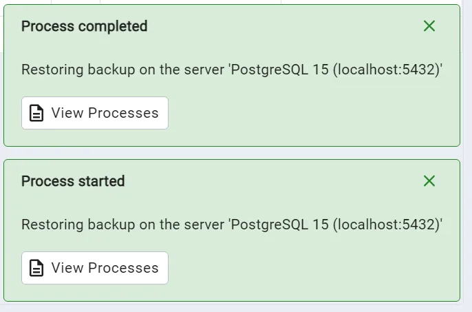
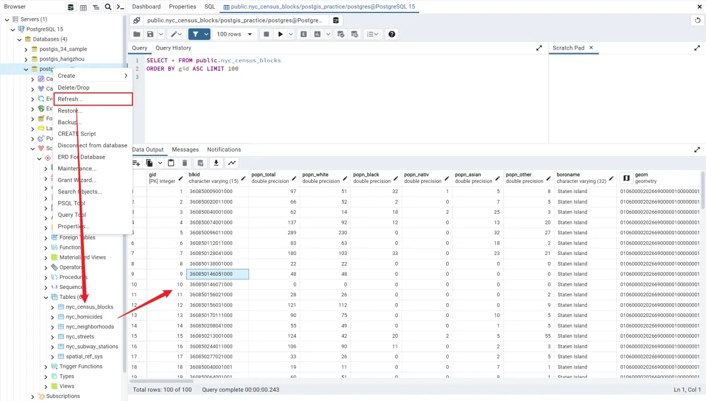
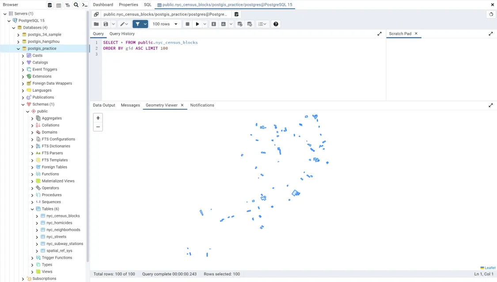

## 2.1. 问题

### 2.1.1. 备份/恢复数据提示

###### 2.1.1.1. 提示信息

```
Utility file not found. Please correct the Binary Path in the Preferences dialog
```

翻译: `找不到实用程序文件。请在“首选项”对话框中更正二进制路径`

###### 2.1.1.2. 解决办法

依次打开: `File - Preferences - Paths - Binary paths`, 选择安装目中的`bin`文件



#### 2.1.1.3. 参考

> 参考-可用

[PostgreSQL 不能数据备份及恢复失败，提示 postgresql Please correct the Binary Path in the Preferences dialog_postgresql 备份恢复失败-CSDN 博客](https://blog.csdn.net/qq_55279253/article/details/118386505)

## 2.2. 加载数据

### 2.2.1. 选择下载的`postgis-workshop`压缩包中的文件



### 2.2.2. 设置`owner`为`选中状态`



### 2.2.3. 点击`restore`

右下角出现提示信息



### 2.2.4. 刷新数据库, 查看数据




