## 4.1. 介绍

执行如下`sql`语句

```sql
CREATE TABLE geometries (name varchar, geom geometry);

INSERT INTO geometries VALUES
  ('Point', 'POINT(0 0)'),
  ('Linestring', 'LINESTRING(0 0, 1 1, 2 1, 2 2)'),
  ('Polygon', 'POLYGON((0 0, 1 0, 1 1, 0 1, 0 0))'),
  ('PolygonWithHole', 'POLYGON((0 0, 10 0, 10 10, 0 10, 0 0),(1 1, 1 2, 2 2, 2 1, 1 1))'),
  ('Collection', 'GEOMETRYCOLLECTION(POINT(2 0),POLYGON((0 0, 1 0, 1 1, 0 1, 0 0)))');

SELECT name, ST_AsText(geom) FROM geometries;
```

> 执行结果

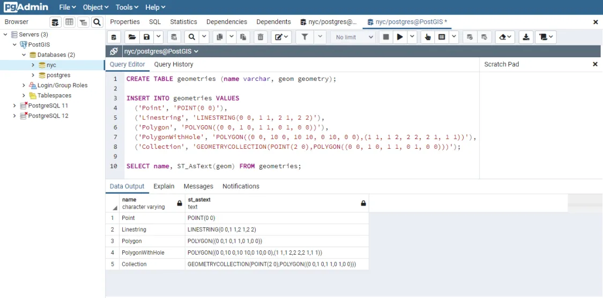

上面的示例 SQL 代码创建了一个名为 **geometries** 的数据表，插入了 5 个几何对象：1 点，1 线，1 多边形，1 带洞多边形，1 集合。最后，使用 SELECT 语句把插入的数据选出来并输出到面板上。

## 4.2. 元数据表

根据Simple Features for SQL ([SFSQL](https://postgis.net/workshops/zh_Hans/postgis-intro/glossary.html#term-SFSQL))规范，PostGIS提供了两个表来跟踪和报告给定数据库中可用的几何类型。

- 第一个表是``spatial_ref_sys``，它定义了数据库中已知的所有空间参考系统，并将在后面更详细地描述。
- 第二个表（实际上是一个视图）是``geometry_columns``，它提供了所有“要素”（定义为具有几何属性的对象）的列表，以及这些要素的基本详细信息。

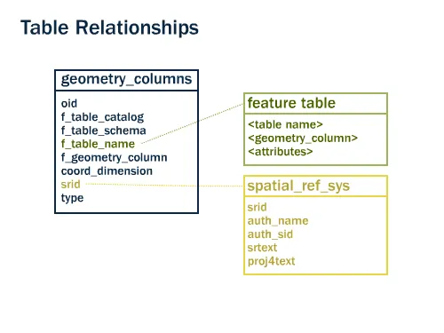

查看数据库中的`geometry_columns`表

> 执行查询

```sql
SELECT * FROM geometry_columns;
```

> 返回结果

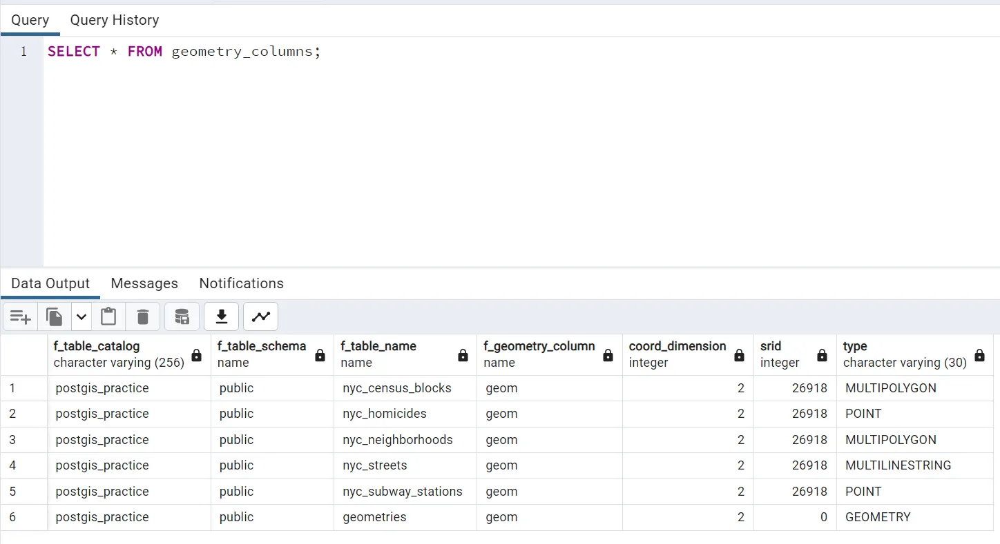

- `f_table_catalog`、`f_table_schema`和`f_table_name`提供了包含给定几何图形的要素表的完全限定名称。因为PostgreSQL不使用目录，所以`f_table_catalog`通常为空。
- `f_geometry_column`是包含几何图形的列的名称——对于具有多个几何列的要素表，每个列将有一条记录。
- `coord_dimension`和`srid`分别定义了几何图形的维度（2、3或4维）和引用`spatial_ref_sys`表的空间参考系统标识符。
- `type`列定义了下面描述的几何类型；到目前为止，我们已经看到了Point和Linestring类型。

通过查询此表，`GIS`客户端和库可以确定在检索数据时可以期望什么，并且可以执行任何必要的投影、处理或渲染，而无需检查每个几何图形。

## 4.3. 表示真实世界的对象

Simple Features for SQL ([SFSQL](https://postgis.net/workshops/zh_Hans/postgis-intro/glossary.html#term-SFSQL)) 规范，是 PostGIS 开发的原始指导标准，定义了如何表示现实世界的对象。通过以固定分辨率对连续形状进行数字化，我们可以获得对象的可通过的表示。SFSQL 只处理二维表示。PostGIS 已将其扩展到包括三维和四维表示；最近 SQL-Multimedia Part 3 ([SQL/MM](https://postgis.net/workshops/zh_Hans/postgis-intro/glossary.html#term-SQL-MM)) 规范已正式定义了他们自己的表示。

> 使用读取几何元数据的函数, 收集每个对象的一般信息

- **ST_GeometryType(geometry)** 返回几何图形的类型
- **ST_NDims(geometry)** 返回几何图形的维数
- **ST_SRID(geometry)** 返回几何图形的空间参考标识号

```sql
SELECT name, ST_GeometryType(geom), ST_NDims(geom), ST_SRID(geom)
  FROM geometries;
```

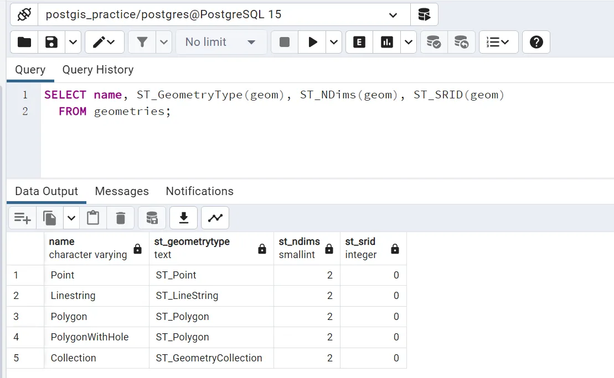

### 4.3.1. 点

空间点表示地球上的一个位置。这个点由一个坐标表示（包括2、3或4个维度）。当在目标比例尺下，确切的细节，例如形状和大小，不重要时，通常使用点来表示对象。例如，在世界地图上，城市可以表示为点，而在单个州的地图上，城市可以表示为多边形。

> 用于处理**点**的特定空间函数

- **ST_X(geometry)** 返回X坐标
- **ST_Y(geometry)** 返回Y坐标

所以可以读取一个点的坐标

```sql
SELECT ST_X(geom), ST_Y(geom)
  FROM geometries
  WHERE name = 'Point';
```

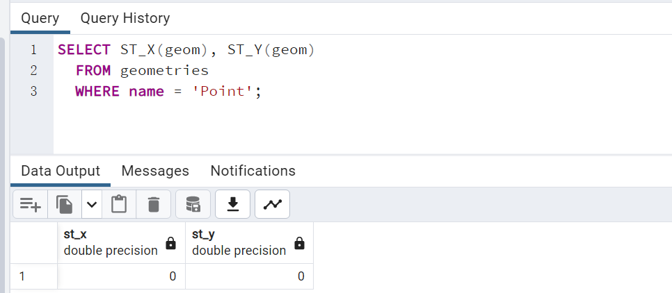

### 4.3.2. 线段

**Linestring\**是两个或多个位置之间的路径。它采用两个或多个点的有序系列的形式。道路和河流通常被表示为linestrings。如果Linestring从同一点开始和结束，则称其为\**closed**。如果Linestring不穿过或触及自身（如果它是封闭的，则除了在其端点处），则称其为**simple**。Linestring可以同时是**closed**和**simple**。

> 用于处理**线段**的特定空间函数

- **ST_Length(geometry)** 返回Linestring的长度
- **ST_StartPoint(geometry)** 返回第一个坐标作为一个点
- **ST_EndPoint(geometry)** 返回最后一个坐标作为一个点
- **ST_NPoints(geometry)** 返回Linestring中坐标的数量

所以可以获取Linestring的一些信息

```sql
SELECT ST_Length(geom),ST_StartPoint(geom), ST_EndPoint(geom), ST_NPoints(geom)
  FROM geometries
  WHERE name = 'Linestring';
```

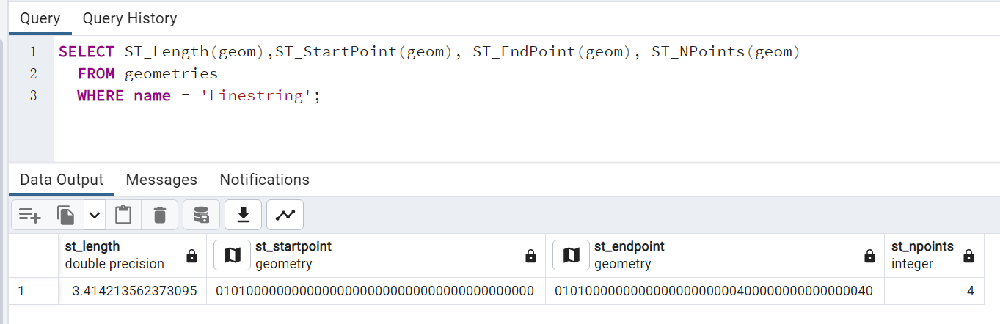

### 4.3.3. 多边形

多边形是一个区域的表示。多边形的外边界由一个环表示。这个环是一个根据上面定义的封闭和简单的Linestring。多边形内的孔也由环表示。

> 用于处理**多边形**的特定空间函数

- **ST_Area(geometry)** 返回多边形的面积
- **ST_NRings(geometry)** 返回环的数量（通常为1，如果有孔则更多）
- **ST_ExteriorRing(geometry)** 返回外环作为一个Linestring
- **ST_InteriorRingN(geometry,n)** 返回指定的内部环作为一个Linestring
- **ST_Perimeter(geometry)** 返回所有环的长度

可以获取多边形的一些信息

```sql
SELECT name, ST_Area(geom), ST_NRings(geom), ST_ExteriorRing(geom), ST_InteriorRingN(geom,1), ST_Perimeter(geom)
  FROM geometries
  WHERE name LIKE 'Polygon%';
```

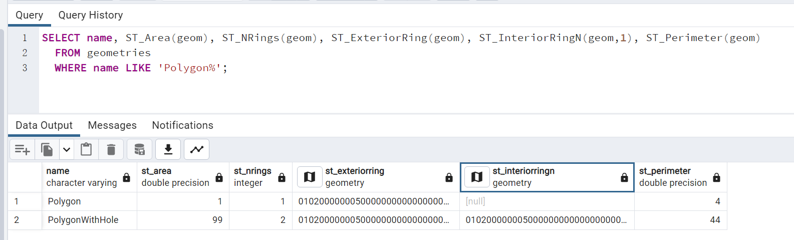

### 4.3.4. 集合

有四种集合类型，它们将多个简单几何图形分组成集合。

- **MultiPoint**，一组点
- **MultiLineString**，一组线串
- **MultiPolygon**，一组多边形
- **GeometryCollection**，任何几何图形的异构集合（包括其他集合）

集合是在GIS软件中出现的另一个概念，而不是在通用图形软件中。它们对于直接建模实际世界对象作为空间对象非常有用。

> 用于处理**集合**的特定空间函数

- **ST_NumGeometries(geometry)** 返回集合中的部分数量
- **ST_GeometryN(geometry,n)** 返回指定的部分
- **ST_Area(geometry)** 返回所有多边形部分的总面积
- **ST_Length(geometry)** 返回所有线性部分的总长度

获取集合的一些信息

```sql
SELECT name, ST_AsText(geom), ST_NumGeometries(geom), ST_GeometryN(geom,1), ST_Area(geom), ST_Length(geom) 
  FROM geometries
  WHERE name = 'Collection';
```

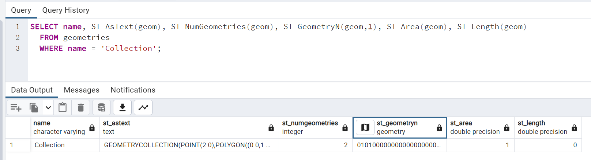

## 4.4. 几何的输入输出

在数据库中，几何图形以一种仅由PostGIS程序使用的格式存储在磁盘上。为了让外部程序插入和检索有用的几何图形，它们需要转换成其他应用程序能够理解的格式。幸运的是，PostGIS支持在大量格式中输入和输出几何图形:

- Well-known text ([WKT](https://postgis.net/workshops/zh_Hans/postgis-intro/glossary.html#term-WKT))
  - **ST_GeomFromText(text, srid)** 返回 `geometry`
  - **ST_AsText(geometry)** 返回 `text`
  - **ST_AsEWKT(geometry)** 返回 `text`
- Well-known binary ([WKB](https://postgis.net/workshops/zh_Hans/postgis-intro/glossary.html#term-WKB))
  - **ST_GeomFromWKB(bytea)** 返回 `geometry`
  - **ST_AsBinary(geometry)** 返回 `bytea`
  - **ST_AsEWKB(geometry)** 返回 `bytea`
- Geographic Mark-up Language ([GML](https://postgis.net/workshops/zh_Hans/postgis-intro/glossary.html#term-GML))
  - **ST_GeomFromGML(text)** 返回 `geometry`
  - **ST_AsGML(geometry)** 返回 `text`
- Keyhole Mark-up Language ([KML](https://postgis.net/workshops/zh_Hans/postgis-intro/glossary.html#term-KML))
  - **ST_GeomFromKML(text)** 返回 `geometry`
  - **ST_AsKML(geometry)** 返回 `text`
- [GeoJSON](https://postgis.net/workshops/zh_Hans/postgis-intro/glossary.html#term-GeoJSON)
  - **ST_AsGeoJSON(geometry)** 返回 `text`
- 可伸缩矢量图形 ([SVG](https://postgis.net/workshops/zh_Hans/postgis-intro/glossary.html#term-SVG))
  - **ST_AsSVG(geometry)** 返回 `text`

构造函数最常见的用途是将几何图形的文本表示转换为内部表示:

请注意，除了具有几何表示的文本参数外，我们还有一个提供几何图形的 [SRID](https://postgis.net/workshops/zh_Hans/postgis-intro/glossary.html#term-SRID) 的数字参数。

> 示例: 
>
> 以下SQL查询显示了一个:term:`WKB`表示的示例（调用:command:`encode()`是为了将二进制输出转换为ASCII形式以便打印）:

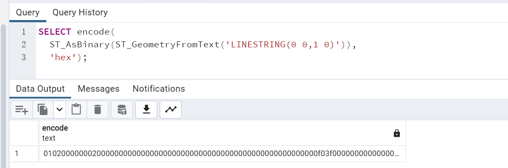

由于WKT和WKB是在:term:`SFSQL`规范中定义的，它们不处理3维或4维几何图形。对于这些情况，PostGIS定义了扩展的常用文本（EWKT）和扩展的常用二进制（EWKB）格式。这些格式提供了与WKT和WKB相同的格式化功能，并添加了维度信息。

这是一个WKT中的三维线串示例: 

```sql
SELECT ST_AsText(ST_GeometryFromText('LINESTRING(0 0 0,1 0 0,1 1 2)'));
```

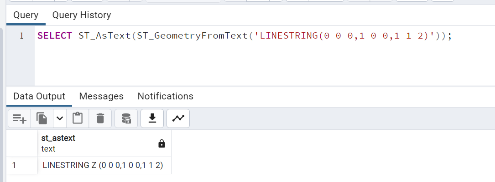

请注意，文本表示发生了变化！这是因为PostGIS的文本输入程序在接受输入时很宽容。它将接受

- 十六进制编码的EWKB，
- 扩展的常用文本，
- ISO标准的常用文本。

在输出方面，:command:`ST_AsText`函数是保守的，并且只输出ISO标准的常用文本。

除了:command:`ST_GeometryFromText`函数之外，还有许多其他方法可以从常用文本或类似格式的输入创建几何图形:

```sql
-- Using ST_GeomFromText with the SRID parameter
SELECT ST_GeomFromText('POINT(2 2)',4326);

-- Using ST_GeomFromText without the SRID parameter
SELECT ST_SetSRID(ST_GeomFromText('POINT(2 2)'),4326);

-- Using a ST_Make* function
SELECT ST_SetSRID(ST_MakePoint(2, 2), 4326);

-- Using PostgreSQL casting syntax and ISO WKT
SELECT ST_SetSRID('POINT(2 2)'::geometry, 4326);

-- Using PostgreSQL casting syntax and extended WKT
SELECT 'SRID=4326;POINT(2 2)'::geometry;
```

除了各种形式的发射器（WKT、WKB、GML、KML、JSON、SVG）之外，PostGIS还具有四个消费者（WKT、WKB、GML、KML）。大多数应用程序使用WKT或WKB几何创建函数，但其他函数也可用。下面是一个消费GML并输出JSON的示例:

```sql
SELECT ST_AsGeoJSON(ST_GeomFromGML('<gml:Point><gml:coordinates>1,1</gml:coordinates></gml:Point>'));
```

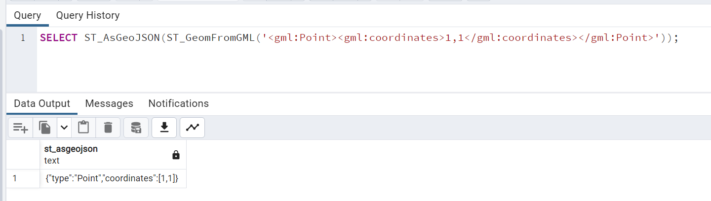

## 4.5. 从文本中解析

到目前为止，我们看到的:term:`WKT`字符串都是'text'类型，我们已经使用PostGIS函数如:command:`ST_GeomFromText()`将它们转换为'geometry'类型。

PostgreSQL包含一种简短的语法，允许将数据从一种类型转换为另一种类型，即转换语法，oldata::newtype。

> 示例: 这个SQL将一个双精度浮点数转换为文本字符串

```sql
SELECT 0.9::text;
```

> 示例: 这个SQL将一个:term:`WKT`字符串转换为几何图形

```sql
SELECT 'POINT(0 0)'::geometry;
```

使用转换创建几何图形时需要注意的一点是：除非您指定SRID，否则您将获得一个具有未知SRID的几何图形。

> 示例: 可以使用"扩展"的常用文本形式指定SRID，该形式在前面包含一个SRID块:

```sql
SELECT 'SRID=4326;POINT(0 0)'::geometry;
```

在处理:term:WKT、geometry`和`geography`列（参见:ref:`geography）时，使用转换符号是非常常见的。

## 4.6. 函数列表

[ST_Area](http://postgis.net/docs/ST_Area.html): 如果几何对象是多边形或多面体，则返回其表面积。对于“geometry”类型，面积以SRID单位表示。对于“geography”类型，面积以平方米表示。

[ST_AsText](http://postgis.net/docs/ST_AsText.html): 返回几何/地理对象的不带SRID元数据的Well-Known Text（WKT）表示。

[ST_AsBinary](http://postgis.net/docs/ST_AsBinary.html): 返回几何/地理对象的不带SRID元数据的Well-Known Binary（WKB）表示。

[ST_EndPoint](http://postgis.net/docs/ST_EndPoint.html): 返回一个 LINESTRING 几何对象的最后一个点，作为一个 POINT。

[ST_AsEWKB](http://postgis.net/docs/ST_AsEWKB.html): 返回具有SRID元数据的几何对象的Well-Known Binary（WKB）表示。

[ST_AsEWKT](http://postgis.net/docs/ST_AsEWKT.html): 返回具有SRID元数据的几何对象的Well-Known Text（WKT）表示。

[ST_AsGeoJSON](http://postgis.net/docs/ST_AsGeoJSON.html): 将几何对象返回为一个 GeoJSON 元素。

[ST_AsGML](http://postgis.net/docs/ST_AsGML.html): 将几何对象返回为一个 GML 版本 2 或 3 元素。

[ST_AsKML](http://postgis.net/docs/ST_AsKML.html): 将几何对象返回为一个 KML 元素。有几种变体。默认版本为2，默认精度为15。

[ST_AsSVG](http://postgis.net/docs/ST_AsSVG.html): 给定几何或地理对象，返回 SVG 路径数据中的几何。

[ST_ExteriorRing](http://postgis.net/docs/ST_ExteriorRing.html): 返回表示多边形几何的外部环的线串。如果几何对象不是多边形，则返回NULL。不适用于MULTIPOLYGON

[ST_GeometryN](http://postgis.net/docs/ST_GeometryN.html): 如果几何对象是GEOMETRYCOLLECTION、MULTIPOINT、MULTILINESTRING、MULTICURVE或MULTIPOLYGON，则返回基于1的第N个几何对象。否则，返回NULL。

[ST_GeomFromGML](http://postgis.net/docs/ST_GeomFromGML.html)：输入 GML，并输出为 PostGIS 的几何对象。

[ST_GeomFromKML](http://postgis.net/docs/ST_GeomFromKML.html): 接受几何的 KML 表示形式，并输出一个 PostGIS 几何对象

[ST_GeomFromText](http://postgis.net/docs/ST_GeomFromText.html): 从 Well-Known Text 表示（WKT）中返回指定的 ST_Geometry 值。

[ST_GeomFromWKB](http://postgis.net/docs/ST_GeomFromWKB.html): 从 Well-Known Binary 几何表示（WKB）和可选 SRID 创建一个几何实例。

[ST_GeometryType](http://postgis.net/docs/ST_GeometryType.html): 返回 ST_Geometry 值的几何类型。

[ST_InteriorRingN](http://postgis.net/docs/ST_InteriorRingN.html): 返回多边形几何体的第 N 个内环线串。如果几何体不是多边形或给定的 N 超出范围，则返回 NULL。

[ST_Length](http://postgis.net/docs/ST_Length.html): 如果几何体是线串或多线串，则返回其二维长度。几何体的单位是空间参考单位，地理学的单位是米（默认椭球体）

[ST_NDims](http://postgis.net/docs/ST_NDims.html): 返回几何体的坐标维数，作为一个小整数。可能的值为：2、3或4。

[ST_NPoints](http://postgis.net/docs/ST_NPoints.html): 返回几何体中点（顶点）的数量。

[ST_NRings](http://postgis.net/docs/ST_NRings.html): 如果几何体是多边形或多部分多边形，则返回环的数量。

[ST_NumGeometries](http://postgis.net/docs/ST_NumGeometries.html): 如果几何体是 GEOMETRYCOLLECTION（或 MULTI*），则返回几何体的数量，否则返回 NULL。

[ST_Perimeter](http://postgis.net/docs/ST_Perimeter.html): 返回 ST_Surface 或 ST_MultiSurface 值的边界的长度测量。（多边形，多多边形）

[ST_SRID](http://postgis.net/docs/ST_SRID.html): 返回 ST_Geometry 的空间参考标识符，如在 spatial_ref_sys 表中定义。

[ST_StartPoint](http://postgis.net/docs/ST_StartPoint.html): 返回线串几何图形的第一个点作为一个点。

[ST_X](http://postgis.net/docs/ST_X.html): 返回点的 X 坐标，如果不可用则返回 NULL。输入必须是一个点。

[ST_Y](http://postgis.net/docs/ST_Y.html): 返回点的 Y 坐标，如果不可用则返回 NULL。输入必须是一个点。
