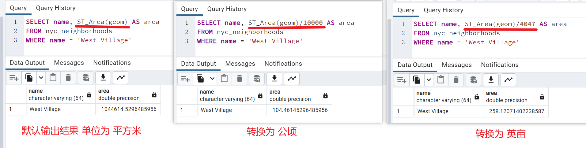
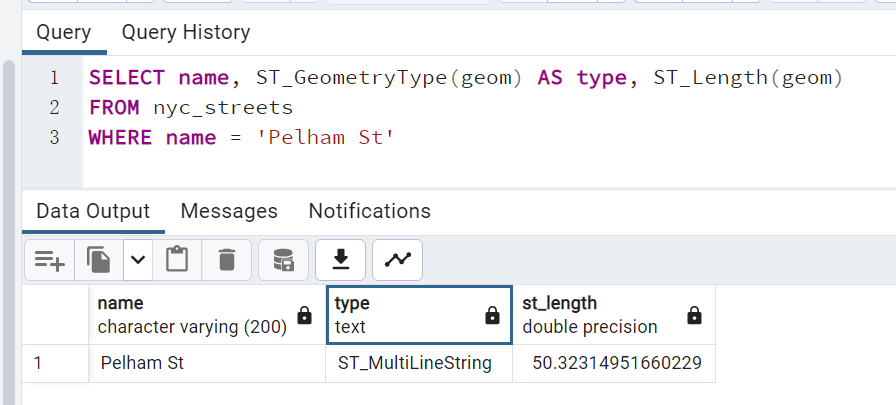
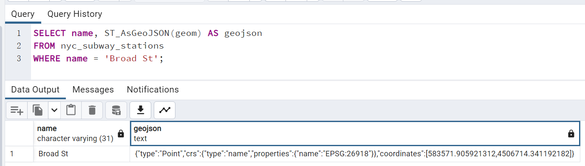
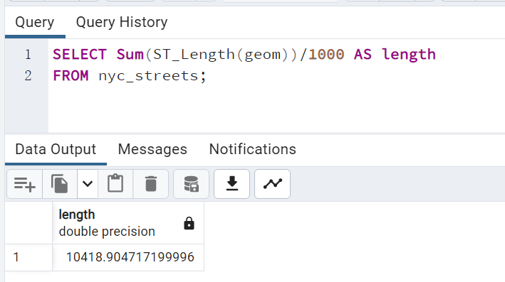
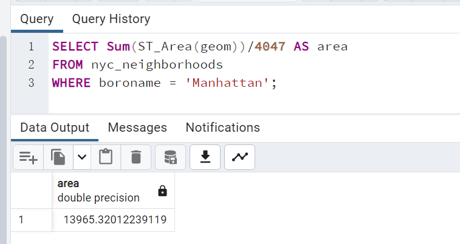
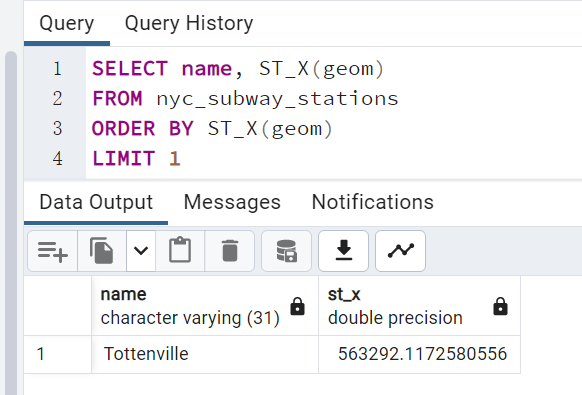
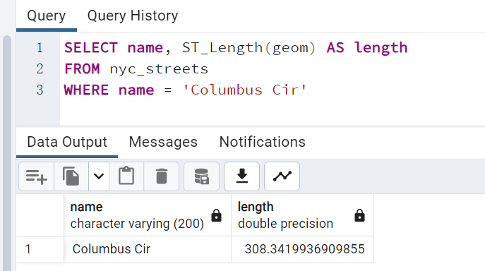
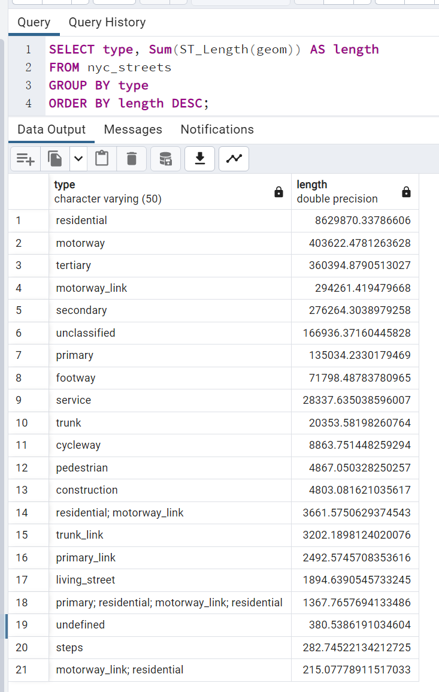

## 5.1. 练习

1. **"West Village"社区的面积是多少?**

```sql
SELECT name, ST_Area(geom)
FROM nyc_neighborhoods
WHERE name = 'West Village';
```

注意: 面积以平方米为单位给出。要将面积转换为公顷，请将其除以 10000。要将面积转换为英亩，请将其除以 4047。

> 结果如下



2. **"Pelham St"的几何类型是什么？长度是多少？**

```sql
SELECT
	name,
	ST_GeometryType(geom) AS type,
	ST_Length(geom)
FROM nyc_streets
WHERE name = 'Pelham St';
```



3. **"Broad St"地铁站的 GeoJSON 表示是什么？**

```sql
SELECT name, ST_AsGeoJSON(geom) AS geojson
FROM nyc_subway_stations
WHERE name = 'Broad St';
```



4. **纽约市的街道总长度（公里）是多少？**（提示：空间数据的测量单位是米，一公里有 1000 米。）

```sql
SELECT Sum(ST_Length(geom))/1000 AS length
FROM nyc_streets;
```



5. **曼哈顿的面积是多少英亩？**

```sql
SELECT Sum(ST_Area(geom))/4047 AS area
FROM nyc_neighborhoods
WHERE boroname = 'Manhattan';
```



6. **最西的地铁站是哪个？**

```sql
SELECT name, ST_X(geom)
FROM nyc_subway_stations
ORDER BY ST_X(geom)
LIMIT 1;
```



7. **“哥伦布圆环”（又名哥伦布圆环）有多长？**

```sql
SELECT name, ST_Length(geom) AS length
FROM nyc_streets
WHERE name = 'Columbus Cir';
```



8. **按类型总结，纽约市的街道长度是多少？**

```sql
SELECT type, Sum(ST_Length(geom)) AS length
FROM nyc_streets
GROUP BY type
ORDER BY length DESC;
```


