## 1. 步骤贴图

根据参考教程, 实际操作如下:

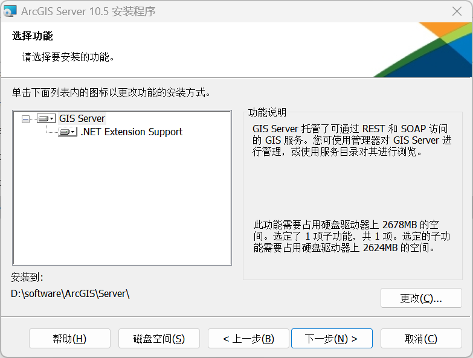

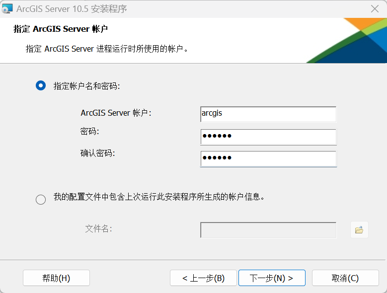
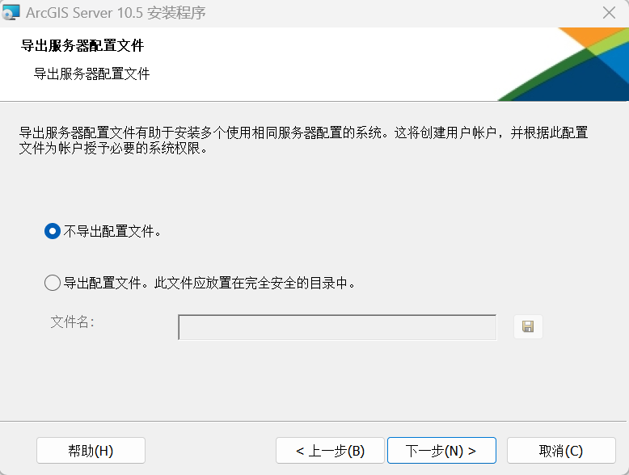
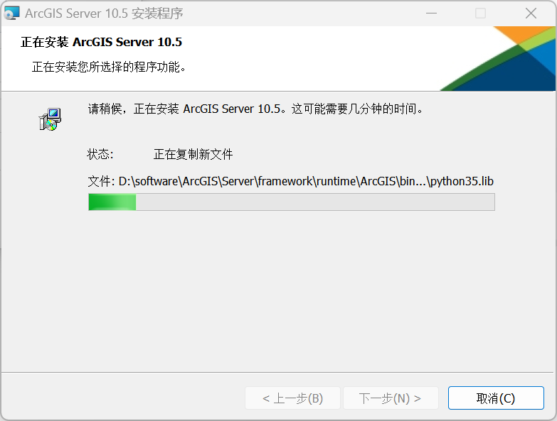
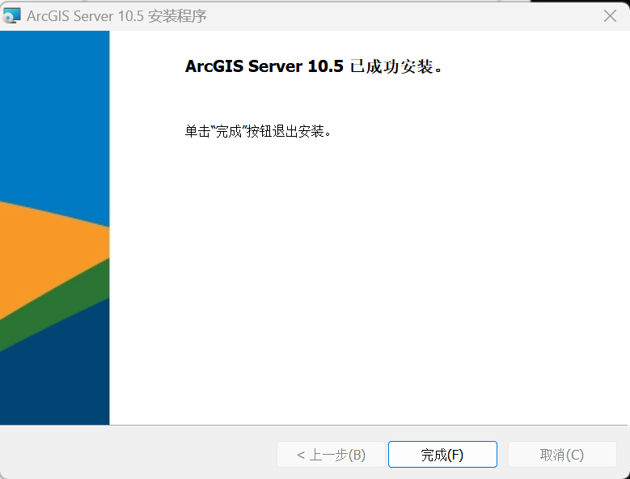
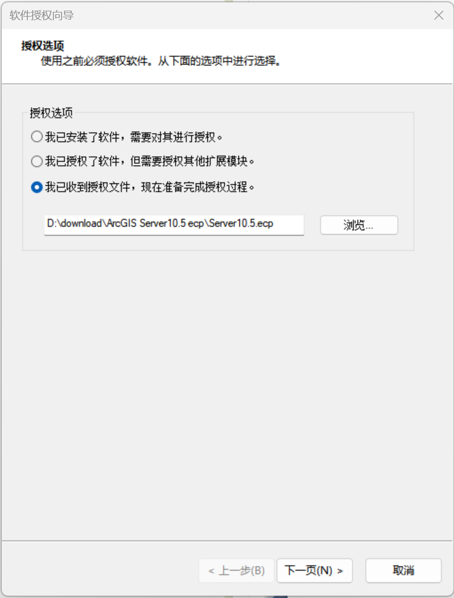
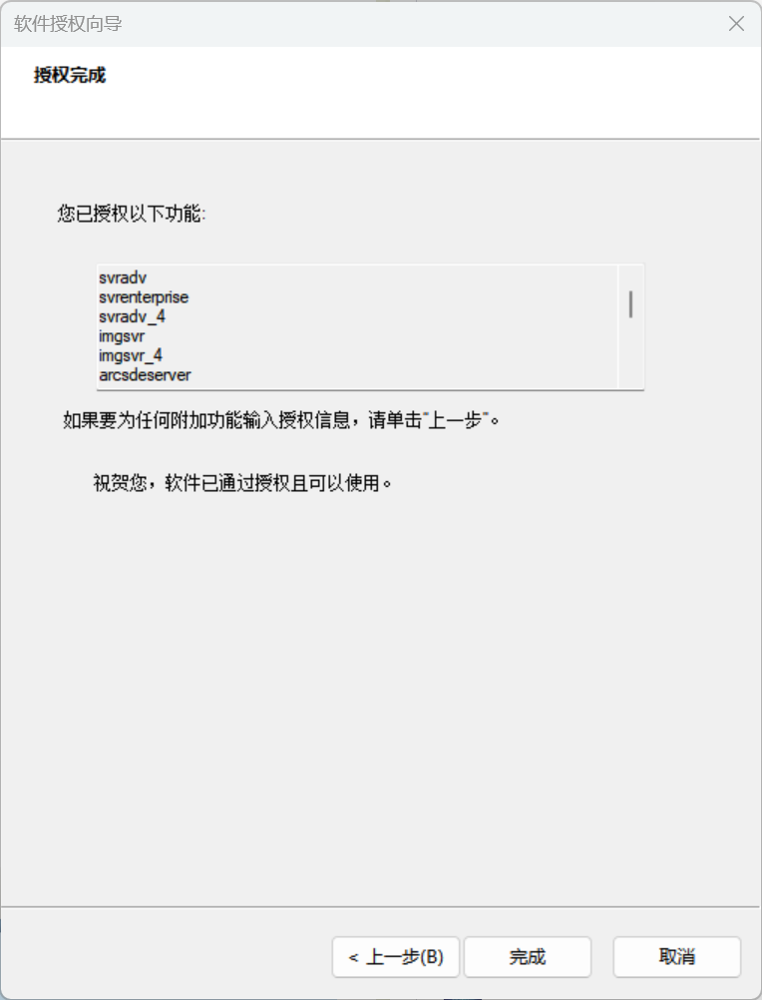
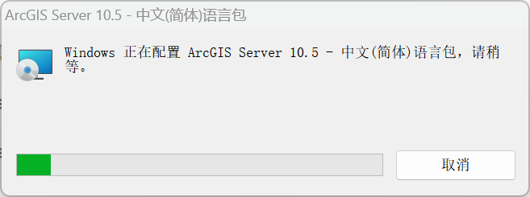
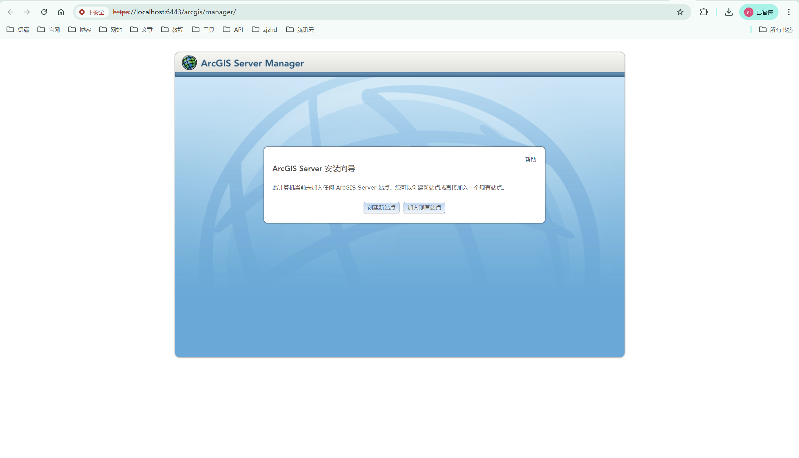
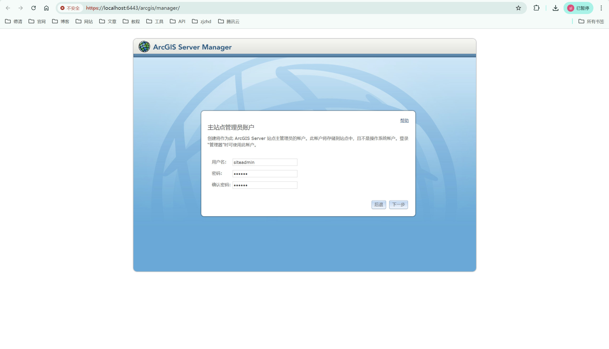
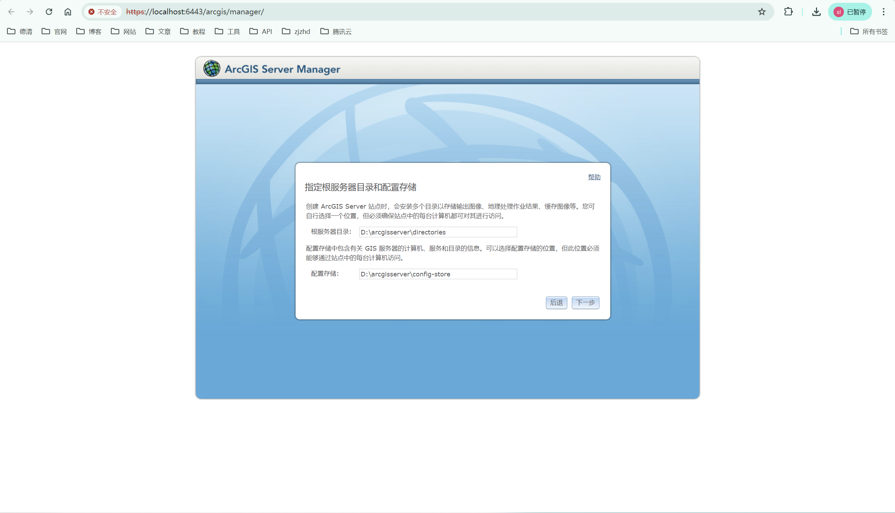
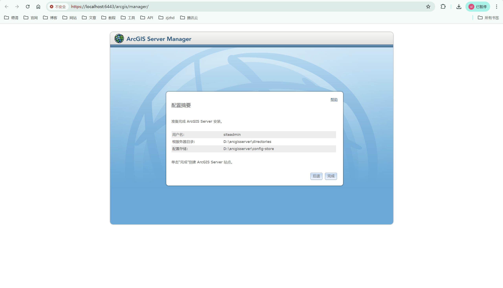
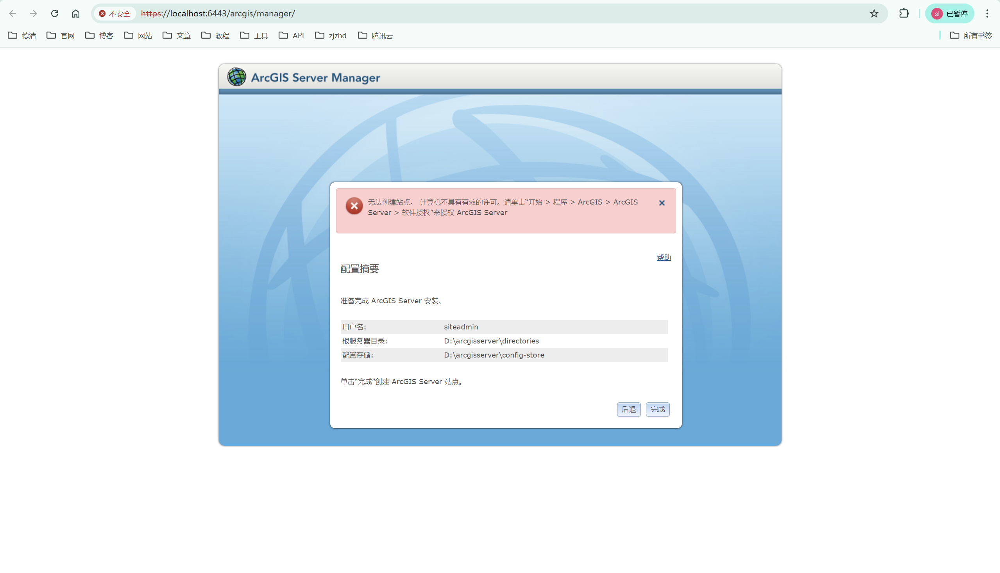
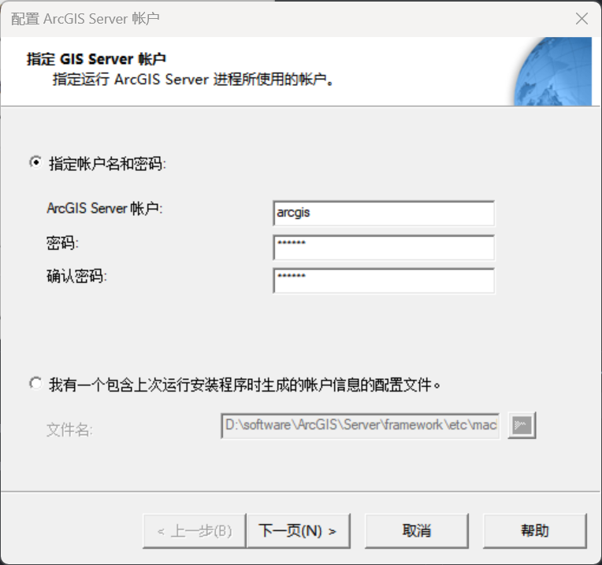
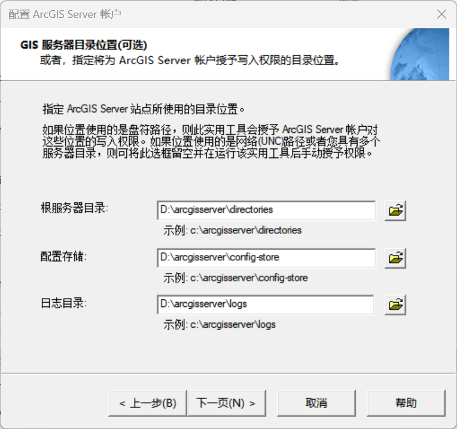
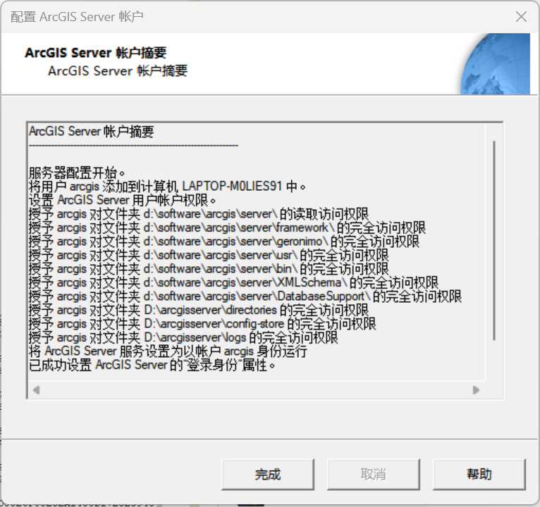
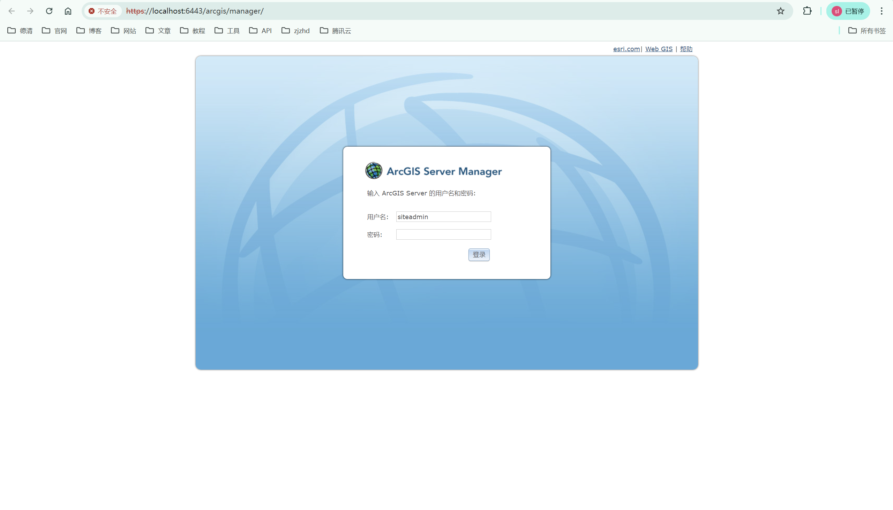

> 修改时间后, 重新创建, 可成功, 改成正常时间, 还是不能访问

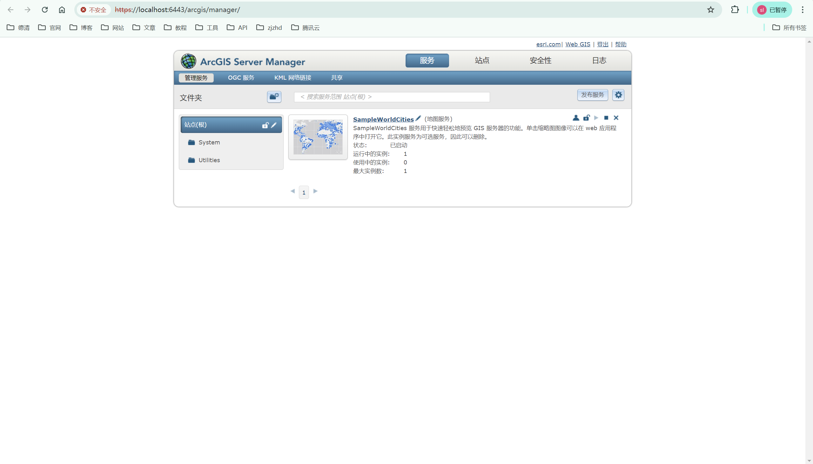

好了, 失败...

## 2. 参考

> 正常安装步骤

[ArcGIS Server教程二：ArcGIS Server的安装部署](https://zhuanlan.zhihu.com/p/97954393)

> 下载

[ArcGIS Server10.5系列一：安装和配置](https://blog.csdn.net/iningwei/article/details/84595414)

> 版本不一, 未实践

[关于arcgis server创建站点失败的问题解决方案](https://blog.csdn.net/feitianxiaojian303/article/details/116354429#:~:text=%E5%A6%82%E6%9E%9C%E6%82%A8%E5%9C%A8%E5%88%9B%E5%BB%BAArcG)

> 修改时间-创建站点成功, 但是改回时间后, 还是失败

[ArcGIS Server“无法创建站点，计算机不具有有效的的许可”](https://blog.csdn.net/Qiuuuy/article/details/90676804#:~:text=ArcGIS%20Ser#:~:text=ArcGIS%20Ser)